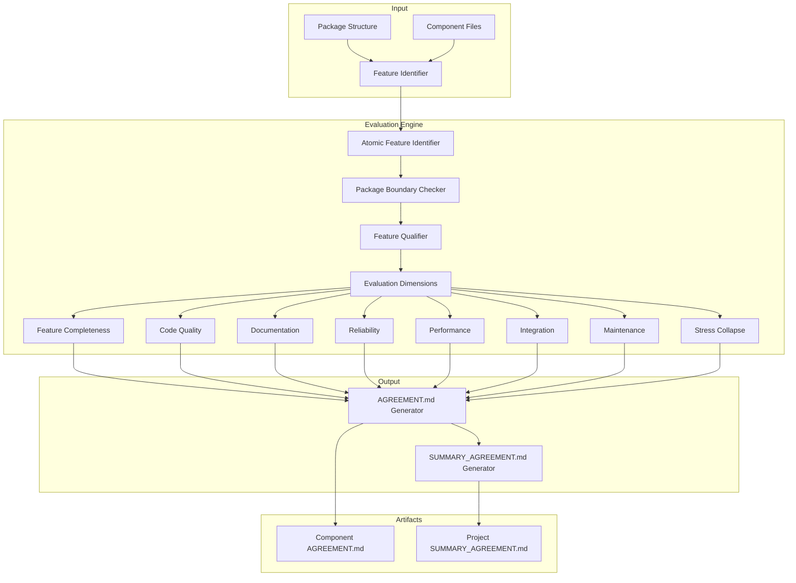

# Design Document: Blind Evaluation Framework

## Overview

The Blind Evaluation Framework is a systematic code quality assessment system for Symphony IDE's frontend packages. It provides a structured methodology to identify atomic features within components, evaluate each feature across 8 quality dimensions, and generate standardized evaluation artifacts (AGREEMENT.md and SUMMARY_AGREEMENT.md files).

### Target Packages for Evaluation

**packages/components/** (17 specialized IDE components):
- activity-bar, code-editor, command-palette, commands, file-explorer, header, mode-switcher, musical-background, notification-center, outlineview, quick-action-card, settings, statusbar, syntax-highlighting, tab-bar, terminal, welcome-screen

**packages/features/** (21 feature packages):
- AutoSave, CodeNavigation, CommandExecution, CommandHistory, EditorCore, EditorLayout, EditorSession, FileManagement, FileSearch, FileTree, FolderManagement, InputHandling, LanguageDetection, OutlineTree, Settings, SettingsValidation, StatusInfo, SyntaxTokenization, TerminalSession, ThemeManagement, TimeTracking

**packages/ui/** (Design system):
- components/ (50+ primitive components)
- feedback/ (progressive feedback system)

**packages/primitives/** (Core primitive system):
- core/, registry/, renderers/, api/, hooks/, ipc/, monitoring/

### System Operation Flow

1. **Traverse** Symphony's package structure (components, features, ui, primitives)
2. **Identify** atomic features within each package using defined criteria
3. **Verify** package boundaries to exclude separate packages from feature lists
4. **Evaluate** each feature across 8 dimensions with evidence-based assessments
5. **Generate** per-component AGREEMENT.md files with detailed evaluations
6. **Consolidate** into project-wide SUMMARY_AGREEMENT.md with cross-component analysis

## Architecture



## Components and Interfaces

### 1. Feature Identifier Module

```typescript
interface AtomicFeature {
  id: number;
  name: string;
  description: string;
  linesOfCode: number;
  primaryLocation: {
    file: string;
    startLine: number;
    endLine: number;
  };
  codeBlocks: CodeBlock[];
  stateManagement: StateUsage[];
  eventHandlers: EventHandler[];
}

interface FeatureIdentificationResult {
  componentPath: string;
  componentType: 'Component' | 'Feature Package';
  identifiedFeatures: AtomicFeature[];
  externalDependencies: ExternalDependency[];
  totalLinesOfCode: number;
}

interface ExternalDependency {
  packageName: string;
  purpose: string;
  importPath: string;
}

interface PackageBoundaryCheck {
  capability: string;
  isSeparatePackage: boolean;
  packagePath?: string;
  reason: string;
}
```

### 2. Evaluation Dimension Interfaces

```typescript
// Feature Completeness (Dimension 1)
interface CompletenessEvaluation {
  rating: 'Not Implemented' | 'Partial' | 'Full' | 'Enterprise-Level';
  percentage: number; // 0-100
  implemented: CapabilityStatus[];
  missing: CapabilityStatus[];
  incomplete: CapabilityStatus[];
  evidence: CodeEvidence;
  rationale: string;
}

interface CapabilityStatus {
  capability: string;
  status: 'implemented' | 'missing' | 'incomplete';
  details?: string;
}

interface CodeEvidence {
  filePath: string;
  lineNumbers: { start: number; end: number };
  codeSnippet: string;
  language: string;
}

// Code Quality (Dimension 2)
interface CodeQualityEvaluation {
  rating: 'Poor' | 'Basic' | 'Good' | 'Excellent';
  featureIsolation: FeatureIsolationClassification;
  antiPatterns: AntiPattern[];
  goodPractices: GoodPractice[];
  assessment: string;
}

type FeatureIsolationClassification = 
  | 'isolated_module'      // ✅ Good
  | 'same_file_separated'  // ⚠️ Acceptable
  | 'mixed_with_other'     // ❌ Bad
  | 'scattered_files';     // ❌ Very Bad

interface AntiPattern {
  id: number;
  name: string;
  evidence: CodeEvidence;
  issue: string;
  impact: string;
  betterApproach: {
    description: string;
    codeExample: string;
  };
}

interface GoodPractice {
  name: string;
  evidence: CodeEvidence;
  description: string;
}

// Documentation (Dimension 3)
interface DocumentationEvaluation {
  rating: 'None' | 'Basic' | 'Good' | 'Excellent';
  coverage: DocumentationCoverage;
  examples: DocumentationExamples;
  assessment: string;
}

interface DocumentationCoverage {
  hasJSDoc: boolean;
  hasInlineComments: boolean;
  hasSelfDocumentingNames: boolean;
  hasUsageExamples: boolean;
  hasEdgeCaseDocs: boolean;
}

interface DocumentationExamples {
  goodDocumentation: CodeEvidence[];
  missingDocumentation: CodeEvidence[];
}

// Reliability (Dimension 4)
interface ReliabilityEvaluation {
  rating: 'Low' | 'Medium' | 'High' | 'Enterprise-Level';
  presentErrorHandling: ErrorHandlingInstance[];
  missingErrorHandling: ErrorHandlingGap[];
  defensiveCoding: DefensiveCodingAssessment;
  edgeCaseHandling: EdgeCaseAssessment;
  assessment: string;
}

interface ErrorHandlingInstance {
  description: string;
  evidence: CodeEvidence;
}

interface ErrorHandlingGap {
  scenario: string;
  location: { file: string; line: number };
  risk: 'Low' | 'Medium' | 'High';
}

// Performance (Dimension 5)
interface PerformanceEvaluation {
  rating: 'Poor' | 'Acceptable' | 'Good' | 'Excellent';
  concerns: PerformanceConcern[];
  optimizations: OptimizationFound[];
  complexityAnalysis: ComplexityAnalysis;
  reRenderAnalysis: ReRenderAnalysis;
  assessment: string;
}

interface PerformanceConcern {
  id: number;
  evidence: CodeEvidence;
  issue: string;
  impact: string;
  recommendedFix: string;
}

interface OptimizationFound {
  technique: 'memoization' | 'debouncing' | 'virtualization' | 'useMemo' | 'useCallback' | 'React.memo';
  evidence: CodeEvidence;
  description: string;
}

interface ComplexityAnalysis {
  algorithmicComplexity: string; // e.g., "O(n)", "O(n²)"
  loopAnalysis: string;
}

interface ReRenderAnalysis {
  hasUnnecessaryReRenders: boolean;
  issues: string[];
}

// Integration (Dimension 6)
interface IntegrationEvaluation {
  rating: 'Not Compatible' | 'Partial' | 'Full' | 'Enterprise-Level';
  configurationOptions: ConfigurationOption[];
  extensibility: ExtensibilityAssessment;
  toggleCapability: boolean;
  featureInteractions: string;
  assessment: string;
}

interface ConfigurationOption {
  name: string;
  type: string;
  present: boolean;
  description?: string;
}

interface ExtensibilityAssessment {
  hasHooksCallbacks: boolean;
  hasSomeExtensionPoints: boolean;
  isHardcoded: boolean;
  details: string;
}

// Maintenance (Dimension 7)
interface MaintenanceEvaluation {
  rating: 'Low' | 'Medium' | 'High' | 'Enterprise-Level';
  modularity: ModularityAssessment;
  modificationEase: ModificationEaseClassification;
  testability: TestabilityClassification;
  dependencies: string[];
  assessment: string;
}

interface ModularityAssessment {
  featureLOC: number;
  complexity: 'Low' | 'Medium' | 'High';
  dependencies: string[];
}

type ModificationEaseClassification = 
  | 'single_file'    // ✅ 1 file
  | 'few_files'      // ⚠️ 2-3 files
  | 'many_files';    // ❌ 4+ files

type TestabilityClassification = 
  | 'isolated'           // ✅ Can be unit tested in isolation
  | 'requires_mocking'   // ⚠️ Requires significant mocking
  | 'tightly_coupled';   // ❌ Tightly coupled, hard to test

// Stress Collapse (Dimension 8)
interface StressCollapseEvaluation {
  conditions: StressCollapseCondition[];
  isRobust: boolean;
  robustReason?: string;
}

interface StressCollapseCondition {
  id: number;
  threshold: string;
  expectedBehavior: string;
  reasoning: string[];
  codePatternReferences: CodeEvidence[];
}
```

### 3. Document Generator Interfaces

```typescript
interface AgreementDocument {
  header: AgreementHeader;
  featureIdentification: FeatureIdentificationSection;
  featureEvaluations: FeatureEvaluation[];
  componentSummary: ComponentSummary;
}

interface AgreementHeader {
  componentName: string;
  type: 'Component' | 'Feature Package';
  evaluatedDate: string;
  path: string;
  linesOfCode: number;
}

interface FeatureIdentificationSection {
  methodology: string[];
  featuresTable: AtomicFeature[];
  totalFeatures: number;
  externalDependencies: ExternalDependency[];
}

interface FeatureEvaluation {
  feature: AtomicFeature;
  completeness: CompletenessEvaluation;
  codeQuality: CodeQualityEvaluation;
  documentation: DocumentationEvaluation;
  reliability: ReliabilityEvaluation;
  performance: PerformanceEvaluation;
  integration: IntegrationEvaluation;
  maintenance: MaintenanceEvaluation;
  stressCollapse: StressCollapseEvaluation;
}

interface ComponentSummary {
  statistics: {
    totalFeatures: number;
    enterpriseLevel: number;
    fullImplementation: number;
    partialImplementation: number;
    notImplemented: number;
  };
  criticalIssues: string[];
  strengths: string[];
  recommendedActions: PriorityAction[];
  overallReadiness: ProductionReadinessStatus;
}

interface PriorityAction {
  priority: 'High' | 'Medium' | 'Low';
  action: string;
  feature?: string;
}

type ProductionReadinessStatus = 
  | 'Production Ready'  // ✅ 80%+ features at Full/Enterprise
  | 'Staging Ready'     // 🟡 60-79%
  | 'Development'       // ⚠️ 40-59%
  | 'Not Ready';        // ❌ <40%

interface SummaryAgreementDocument {
  executiveSummary: ExecutiveSummary;
  detailedTable: DetailedEvaluationRow[];
  statistics: StatisticsByCategory;
  criticalIssues: CriticalIssue[];
  commonAntiPatterns: CommonAntiPattern[];
  productionReadiness: ProductionReadinessRow[];
  stressCollapseSummary: StressCollapseSummary;
  recommendations: Recommendations;
  heatmap: FeatureQualityHeatmap;
}
```

## Data Models

### Evaluation Data Model

```typescript
interface EvaluationSession {
  projectName: string;
  evaluationDate: string;
  packages: PackageEvaluation[];
}

interface PackageEvaluation {
  packagePath: string;
  packageType: 'Component' | 'Feature Package' | 'UI' | 'Primitives';
  agreementDocument: AgreementDocument;
}

// Rating enums for type safety
enum CompletenessRating {
  NOT_IMPLEMENTED = 0,
  PARTIAL = 1,
  FULL = 2,
  ENTERPRISE = 3
}

enum QualityRating {
  POOR = 0,
  BASIC = 1,
  GOOD = 2,
  EXCELLENT = 3
}

enum ReliabilityRating {
  LOW = 0,
  MEDIUM = 1,
  HIGH = 2,
  ENTERPRISE = 3
}

enum IntegrationRating {
  NOT_COMPATIBLE = 0,
  PARTIAL = 1,
  FULL = 2,
  ENTERPRISE = 3
}
```

## Correctness Properties

*A property is a characteristic or behavior that should hold true across all valid executions of a system-essentially, a formal statement about what the system should do. Properties serve as the bridge between human-readable specifications and machine-verifiable correctness guarantees.*

### Property 1: Atomic feature identification completeness
*For any* component package with N distinct capabilities (where each capability has dedicated code blocks, state management, or event handlers), the Feature Identifier SHALL identify all N capabilities as atomic features.
**Validates: Requirements 1.1**

### Property 2: Package boundary check correctness
*For any* capability identified during feature analysis, if that capability exists as a separate package in the codebase (verified by checking packages/ directory structure), the system SHALL exclude it from the atomic features list and document it as an external dependency.
**Validates: Requirements 1.2**

### Property 3: Feature table output format
*For any* set of identified atomic features, the output table SHALL contain exactly 5 columns (number, name, description, LOC, primary location) with valid data for each feature.
**Validates: Requirements 1.4**

### Property 4: Completeness rating validity
*For any* feature completeness evaluation, the assigned rating SHALL be exactly one of: "Not Implemented" (0%), "Partial" (1-49%), "Full" (50-99%), or "Enterprise-Level" (100%), and the percentage SHALL fall within the corresponding range.
**Validates: Requirements 2.1**

### Property 5: Capability status markers consistency
*For any* feature evaluation, all implemented capabilities SHALL be marked with ✅, all missing capabilities SHALL be marked with ❌, and all incomplete capabilities SHALL be marked with ⚠️ with accompanying details.
**Validates: Requirements 2.2, 2.3, 2.4**

### Property 6: Evidence inclusion
*For any* feature rating, there SHALL exist associated code evidence containing a valid file path (existing in the codebase), line numbers (start ≤ end, both > 0), and a non-empty code snippet.
**Validates: Requirements 2.5**

### Property 7: Code quality rating validity
*For any* code quality evaluation, the assigned rating SHALL be exactly one of: "Poor", "Basic", "Good", or "Excellent".
**Validates: Requirements 3.1**

### Property 8: Feature isolation classification
*For any* feature evaluation, the feature isolation SHALL be classified as exactly one of: "isolated_module" (Good), "same_file_separated" (Acceptable), "mixed_with_other" (Bad), or "scattered_files" (Very Bad).
**Validates: Requirements 3.2**

### Property 9: Anti-pattern documentation format
*For any* detected anti-pattern, the documentation SHALL contain: a numbered heading, code snippet with file path and line numbers, issue description, impact assessment, and better approach with example code.
**Validates: Requirements 3.3**

### Property 10: Anti-pattern detection
*For any* code containing excessive nesting (>3 levels), deep property chains, magic numbers/strings, code duplication, or feature code mixed with other feature logic, the system SHALL flag these as anti-patterns.
**Validates: Requirements 3.4**

### Property 11: Documentation rating validity
*For any* documentation evaluation, the assigned rating SHALL be exactly one of: "None", "Basic", "Good", or "Excellent".
**Validates: Requirements 4.1**

### Property 12: Documentation coverage checkboxes
*For any* documentation evaluation, the coverage assessment SHALL include boolean checkboxes for: JSDoc/TSDoc comments, inline comments, self-documenting names, usage examples, and edge case documentation.
**Validates: Requirements 4.2, 4.3, 4.4, 4.5**

### Property 13: Reliability rating validity
*For any* reliability evaluation, the assigned rating SHALL be exactly one of: "Low", "Medium", "High", or "Enterprise-Level".
**Validates: Requirements 5.1**

### Property 14: Error handling documentation
*For any* reliability evaluation, present error handling SHALL be documented with ✅ and code examples, and missing error handling scenarios SHALL be documented with ❌ and risk assessment.
**Validates: Requirements 5.2, 5.3**

### Property 15: Performance rating validity
*For any* performance evaluation, the assigned rating SHALL be exactly one of: "Poor", "Acceptable", "Good", or "Excellent".
**Validates: Requirements 6.1**

### Property 16: Performance concern documentation format
*For any* identified performance concern, the documentation SHALL contain: numbered heading, code snippet with file and line numbers, issue description, impact description, and recommended fix.
**Validates: Requirements 6.2**

### Property 17: Complexity analysis presence
*For any* performance evaluation, the assessment SHALL include algorithmic complexity analysis (e.g., O(n), O(n²)) for relevant code patterns.
**Validates: Requirements 6.3**

### Property 18: Integration rating validity
*For any* integration evaluation, the assigned rating SHALL be exactly one of: "Not Compatible", "Partial", "Full", or "Enterprise-Level".
**Validates: Requirements 7.1**

### Property 19: Maintenance rating validity
*For any* maintenance evaluation, the assigned rating SHALL be exactly one of: "Low", "Medium", "High", or "Enterprise-Level".
**Validates: Requirements 8.1**

### Property 20: Modularity metrics presence
*For any* maintenance evaluation, the modularity assessment SHALL include: feature lines of code (number > 0), complexity level (Low/Medium/High), and list of dependencies.
**Validates: Requirements 8.2**

### Property 21: Stress collapse format
*For any* stress collapse estimation with identified collapse scenarios, each condition SHALL follow the format: "[Numeric threshold] → [Expected behavior]" with accompanying reasoning.
**Validates: Requirements 9.1**

### Property 22: Stress collapse N/A handling
*For any* feature where no collapse scenario can be identified, the stress collapse evaluation SHALL document "N/A" with an explanation of why the feature is robust.
**Validates: Requirements 9.5**

### Property 23: AGREEMENT.md creation
*For any* completed component evaluation, an AGREEMENT.md file SHALL be created inside the component directory at the path: {componentPath}/AGREEMENT.md.
**Validates: Requirements 10.1**

### Property 24: AGREEMENT.md structure completeness
*For any* generated AGREEMENT.md file, the document SHALL contain: header section (component name, type, date, path, LOC), atomic feature identification section (methodology, features table, total count, external dependencies), feature-by-feature evaluation section (all 8 dimensions for each feature), and component-level summary section (statistics, issues, strengths, actions, readiness status).
**Validates: Requirements 10.2, 10.3, 10.4, 10.5**

### Property 25: SUMMARY_AGREEMENT.md creation
*For any* completed evaluation session covering all components, a SUMMARY_AGREEMENT.md file SHALL be created in the project root directory.
**Validates: Requirements 11.1**

### Property 26: SUMMARY_AGREEMENT.md structure completeness
*For any* generated SUMMARY_AGREEMENT.md file, the document SHALL contain: executive summary, detailed evaluation table (one row per atomic feature with all 11 columns), statistics by category, critical issues section, common anti-patterns section, production readiness table, stress collapse summary, recommendations section, and feature quality heatmap.
**Validates: Requirements 11.2, 11.3, 11.4, 11.5, 11.6, 11.7, 11.8, 11.9, 11.10**

### Property 27: Markdown round-trip consistency
*For any* evaluation data structure, serializing to AGREEMENT.md format and then parsing back SHALL produce an equivalent data structure with all ratings, evidence, code snippets, and recommendations preserved.
**Validates: Requirements 12.1, 12.4, 12.6**

### Property 28: Table format validity
*For any* generated markdown table, the table SHALL use pipe-delimited format with consistent column headers matching the specification.
**Validates: Requirements 12.2**

### Property 29: Code block format
*For any* generated code snippet in the evaluation documents, the snippet SHALL use fenced code blocks with language identifier and include file path and line numbers as comments.
**Validates: Requirements 12.5**

## Error Handling

### Error Categories

```typescript
enum EvaluationErrorType {
  FILE_NOT_FOUND = 'FILE_NOT_FOUND',
  PARSE_ERROR = 'PARSE_ERROR',
  INVALID_PACKAGE_STRUCTURE = 'INVALID_PACKAGE_STRUCTURE',
  FEATURE_IDENTIFICATION_FAILED = 'FEATURE_IDENTIFICATION_FAILED',
  EVALUATION_INCOMPLETE = 'EVALUATION_INCOMPLETE',
  DOCUMENT_GENERATION_FAILED = 'DOCUMENT_GENERATION_FAILED',
  SERIALIZATION_ERROR = 'SERIALIZATION_ERROR'
}

interface EvaluationError {
  type: EvaluationErrorType;
  message: string;
  context: {
    packagePath?: string;
    featureName?: string;
    dimension?: string;
    filePath?: string;
    lineNumber?: number;
  };
  recoverable: boolean;
  suggestedAction?: string;
}
```

### Error Handling Strategy

1. **File Not Found**: Log warning, skip file, continue with available files
2. **Parse Error**: Log error with file path, attempt partial parsing, mark feature as incomplete
3. **Invalid Package Structure**: Log error, skip package, document in summary as unevaluated
4. **Feature Identification Failed**: Log error, attempt manual feature list, request user input
5. **Evaluation Incomplete**: Mark affected dimensions as "Unable to evaluate", continue with others
6. **Document Generation Failed**: Retry with simplified format, fall back to JSON output
7. **Serialization Error**: Log error, output raw data structure for manual review

## Testing Strategy

### Dual Testing Approach

The Blind Evaluation Framework requires both unit tests and property-based tests to ensure correctness:

**Unit Tests** verify specific examples and edge cases:
- Specific component evaluations with known outcomes
- Edge cases like empty components, single-feature components
- Error condition handling
- Document format validation

**Property-Based Tests** verify universal properties across all inputs:
- Rating validity across all possible evaluations
- Document structure completeness for any component
- Round-trip consistency for serialization/parsing
- Format compliance for all generated artifacts

### Property-Based Testing Library

**Library**: fast-check (JavaScript/TypeScript)

**Configuration**: Minimum 100 iterations per property test

**Test File Naming**: `*.property.test.ts`

### Property Test Examples

```typescript
// Example: Property 4 - Completeness rating validity
/**
 * **Feature: blind-evaluation-framework, Property 4: Completeness rating validity**
 */
describe('Completeness Rating Validity', () => {
  it('should assign valid completeness ratings', () => {
    fc.assert(
      fc.property(
        fc.record({
          percentage: fc.integer({ min: 0, max: 100 }),
          implemented: fc.array(fc.string()),
          missing: fc.array(fc.string())
        }),
        (input) => {
          const evaluation = evaluateCompleteness(input);
          const validRatings = ['Not Implemented', 'Partial', 'Full', 'Enterprise-Level'];
          expect(validRatings).toContain(evaluation.rating);
          
          // Verify percentage matches rating range
          if (evaluation.rating === 'Not Implemented') {
            expect(evaluation.percentage).toBe(0);
          } else if (evaluation.rating === 'Partial') {
            expect(evaluation.percentage).toBeGreaterThanOrEqual(1);
            expect(evaluation.percentage).toBeLessThanOrEqual(49);
          } else if (evaluation.rating === 'Full') {
            expect(evaluation.percentage).toBeGreaterThanOrEqual(50);
            expect(evaluation.percentage).toBeLessThanOrEqual(99);
          } else {
            expect(evaluation.percentage).toBe(100);
          }
        }
      ),
      { numRuns: 100 }
    );
  });
});

// Example: Property 27 - Markdown round-trip consistency
/**
 * **Feature: blind-evaluation-framework, Property 27: Markdown round-trip consistency**
 */
describe('Markdown Round-Trip', () => {
  it('should preserve evaluation data through serialization and parsing', () => {
    fc.assert(
      fc.property(
        arbitraryEvaluationData(),
        (evaluationData) => {
          const markdown = serializeToMarkdown(evaluationData);
          const parsed = parseMarkdown(markdown);
          expect(parsed).toEqual(evaluationData);
        }
      ),
      { numRuns: 100 }
    );
  });
});
```

### Test Coverage Requirements

| Component | Unit Tests | Property Tests |
|-----------|------------|----------------|
| Feature Identifier | ✓ | ✓ |
| Package Boundary Checker | ✓ | ✓ |
| Completeness Evaluator | ✓ | ✓ |
| Code Quality Evaluator | ✓ | ✓ |
| Documentation Evaluator | ✓ | ✓ |
| Reliability Evaluator | ✓ | ✓ |
| Performance Evaluator | ✓ | ✓ |
| Integration Evaluator | ✓ | ✓ |
| Maintenance Evaluator | ✓ | ✓ |
| Stress Collapse Estimator | ✓ | ✓ |
| AGREEMENT.md Generator | ✓ | ✓ |
| SUMMARY_AGREEMENT.md Generator | ✓ | ✓ |
| Markdown Serializer | ✓ | ✓ |
| Markdown Parser | ✓ | ✓ |

## Appendix A: AGREEMENT.md Template Structure

The following template shows the exact structure that AGREEMENT.md files must follow:

```markdown
# [Component/Feature Name] - Evaluation Agreement

**Type:** Component | Feature Package
**Evaluated:** [Date]
**Path:** [File path]
**Lines of Code:** [Approximate count]

---

## Atomic Feature Identification

**Methodology:**
1. Analyzed component code structure
2. Identified distinct capabilities
3. Verified no separate packages exist for these capabilities
4. Listed smallest independent features

**Identified Atomic Features:**

| # | Feature Name | Description | LOC | Primary Location |
|---|-------------|-------------|-----|------------------|
| 1 | [Feature Name] | [Brief 1-line description] | ~[X] | [File:line-range] |

**Total Atomic Features Identified:** [Count]

**External Dependencies (Separate Packages):**
- [Package Name] - Used for [purpose] (NOT evaluated as feature here)

---

## Feature-by-Feature Evaluation

---

### Feature 1: [Atomic Feature Name]

**Location:** `[File path]`, lines [X-Y]
**Code Volume:** ~[X] lines
**Confidence Level:** High | Medium | Low

---

#### 1.1 Feature Completeness: [Rating - XX%]

**Implementation Status:**

✅ **Implemented:**
- [Specific capability 1]

❌ **Missing:**
- [Missing capability 1]

⚠️ **Incomplete:**
- [Partially implemented capability with details]

**Evidence:**
```[language]
// Lines [X-Y] from [file]
[relevant code snippet]
```

**Rationale for Rating:**
[Explanation]

---

#### 1.2 Code Quality / Maintainability: [Rating]

**Code Organization:**
- [ ] ✅ Feature isolated in separate module/hook
- [ ] ⚠️ Feature in same file, clearly separated
- [ ] ❌ Feature mixed with other logic
- [ ] ❌ Feature scattered across multiple files

**Anti-Patterns Detected:**

**#1: [Anti-pattern Name]**
```[language]
// Lines [X-Y] from [file]
[code snippet]
```
- **Issue:** [Description]
- **Impact:** [Impact assessment]
- **Better Approach:**
```[language]
[improved code]
```

**Good Practices Observed:**
- ✅ [Specific good practice]

**Overall Code Quality Assessment:**
[Detailed justification]

---

#### 1.3 Documentation & Comments: [Rating]

**Documentation Coverage:**
- [ ] JSDoc/TSDoc comments on feature functions
- [ ] Inline comments explaining complex logic
- [ ] Self-documenting variable/function names
- [ ] Usage examples
- [ ] Edge cases documented

**Examples:**
```[language]
// FOUND: Good documentation
[example]

// MISSING: No explanation
[example]
```

**Assessment:** [Justification]

---

#### 1.4 Reliability / Fault-Tolerance: [Rating]

**Error Handling Analysis:**

✅ **Present:**
- [Specific error handling found]

❌ **Missing:**
- [Missing error handling scenario]

**Code Examples:**
```[language]
// GOOD: Error handling present
[code]

// BAD: No error handling
[code]
```

**Edge Cases:**
- [Assessment]

**Assessment:** [Justification]

---

#### 1.5 Performance & Efficiency: [Rating]

**Performance Analysis:**

**Concerns Identified:**

**#1: [Performance Issue]**
```[language]
// Lines [X-Y]
[code]
```
- **Impact:** [Description]
- **Fix:** [Recommendation]

**Optimizations Found:**
- ✅ [Good optimization technique]

**Assessment:** [Justification]

---

#### 1.6 Integration & Extensibility: [Rating]

**Integration Analysis:**

**Configuration Options:**
```[language]
{
  option: type;  // ✅ Present or ❌ Missing
}
```

**Extensibility:**
- [ ] ✅ Hooks/callbacks for custom behavior
- [ ] ⚠️ Some extension points
- [ ] ❌ Hardcoded, not extensible

**Works with other features:**
- [Analysis]

**Assessment:** [Justification]

---

#### 1.7 Maintenance & Support: [Rating]

**Maintainability Analysis:**

**Modularity:**
- Feature LOC: ~[X] lines
- Complexity: [Low/Medium/High]
- Dependencies: [List]

**Ease of Modification:**
- [ ] ✅ Change requires editing 1 file
- [ ] ⚠️ Change requires editing 2-3 files
- [ ] ❌ Change requires editing 4+ files

**Testability:**
- [ ] ✅ Feature can be unit tested in isolation
- [ ] ⚠️ Requires significant mocking
- [ ] ❌ Tightly coupled, hard to test

**Assessment:** [Justification]

---

#### 1.8 Stress Collapse Estimation: [When Collapse]

**Failure Condition Analysis:**

**Condition 1:** [Specific scenario]
```
[Numeric threshold] → [Expected behavior]
```
**Reasoning:**
- [Code pattern observation]
- [Why this will fail]

---

## Component-Level Summary

**Overall Statistics:**
- Total Atomic Features: [Count]
- Enterprise-Level: [Count]
- Full Implementation: [Count]
- Partial Implementation: [Count]
- Not Implemented: [Count]

**Critical Issues Across Features:**
1. [Issue]

**Strengths:**
- [Key positive finding]

**Recommended Priority Actions:**
1. **High Priority:** [Action]
2. **Medium Priority:** [Action]
3. **Low Priority:** [Action]

**Overall Component Readiness:** ❌ Not Ready | ⚠️ Development | 🟡 Staging | ✅ Production
```

## Appendix B: SUMMARY_AGREEMENT.md Template Structure

```markdown
# Frontend Evaluation Summary

**Project:** Symphony IDE
**Evaluation Date:** [Date]
**Components/Packages Evaluated:** [Count]
**Total Atomic Features Evaluated:** [Count]

---

## Executive Summary

[Brief overview]

**Key Findings:**
- [Finding 1]
- [Finding 2]

---

## Detailed Evaluation Table

| Component/Package | Type | Feature Name | Completeness | Code Quality | Docs | Reliability | Performance | Integration | Maintenance | When Collapse | Notes |
|------------------|------|--------------|--------------|--------------|------|-------------|-------------|-------------|-------------|---------------|-------|
| [Component] | Component | [Feature] | [Rating] | [Rating] | [Rating] | [Rating] | [Rating] | [Rating] | [Rating] | [Threshold] | [Notes] |

---

## Statistics by Category

### Feature Completeness Distribution
- **Enterprise-Level (100%):** [Count] features
- **Full (50-99%):** [Count] features
- **Partial (1-49%):** [Count] features
- **Not Implemented (0%):** [Count] features

### Code Quality Distribution
- **Excellent:** [Count] features
- **Good:** [Count] features
- **Basic:** [Count] features
- **Poor:** [Count] features

### Performance Issues
- **Critical:** [Count] features
- **Medium:** [Count] features
- **Good:** [Count] features

---

## Critical Issues (High Priority)

### 1. [Component Name] - [Feature Name]
- **Issue:** [Description]
- **Impact:** [What breaks]
- **Evidence:** [Code reference]
- **Recommendation:** [Fix]

---

## Common Anti-Patterns Across Project

### 1. [Pattern Name]
**Found in:**
- [Component]: [Feature]

**Impact:** [Description]
**Recommendation:** [Fix]

---

## Production Readiness by Component

| Component/Package | Total Features | Enterprise | Full | Partial | Not Impl | Overall Status |
|------------------|----------------|------------|------|---------|----------|----------------|
| [Component] | [N] | [N] | [N] | [N] | [N] | ✅/🟡/⚠️/❌ |

**Legend:**
- ✅ Production Ready: 80%+ features at Full or Enterprise level
- 🟡 Staging Ready: 60-79% features at Full or Enterprise level
- ⚠️ Development: 40-59% features at Full or Enterprise level
- ❌ Not Ready: <40% features at Full or Enterprise level

---

## Stress Collapse Summary

### Most Fragile Features (Will Collapse Earliest)
1. **[Component] - [Feature]**
   - Collapses at: [Threshold]
   - Impact: [Description]
   - Priority: HIGH

### Most Robust Features (High Stress Tolerance)
1. **[Component] - [Feature]**
   - No collapse scenario identified
   - [Reason]

---

## Recommendations

### Immediate Actions (This Sprint)
1. [Action with effort estimate]

### Short-term (Next 2-4 Weeks)
1. [Action with effort estimate]

### Long-term Improvements
1. [Strategic improvement]

---

## Feature Quality Heatmap

```
Component          | Enterprise | Full | Partial | Not Impl | Score
-------------------|-----------|------|---------|----------|------
[Component]        | ██        | ████ | ██      |          | X.X/10
```

---

## Conclusion

[Overall assessment]

**Strengths:**
- [Key strength]

**Areas for Improvement:**
- [Key area]

**Next Steps:**
1. [Step 1]
2. [Step 2]
```

## Appendix C: Example Atomic Feature Identification

### Example: StatusBar Component

Based on analysis of `packages/components/statusbar/src/StatusBar.jsx`:

**Identified Atomic Features:**

| # | Feature Name | Description | LOC | Primary Location |
|---|-------------|-------------|-----|------------------|
| 1 | Time Display | Real-time clock display with minute updates | ~15 | StatusBar.jsx:18-32 |
| 2 | Git Branch Display | Shows current git branch name | ~5 | StatusBar.jsx:45-48 |
| 3 | File Info Display | Shows active file name and line count | ~5 | StatusBar.jsx:50-53 |
| 4 | Cursor Position | Displays current line and column | ~3 | StatusBar.jsx:55-57 |
| 5 | Language Display | Shows detected file language | ~2 | StatusBar.jsx:59 |
| 6 | Last Saved Indicator | Relative time since last save | ~15 | StatusBar.jsx:34-43 |
| 7 | Terminal Toggle | Button to show/hide terminal | ~10 | StatusBar.jsx:70-78 |
| 8 | Collaborators Count | Shows number of active collaborators | ~5 | StatusBar.jsx:80-85 |
| 9 | Online Status | Indicates connection status | ~5 | StatusBar.jsx:87-91 |

**External Dependencies (Separate Packages):**
- `ui` - Used for Button, Flex, Text, Badge, Separator components (NOT evaluated as feature here)
- `lucide-react` - Used for icons (NOT evaluated as feature here)

### Example: NotificationCenter Component

Based on analysis of `packages/components/notification-center/src/NotificationCenter.jsx`:

**Identified Atomic Features:**

| # | Feature Name | Description | LOC | Primary Location |
|---|-------------|-------------|-----|------------------|
| 1 | Popover Toggle | Open/close notification popover | ~10 | NotificationCenter.jsx:17-18, 26-40 |
| 2 | Unread Count Badge | Displays count of unread notifications | ~5 | NotificationCenter.jsx:20, 35-37 |
| 3 | Notification List | Scrollable list of notification items | ~15 | NotificationCenter.jsx:60-67 |
| 4 | Mark All Read | Button to mark all notifications as read | ~10 | NotificationCenter.jsx:73-81 |
| 5 | View All Link | Navigation to full notifications view | ~8 | NotificationCenter.jsx:82-89 |
| 6 | Empty State | Display when no notifications exist | ~8 | NotificationCenter.jsx:93-99 |

**External Dependencies (Separate Packages):**
- `ui` - Used for Button, Badge, ScrollArea, Popover components (NOT evaluated as feature here)
- `./components/NotificationItem.jsx` - Separate component for individual items (evaluated separately)
