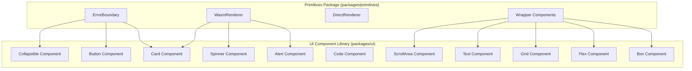

# Design Document: UI Components Migration

## Overview

This design document outlines the migration of plain HTML elements in the Symphony primitives package to use the established UI component library. The migration ensures consistent styling, accessibility, and maintainability by requiring all components to use Symphony's design system components instead of raw HTML elements.

The migration involves:
1. Creating new UI primitive components (Box, Flex, Grid, Text, Spinner, Code) to fill gaps in the design system
2. Updating existing renderer components (ErrorBoundary, WasmRenderer) to use UI components
3. Updating wrapper components to integrate with the design system
4. Documenting justified exceptions for performance-critical components (Monaco, xterm.js)

## Architecture



## Components and Interfaces

### New UI Components

#### Box Component
A basic container component for layout purposes.

```typescript
interface BoxProps extends React.HTMLAttributes<HTMLDivElement> {
  as?: React.ElementType;
  padding?: 'none' | 'sm' | 'md' | 'lg' | 'xl';
  margin?: 'none' | 'sm' | 'md' | 'lg' | 'xl';
  display?: 'block' | 'inline' | 'inline-block' | 'flex' | 'inline-flex' | 'grid';
  className?: string;
  children?: React.ReactNode;
}
```

#### Flex Component
A flexbox layout component with common flex properties.

```typescript
interface FlexProps extends React.HTMLAttributes<HTMLDivElement> {
  direction?: 'row' | 'row-reverse' | 'column' | 'column-reverse';
  justify?: 'start' | 'end' | 'center' | 'between' | 'around' | 'evenly';
  align?: 'start' | 'end' | 'center' | 'baseline' | 'stretch';
  wrap?: 'nowrap' | 'wrap' | 'wrap-reverse';
  gap?: 'none' | 'sm' | 'md' | 'lg' | 'xl' | number;
  className?: string;
  children?: React.ReactNode;
}
```

#### Grid Component
A CSS grid layout component.

```typescript
interface GridProps extends React.HTMLAttributes<HTMLDivElement> {
  columns?: number | string;
  rows?: number | string;
  gap?: 'none' | 'sm' | 'md' | 'lg' | 'xl' | number;
  alignItems?: 'start' | 'end' | 'center' | 'stretch';
  justifyItems?: 'start' | 'end' | 'center' | 'stretch';
  className?: string;
  children?: React.ReactNode;
}
```

#### Text Component
A typography component for text content.

```typescript
interface TextProps extends React.HTMLAttributes<HTMLElement> {
  as?: 'p' | 'span' | 'div' | 'label';
  size?: 'xs' | 'sm' | 'base' | 'lg' | 'xl' | '2xl' | '3xl' | '4xl';
  weight?: 'normal' | 'medium' | 'semibold' | 'bold';
  color?: 'default' | 'muted' | 'accent' | 'destructive';
  align?: 'left' | 'center' | 'right';
  className?: string;
  children?: React.ReactNode;
}
```

#### Heading Component
A heading component for titles.

```typescript
interface HeadingProps extends React.HTMLAttributes<HTMLHeadingElement> {
  as?: 'h1' | 'h2' | 'h3' | 'h4' | 'h5' | 'h6';
  size?: 'xs' | 'sm' | 'base' | 'lg' | 'xl' | '2xl' | '3xl' | '4xl';
  weight?: 'normal' | 'medium' | 'semibold' | 'bold';
  className?: string;
  children?: React.ReactNode;
}
```

#### Spinner Component
A loading spinner component.

```typescript
interface SpinnerProps extends React.HTMLAttributes<HTMLDivElement> {
  size?: 'sm' | 'md' | 'lg';
  color?: 'default' | 'primary' | 'secondary';
  className?: string;
}
```

#### Code Component
An inline code display component.

```typescript
interface CodeProps extends React.HTMLAttributes<HTMLElement> {
  variant?: 'inline' | 'block';
  className?: string;
  children?: React.ReactNode;
}
```

### Updated Components

#### ErrorBoundary DefaultFallback
Updated to use UI components:

```jsx
function DefaultFallback({ error, errorInfo, retry }) {
  return (
    <Card className="border-destructive bg-destructive/10">
      <CardHeader>
        <CardTitle className="text-destructive">Something went wrong</CardTitle>
        <CardDescription>{error.message || 'An unexpected error occurred'}</CardDescription>
      </CardHeader>
      {errorInfo && (
        <CardContent>
          <Collapsible>
            <CollapsibleTrigger asChild>
              <Button variant="ghost" size="sm">Error details</Button>
            </CollapsibleTrigger>
            <CollapsibleContent>
              <Code variant="block">{error.stack}{errorInfo.componentStack}</Code>
            </CollapsibleContent>
          </Collapsible>
        </CardContent>
      )}
      <CardFooter>
        <Button variant="destructive" onClick={retry}>Try again</Button>
      </CardFooter>
    </Card>
  );
}
```

#### WasmRenderer Error Fallback
Updated to use Alert components:

```jsx
function DefaultWasmErrorFallback({ error, retry, modulePath }) {
  return (
    <Alert variant="destructive">
      <AlertTitle>WASM Component Failed to Load</AlertTitle>
      <AlertDescription>
        <Text size="sm">Module: <Code>{modulePath}</Code></Text>
        <Text size="sm" className="mt-2">{error.message}</Text>
        <Collapsible className="mt-2">
          <CollapsibleTrigger asChild>
            <Button variant="ghost" size="sm">Error details</Button>
          </CollapsibleTrigger>
          <CollapsibleContent>
            <Code variant="block">{error.stack}</Code>
          </CollapsibleContent>
        </Collapsible>
        <Button variant="outline" onClick={retry} className="mt-4">Retry</Button>
      </AlertDescription>
    </Alert>
  );
}
```

#### WasmRenderer Loading Indicator
Updated to use Card and Spinner:

```jsx
function WasmLoadingIndicator({ modulePath }) {
  return (
    <Card>
      <CardContent className="flex flex-col items-center py-6">
        <Spinner size="md" className="mb-2" />
        <Text size="sm" color="muted">Loading WASM module...</Text>
        <Text size="xs" color="muted">{modulePath}</Text>
      </CardContent>
    </Card>
  );
}
```

## Data Models

### Component Tree Serialization

For round-trip testing, component trees are serialized to a JSON-like format:

```typescript
interface SerializedComponent {
  type: string;
  props: Record<string, unknown>;
  children: SerializedComponent[];
}

interface ComponentTreeSerializer {
  serialize(component: React.ReactElement): string;
  parse(serialized: string): SerializedComponent;
}
```

## Correctness Properties

*A property is a characteristic or behavior that should hold true across all valid executions of a system-essentially, a formal statement about what the system should do. Properties serve as the bridge between human-readable specifications and machine-verifiable correctness guarantees.*

Based on the prework analysis, the following correctness properties have been identified:

### Property 1: ErrorBoundary uses Card components for error container
*For any* error caught by ErrorBoundary, the rendered fallback UI should contain Card, CardHeader, CardTitle, and CardContent components for the error container structure.
**Validates: Requirements 1.1**

### Property 2: ErrorBoundary uses Collapsible for error details
*For any* error with errorInfo, the ErrorBoundary fallback should use Collapsible, CollapsibleTrigger, and CollapsibleContent components for the expandable error details section.
**Validates: Requirements 1.2**

### Property 3: ErrorBoundary uses Button for retry action
*For any* ErrorBoundary fallback, the retry action should be rendered using the Button component with the destructive variant.
**Validates: Requirements 1.3**

### Property 4: WasmRenderer error uses Alert components
*For any* WASM loading error, the error fallback should use Alert, AlertTitle, and AlertDescription components for error messaging.
**Validates: Requirements 1.4**

### Property 5: WasmRenderer error uses Button for retry
*For any* WasmRenderer error fallback, the retry action should be rendered using the Button component.
**Validates: Requirements 1.5**

### Property 6: WasmRenderer loading state uses UI components
*For any* WasmRenderer in loading state, the loading indicator should use Card, CardContent, Spinner, and Text components for consistent styling.
**Validates: Requirements 2.1, 2.2, 2.3**

### Property 7: ListWrapper uses ScrollArea for scrollable content
*For any* ListWrapper with scrollable content, the component should use ScrollArea for scroll functionality.
**Validates: Requirements 3.4**

### Property 8: FormWrapper integrates with UI form styling
*For any* FormWrapper, the form element should integrate with UI component styling classes.
**Validates: Requirements 4.1**

### Property 9: Typography components render correct elements
*For any* Text component with a specified variant, the rendered output should use the correct HTML element and apply consistent typography styles.
**Validates: Requirements 5.1, 5.2**

### Property 10: Code component renders with monospace styling
*For any* Code component, the rendered output should apply monospace font styling and appropriate background.
**Validates: Requirements 5.3**

### Property 11: Box component applies layout props correctly
*For any* Box component with padding, margin, or display props, the rendered output should have the corresponding CSS styles applied.
**Validates: Requirements 6.1**

### Property 12: Flex component applies flexbox props correctly
*For any* Flex component with direction, justify, align, wrap, or gap props, the rendered output should have the corresponding flexbox CSS styles applied.
**Validates: Requirements 6.2**

### Property 13: Grid component applies grid props correctly
*For any* Grid component with columns, rows, or gap props, the rendered output should have the corresponding CSS grid styles applied.
**Validates: Requirements 6.3**

### Property 14: Text component applies typography props correctly
*For any* Text component with size, weight, or color props, the rendered output should have the corresponding typography CSS classes applied.
**Validates: Requirements 6.4**

### Property 15: Spinner component renders loading animation
*For any* Spinner component, the rendered output should include animation styles for the loading indicator.
**Validates: Requirements 6.5**

### Property 16: Code component applies code styling
*For any* Code component with inline or block variant, the rendered output should apply appropriate code styling (monospace font, background).
**Validates: Requirements 6.6**

### Property 17: Component tree serialization round-trip
*For any* valid UI component tree, serializing then parsing should produce an equivalent component structure with preserved types and props.
**Validates: Requirements 8.1, 8.2, 8.3**

## Error Handling

### Component Loading Errors
- UI components that fail to load should display a minimal fallback using inline styles as a last resort
- Error boundaries should catch and display errors using the UI component-based fallback

### Missing UI Components
- If a required UI component is not available, the system should log a warning and fall back to a basic styled element
- Development mode should show prominent warnings for missing UI components

### Prop Validation
- All new UI components should validate props and provide helpful error messages for invalid values
- TypeScript interfaces ensure compile-time type safety

## Testing Strategy

### Dual Testing Approach

This feature requires both unit tests and property-based tests:

#### Unit Tests
- Test individual UI component rendering with specific prop combinations
- Test error boundary behavior with specific error types
- Test integration between primitives and UI components

#### Property-Based Testing

**Library**: fast-check (JavaScript property-based testing library)

**Configuration**: Minimum 100 iterations per property test

**Test Annotations**: Each property-based test must include:
```javascript
// **Feature: ui-components-migration, Property {number}: {property_text}**
```

**Property Test Categories**:

1. **Component Structure Properties** (Properties 1-6)
   - Generate random error objects and verify UI component usage in rendered output
   - Use React Testing Library to query for component presence

2. **Layout Component Properties** (Properties 11-13)
   - Generate random prop combinations for Box, Flex, Grid
   - Verify CSS styles are correctly applied

3. **Typography Properties** (Properties 9, 10, 14)
   - Generate random text content and variant combinations
   - Verify correct element types and CSS classes

4. **Round-Trip Property** (Property 17)
   - Generate random component trees
   - Serialize and parse, verify structural equivalence

### Test File Organization

```
packages/primitives/__tests__/
├── renderers/
│   ├── ErrorBoundary.ui.test.jsx      # UI component usage tests
│   └── WasmRenderer.ui.test.jsx       # UI component usage tests
└── ui-migration/
    ├── components.property.test.js     # Property tests for new UI components
    └── serialization.property.test.js  # Round-trip property tests

packages/ui/__tests__/
├── layout/
│   ├── Box.test.tsx
│   ├── Flex.test.tsx
│   └── Grid.test.tsx
├── typography/
│   ├── Text.test.tsx
│   ├── Heading.test.tsx
│   └── Code.test.tsx
└── feedback/
    └── Spinner.test.tsx
```

## Documented Exceptions

### Performance-Critical Components

The following components are documented exceptions that may use plain HTML elements:

1. **MonacoEditorDirect** (`packages/primitives/src/renderers/DirectRenderer.jsx`)
   - Uses plain `<div>` for Monaco Editor container
   - Justification: Monaco Editor requires direct DOM access and manages its own rendering
   - JSDoc comment required explaining the exception

2. **XTermTerminalDirect** (`packages/primitives/src/renderers/DirectRenderer.jsx`)
   - Uses plain `<div>` for xterm.js container
   - Justification: xterm.js requires direct DOM access for terminal rendering
   - JSDoc comment required explaining the exception

3. **Layout Wrapper Primitives** (ContainerWrapper, FlexWrapper, GridWrapper)
   - May use plain `<div>` elements for performance-critical layout operations
   - Justification: These are low-level primitives where UI component overhead may impact performance
   - Should be evaluated case-by-case; prefer UI components when performance is not critical

