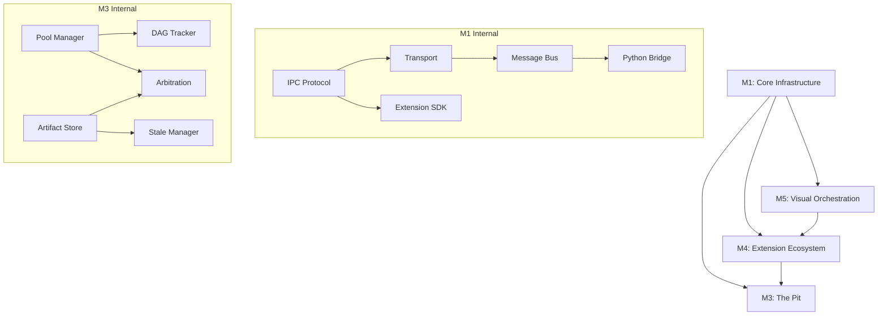

# Symphony Backend Milestones - Level 2 Decomposition

> **Complete decomposition of M1, M5, M4, M3 into actionable tasks**

---

## 🚨 CRITICAL PREREQUISITE: sy-commons Foundation

**ALL Level 2 milestone development depends on M1.0 sy-commons Foundation completion**:
- SymphonyError - base error for ALL Symphony crates (mandatory)
- Professional logging (tracing-based) - Console, File, JSON outputs
- Environment configuration (TOML + Figment) - default.toml, test.toml, production.toml
- Safe filesystem utilities - professional architecture, low complexity
- Pre-validation helpers - simple rule validation utilities
- Duck debugging - temporary debugging utilities with duck!() macro

**Core Rule**: "Common First" - Any functionality that can be shared across crates MUST be implemented in sy-commons first.

---

## 📁 Files Overview

| File | Milestone | Duration | Tasks | Focus | Dependencies |
|------|-----------|----------|-------|-------|--------------|
| **M1.0** | **sy-commons Foundation** | **2 weeks** | **~20** | **Shared utilities** | **None** |
| [MILESTONE_LEVEL2_M1.md](./MILESTONE_LEVEL2_M1.md) | Core Infrastructure | 15 weeks | ~78 | IPC, Python Bridge, Extension SDK | **M1.0** |
| [MILESTONE_LEVEL2_M5.md](./MILESTONE_LEVEL2_M5.md) | Visual Orchestration | 11 weeks | ~175 | Workflow data model, DAG ops, Templates | **M1.0** |
| [MILESTONE_LEVEL2_M4.md](./MILESTONE_LEVEL2_M4.md) | Extension Ecosystem | 20 weeks | ~220 | Permissions, sandboxing, extension types | **M1.0** |
| [MILESTONE_LEVEL2_M3.md](./MILESTONE_LEVEL2_M3.md) | The Pit | 18 weeks | ~170 | Pool Manager, DAG Tracker, Artifact Store | **M1.0** |

**Total**: ~663 detailed tasks across 66 weeks (with parallelization: ~42 weeks)

---

## 🎯 Execution Order: M1.0 → M1 → M5 → M4 → M3

### Phase 0: M1.0 - sy-commons Foundation (Weeks 1-2) - PREREQUISITE
**Foundation for ALL Symphony development**
- Error handling (SymphonyError)
- Professional logging system
- Environment configuration
- Safe filesystem utilities
- Pre-validation helpers
- Duck debugging utilities

### Phase 1: M1 - Core Infrastructure (Weeks 3-17)
**Foundation for everything else** - DEPENDS ON M1.0
- M1.1: IPC Protocol & Serialization
- M1.2: Transport Layer (Unix sockets, Named pipes)
- M1.3: Message Bus Core
- M1.4: Python-Rust Bridge (PyO3)
- M1.5: Extension SDK Foundation

### Phase 2: M5 - Visual Orchestration Backend (Weeks 18-28) - DEPENDS ON M1.0
**Data structures for workflows**
- M5.1: Workflow Data Model (nodes, edges)
- M5.2: DAG Validation & Operations
- M5.3: Workflow Serialization (JSON, binary, pretty-print)
- M5.4: Template System
- M5.5: Execution State API

### Phase 3: M4 - Extension Ecosystem (Weeks 27-46)
**The Orchestra Kit**
- M4.1: Manifest System
- M4.2: Permission Framework
- M4.3: Process Isolation (sandboxing)
- M4.4: Extension Loader
- M4.5: Registry & Discovery
- M4.6: Extension Types (Instruments, Operators, Addons)

### Phase 4: M3 - The Pit (Weeks 47-64)
**Infrastructure extensions**
- M3.1: Pool Manager (AI model lifecycle)
- M3.2: DAG Tracker (workflow execution)
- M3.3: Artifact Store (content-addressable storage)
- M3.4: Arbitration Engine (resource allocation)
- M3.5: Stale Manager (data lifecycle)

---

## 🔗 Key Dependencies



---

## 📊 Performance Targets Summary

| Component | Metric | Target |
|-----------|--------|--------|
| **IPC Bus** | Message latency | <0.3ms |
| **IPC Bus** | Throughput | 10,000+ msg/sec |
| **Python Bridge** | FFI overhead | <0.01ms |
| **Pool Manager** | Model allocation | <100μs (cache hit) |
| **DAG Tracker** | Workflow capacity | 10,000 nodes |
| **Artifact Store** | Store/retrieve | <5ms / <2ms |
| **Extension Loader** | Load time | <100ms |
| **Sandbox** | Process spawn | <50ms |
| **Search** | Query latency | <100ms |

---

## 🛠️ Technology Stack

### Core Technologies
- **Rust 2021**: All backend crates
- **PyO3**: Python-Rust FFI bridge
- **Tokio**: Async runtime
- **Serde**: Serialization (JSON, MessagePack, Bincode)
- **Tantivy**: Full-text search
- **SQLite**: Local registry storage

### Platform Support
- **Linux**: Unix sockets, namespaces, cgroups
- **macOS**: Unix sockets, sandbox-exec
- **Windows**: Named pipes, Job Objects

### Testing Strategy

**Three-Layer Testing Architecture**:
- **Layer 1**: Unit tests with mocked dependencies (<100ms)
- **Layer 2**: Integration tests with WireMock for OFB Python (<5s)  
- **Layer 3**: Pre-validation tests for fast rejection (<1ms)

**Testing Boundary Separation**:
- **Rust Layer**: Orchestration logic, algorithms, data structures, performance-critical operations
- **OFB Python Layer**: Authoritative validation, RBAC, data persistence, business rules

**Key Testing Approaches**:
- **Mock-Based Contract Testing**: All external dependencies mocked using mockall
- **WireMock Contract Verification**: HTTP endpoints mocked for OFB Python integration
- **Property Tests**: Serialization round-trips, state machines
- **Integration Tests**: Cross-crate functionality
- **Benchmarks**: Performance regression detection
- **Security Tests**: Sandbox escape attempts

---

## 🎯 Success Criteria

### Technical Metrics
- ✅ All performance targets met
- ✅ >80% test coverage across all crates
- ✅ Zero critical security vulnerabilities
- ✅ All property tests pass

### Quality Metrics
- ✅ Complete rustdoc for all public APIs
- ✅ Clippy passes with pedantic lints
- ✅ All crates compile on stable Rust
- ✅ CI/CD pipeline green

### Integration Metrics
- ✅ Python Conductor can orchestrate workflows
- ✅ Extensions load and execute safely
- ✅ Visual workflows execute correctly
- ✅ All five Pit extensions operational

---

## 🚀 Getting Started

1. **Review Requirements**: Check [MILESTONES_LEVEL1.md](../MILESTONES_LEVEL1.md)
2. **Start with M1.1.1**: Message Envelope Design (2 days)
3. **Follow Dependencies**: Use the dependency graph above
4. **Parallel Work**: Identify independent tasks for team members
5. **Regular Reviews**: Weekly milestone progress reviews

---

## 📝 Crate Structure

All crates will be located in `apps/backend/crates/`:

```
apps/backend/crates/
├── symphony-ipc-protocol/      # M1.1: Message formats
├── symphony-ipc-transport/     # M1.2: Transport layer
├── symphony-ipc-bus/           # M1.3: Message bus
├── symphony-python-bridge/     # M1.4: PyO3 bindings
├── symphony-extension-sdk/     # M1.5: Extension SDK
├── symphony-workflow-model/    # M5.1-M5.3: Workflow data
├── symphony-workflow-templates/# M5.4: Templates
├── symphony-workflow-execution/# M5.5: Execution API
├── symphony-permissions/       # M4.2: Permissions
├── symphony-sandbox/           # M4.3: Process isolation
├── symphony-extension-loader/  # M4.4: Extension loading
├── symphony-extension-registry/# M4.5: Registry
├── symphony-extension-types/   # M4.6: Extension types
├── symphony-pool-manager/      # M3.1: Model lifecycle
├── symphony-dag-tracker/       # M3.2: Workflow execution
├── symphony-artifact-store/    # M3.3: Content storage
├── symphony-arbitration-engine/# M3.4: Resource allocation
└── symphony-stale-manager/     # M3.5: Data lifecycle
```

---

## 📋 Task Tracking

Each milestone file contains detailed task lists with:
- [ ] Checkbox format for tracking
- Acceptance criteria for each task
- Code examples and deliverables
- Duration estimates

Use these files to:
1. Create GitHub issues for each task
2. Track progress in project boards
3. Assign work to team members
4. Review completion criteria

---

**Created**: December 2025  
**Status**: Ready for implementation  
**Next Step**: Begin M1.1.1 - Message Envelope Design
