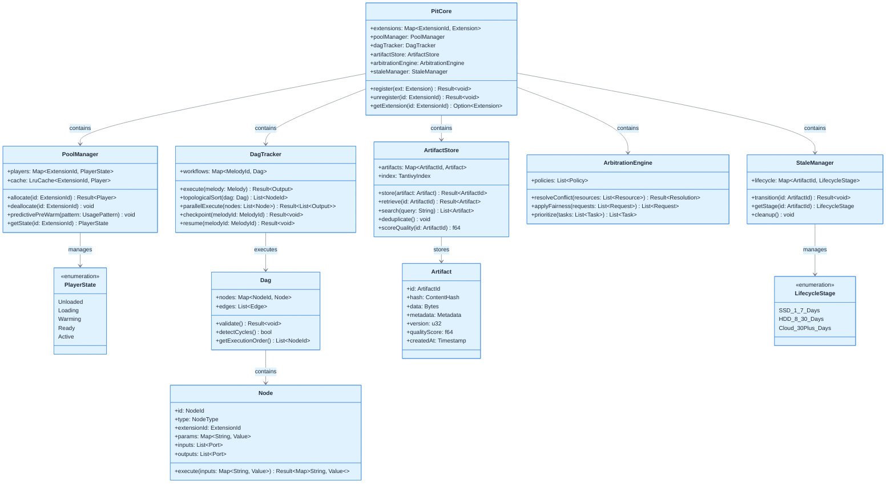

# Symphony IDE - Comprehensive Class Diagrams

This document contains focused class diagrams for the Symphony IDE system, organized by architectural layers for better readability and navigation.

---

## 1. Foundation Layer & Core Extension API

This diagram shows the foundational components: Core orchestration host, type system, configuration management, and the base Extension API that all extensions implement.

---

## 2. The Pit - AIDE Layer (High-Performance In-Process Execution)

This diagram focuses on The Pit's five core components that enable 50-100ns latency execution: Pool Manager, DAG Tracker, Artifact Store, Arbitration Engine, and Stale Manager.

---

## 3. IPC Communication Backbone & Conductor (RL Orchestration)

This diagram shows the inter-process communication infrastructure and the Python-based Conductor that uses reinforcement learning for intelligent workflow generation.

---

## 4. Orchestra Kit - Extension Ecosystem Management

This diagram covers the complete extension lifecycle: Registry, Marketplace, Installer, Lifecycle (Chambering), Security, and the Carets CLI/SDK toolchain.

---

## 5. Orchestration Engine, Harmony Board & Bootstrap System

This diagram shows workflow orchestration (Maestro/Manual modes), the visual Harmony Board designer, and the phased bootstrap initialization system.

---

## 6. IDE Layer, Applications & Infrastructure Services

This diagram covers traditional IDE features (file operations, LSP, UI bridge), the three application types (Desktop, Server, Terminal), and infrastructure services (logging, hooks).

---

## Summary

The Symphony IDE class diagrams have been decomposed into **6 focused diagrams**, each covering a specific architectural layer:

1. **Foundation Layer & Core Extension API** - Core orchestration, type system, configuration, and base Extension interface with Player Policy
2. **The Pit (AIDE Layer)** - High-performance in-process execution with Pool Manager, DAG Tracker, Artifact Store, Arbitration Engine, and Stale Manager
3. **IPC Communication & Conductor** - Inter-process messaging infrastructure and Python-based RL orchestration
4. **Orchestra Kit & Extension Ecosystem** - Complete extension lifecycle management including Registry, Marketplace, Installer, Chambering, Security, and Carets CLI/SDK
5. **Orchestration Engine, Harmony Board & Bootstrap** - Workflow orchestration modes, visual designer, Polyphony Store, and phased initialization
6. **IDE Layer, Applications & Infrastructure** - Traditional IDE features, three application types, and infrastructure services

Each diagram maintains clean relationships and logical grouping while providing complete coverage of the Symphony IDE architecture. Classes that appear in multiple contexts (like `Core`, `Dag`, `Melody`) are duplicated where necessary to keep diagrams self-contained and readable.
