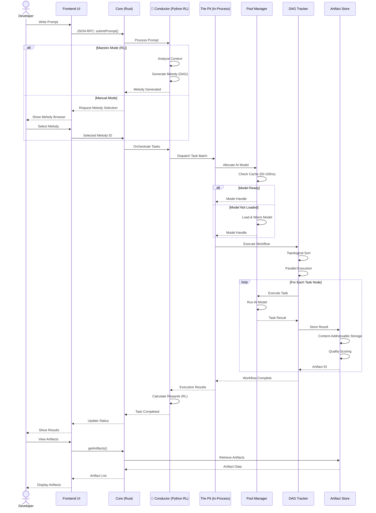
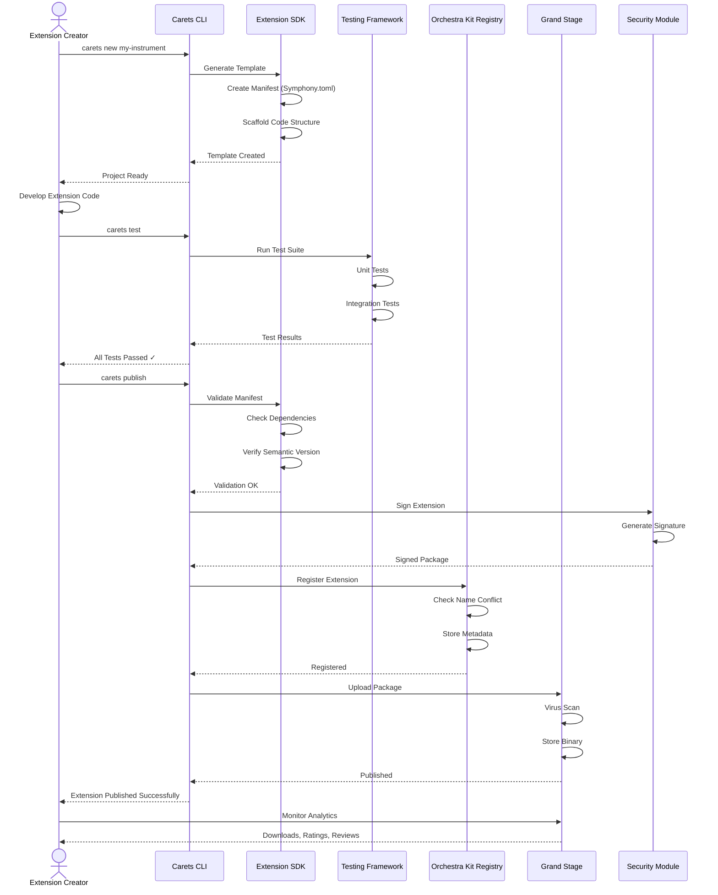
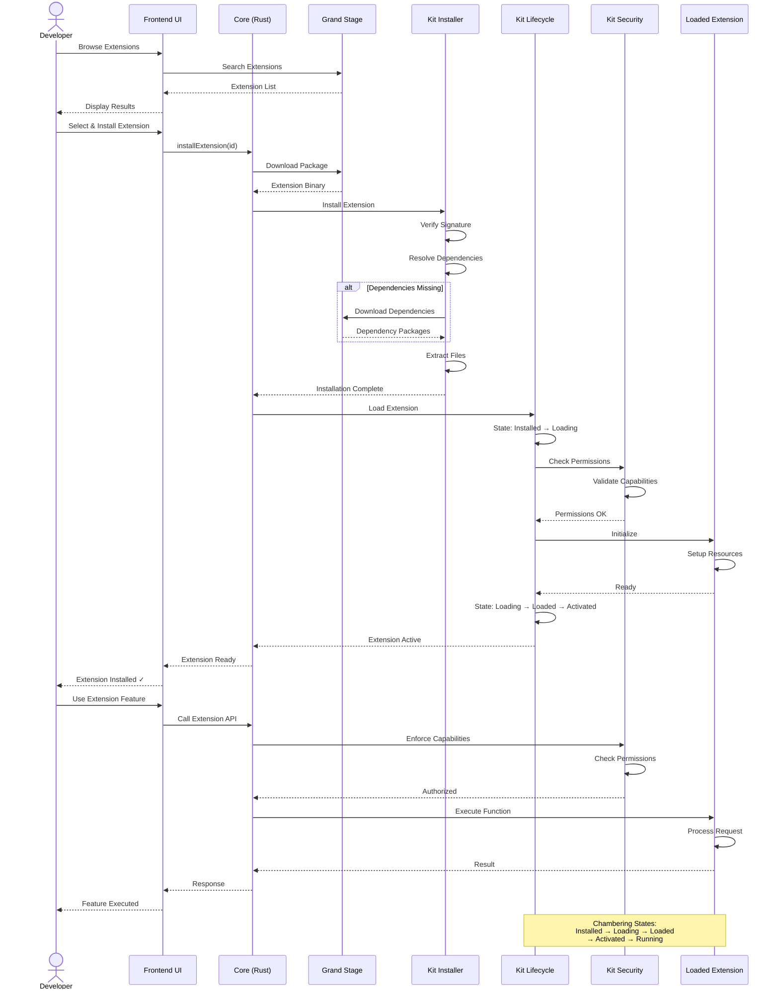
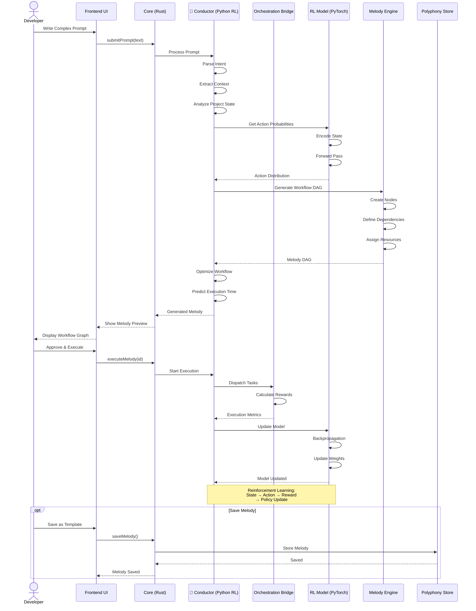
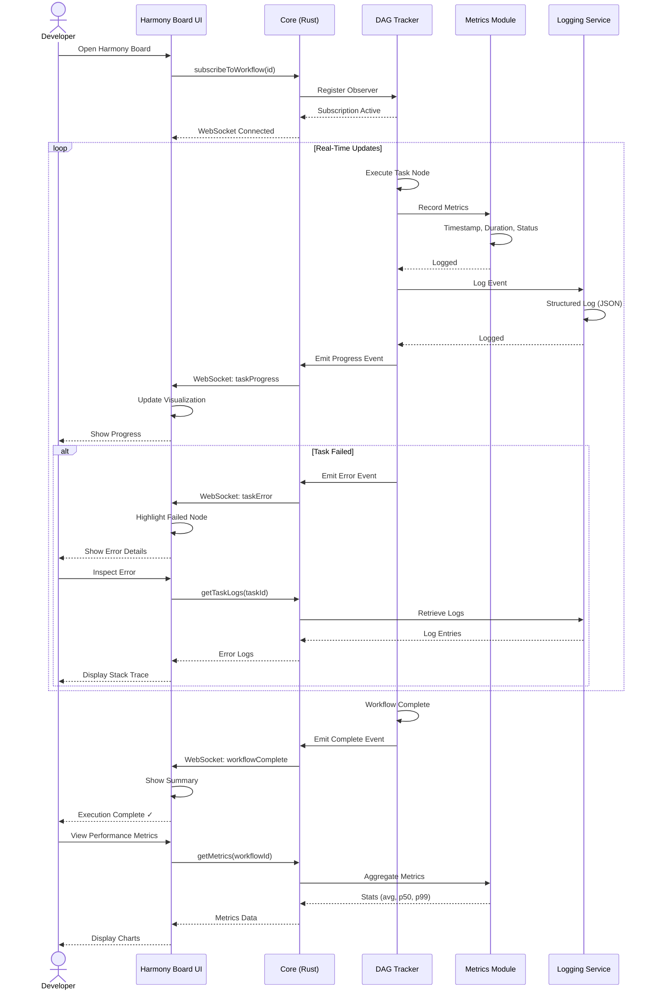
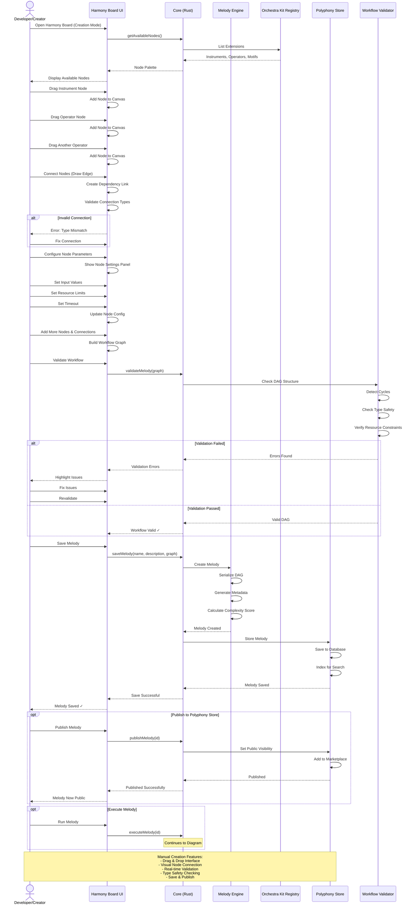
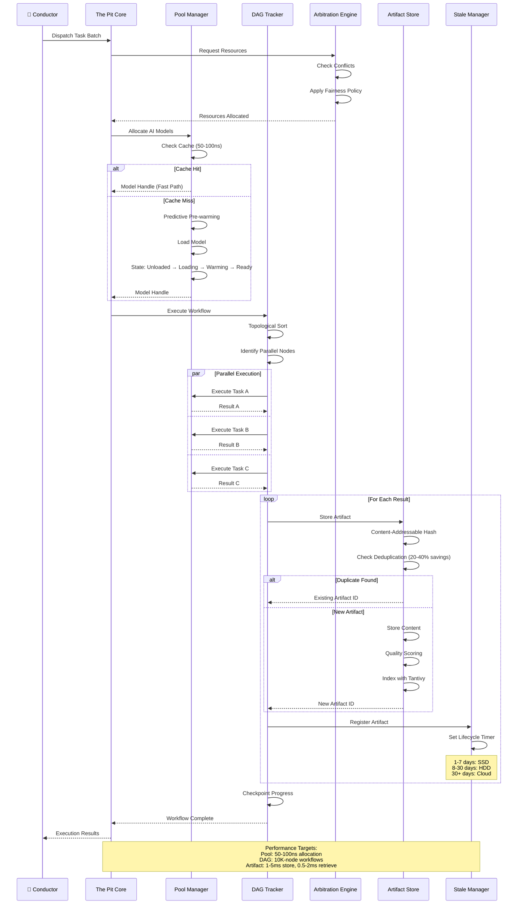
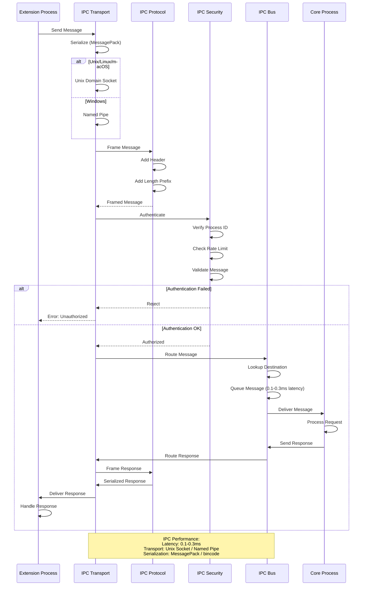
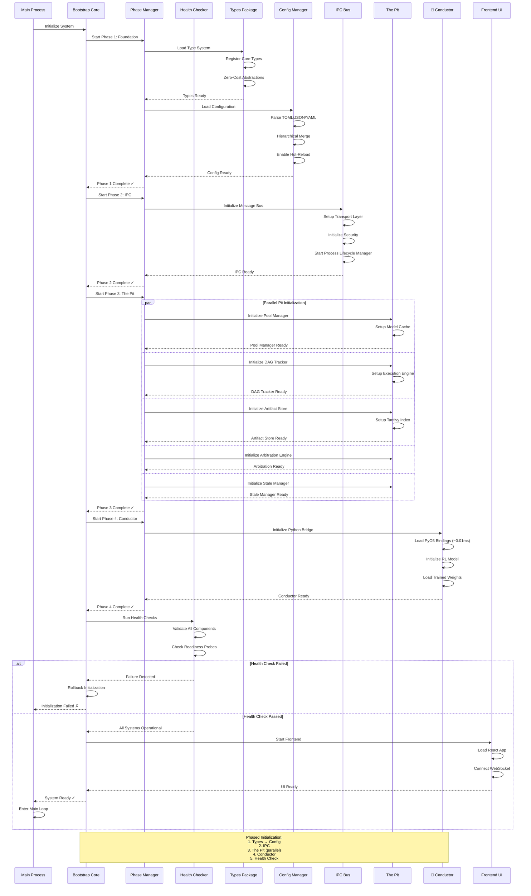

# Symphony IDE - Comprehensive Sequence Diagrams

> **Purpose**: This document provides detailed sequence diagrams covering all major workflows in Symphony IDE, showing interactions between actors, components, and systems.

---

## 1. Developer Workflow: Execute Melody (AI-Driven)

---

## 2. Extension Creator Workflow: Build & Publish Extension

---

## 3. Developer Workflow: Install & Use Extension

---

## 4. Conductor Workflow: Generate Melody from Prompt

---

## 5. Harmony Board: Real-Time Monitoring

---

## 6. Manual Melody Creation: Harmony Board Drag & Drop

---

## 7. The Pit: High-Performance Task Execution

---

## 8. IPC Communication: Cross-Process Messaging

---

## 9. Bootstrap Sequence: System Initialization

---

## Key Architectural Patterns

### Performance Characteristics
- **Pool Manager**: 50-100ns allocation (cache hit), >80% prediction accuracy
- **DAG Tracker**: 10,000-node workflows, parallel execution
- **Artifact Store**: 1-5ms store, 0.5-2ms retrieve, 20-40% dedup savings
- **IPC Bus**: 0.1-0.3ms message latency
- **Conductor Bridge**: ~0.01ms PyO3 overhead

### Execution Models
- **In-Process (The Pit)**: 50-100ns latency, 1M+ ops/sec
- **Out-of-Process (UFE)**: 0.1-0.5ms latency, isolated processes
- **Python Conductor**: 0.5-2ms latency, RL orchestration

### State Machines
- **Extension Lifecycle (Chambering)**: Installed → Loading → Loaded → Activated → Running → Paused → Error
- **Model Lifecycle**: Unloaded → Loading → Warming → Ready → Active
- **Artifact Lifecycle**: 1-7 days SSD → 8-30 days HDD → 30+ days Cloud

---

## Glossary

- **Conductor (🎩)**: AI orchestration engine using reinforcement learning
- **Melody (🎵)**: Composable workflow (DAG of tasks)
- **The Pit**: High-performance in-process extension layer
- **Orchestra Kit (🎭)**: Extension management system
- **Harmony Board (🎛️)**: Visual workflow monitoring dashboard
- **Instrument (🎻)**: AI/ML model extension
- **Operator (⚙️)**: Workflow utility extension
- **Motif (🧩)**: UI/UX enhancement extension
- **Chambering**: Extension lifecycle state machine
- **Artifact**: Generated output (code, docs, tests, config)
- **Grand Stage**: Extension marketplace
- **Polyphony Store**: Melody (workflow) marketplace
