# Symphony IDE - Use Case Diagram

> **Purpose**: This diagram accurately represents Symphony's use cases using correct terminology, showing relationships between actors and system functions with proper `<<include>>` and `<<extend>>` metadata.

## Legend

- **Actors**: Developer, Extension Creator, Conductor (AI), Orchestra Kit (System)
- **Extension Types**: 🎻 Instrument (AI/ML) | ⚙️ Operator (Workflow) | 🧩 Motif (UI/UX)
- **`<<include>>`**: Required dependency (use case A requires use case B)
- **`<<extend>>`**: Optional extension (use case B optionally extends use case A)

---

## Use Case Diagram

```mermaid
%%{init: {
  'theme':'base',
  'themeVariables': {
    'primaryColor':'#f8f9fa',
    'primaryTextColor':'#212529',
    'primaryBorderColor':'#4a90e2',
    'lineColor':'#4a90e2',
    'secondaryColor':'#ffffff',
    'tertiaryColor':'#e8f4f8',
    'actorBkg':'#f8f9fa',
    'actorBorder':'#4a90e2',
    'actorTextColor':'#212529',
    'actorLineColor':'#4a90e2',
    'fontSize':'14px',
    'fontFamily':'Inter, -apple-system, system-ui, sans-serif'
  }
}}%%

graph TB
    subgraph Symphony["Symphony IDE System"]
        
        %% Developer Use Cases
        ManageProject["Manage Project"]
        EditCode["Edit Code"]
        WritePrompt["Write Prompt"]
        BrowseMelodies["Browse Melodies 🎵"]
        ExecuteMelody["Execute Melody 🎵"]
        MonitorTasks["Monitor Tasks"]
        ViewArtifacts["View Artifacts"]
        ManageArtifacts["Manage Artifacts"]
        BrowseExtensions["Browse Extensions"]
        InstallExtension["Install Extension"]
        ConfigureExtension["Configure Extension"]
        UninstallExtension["Uninstall Extension"]
        
        %% Extension Creator Use Cases
        BuildExtension["Build Extension<br/>(🎻 Instrument | ⚙️ Operator | 🧩 Motif)"]
        TestExtension["Test Extension"]
        PublishExtension["Publish Extension"]
        UpdateExtension["Update Extension"]
        CreateMelody["Create Melody 🎵"]
        PublishMelody["Publish Melody 🎵"]
        ViewAnalytics["View Analytics"]
        MonitorReviews["Monitor Reviews"]
        
        %% Conductor Use Cases (Internal)
        OrchestrateTasks["🎩 Orchestrate Tasks<br/>(Conductor)"]
        GenerateMelody["🎩 Generate Melody<br/>(Conductor)"]
        DispatchToPit["🎩 Dispatch to Pit<br/>(Conductor)"]
        
        %% Orchestra Kit Use Cases (Internal)
        LoadExtension["🎭 Load Extension<br/>(Orchestra Kit)"]
        ManageLifecycle["🎭 Manage Lifecycle<br/>(Orchestra Kit)"]
        EnforceSecurity["🎭 Enforce Security<br/>(Orchestra Kit)"]
        
    end
    
    %% Actors
    Developer((Developer))
    ExtensionCreator((Extension<br/>Creator))
    
    %% Developer Connections
    Developer --> ManageProject
    Developer --> EditCode
    Developer --> WritePrompt
    Developer --> BrowseMelodies
    Developer --> ExecuteMelody
    Developer --> MonitorTasks
    Developer --> ViewArtifacts
    Developer --> ManageArtifacts
    Developer --> BrowseExtensions
    Developer --> InstallExtension
    Developer --> ConfigureExtension
    Developer --> UninstallExtension
    
    %% Extension Creator Connections
    ExtensionCreator --> BuildExtension
    ExtensionCreator --> PublishExtension
    ExtensionCreator --> UpdateExtension
    ExtensionCreator --> CreateMelody
    ExtensionCreator --> PublishMelody
    ExtensionCreator --> ViewAnalytics
    ExtensionCreator --> MonitorReviews
    
    %% Include Relationships (Required)
    ExecuteMelody -.->|"<<include>>"| OrchestrateTasks
    OrchestrateTasks -.->|"<<include>>"| DispatchToPit
    InstallExtension -.->|"<<include>>"| LoadExtension
    LoadExtension -.->|"<<include>>"| ManageLifecycle
    ManageLifecycle -.->|"<<include>>"| EnforceSecurity
    BuildExtension -.->|"<<include>>"| TestExtension
    PublishExtension -.->|"<<include>>"| TestExtension
    
    %% Extend Relationships (Optional)
    GenerateMelody -.->|"<<extend>>"| ExecuteMelody
    ViewAnalytics -.->|"<<extend>>"| PublishExtension
    MonitorReviews -.->|"<<extend>>"| PublishExtension
    ConfigureExtension -.->|"<<extend>>"| InstallExtension
    
    style OrchestrateTasks fill:#e8f4f8
    style GenerateMelody fill:#e8f4f8
    style DispatchToPit fill:#e8f4f8
    style LoadExtension fill:#e8f4f8
    style ManageLifecycle fill:#e8f4f8
    style EnforceSecurity fill:#e8f4f8
```

---

## Use Case Descriptions

### Developer Use Cases

| Use Case | Description | Includes | Extends |
|----------|-------------|----------|---------|
| **Manage Project** | Create, open, configure projects | - | - |
| **Edit Code** | Edit source code files | - | - |
| **Write Prompt** | Submit natural language prompts to Conductor | - | - |
| **Browse Melodies** | Browse available workflows from Polyphony Store | - | - |
| **Execute Melody** | Run a workflow (DAG of tasks) | Orchestrate Tasks | Generate Melody (optional) |
| **Monitor Tasks** | View real-time task execution status | - | - |
| **View Artifacts** | View generated artifacts (code, docs, tests) | - | - |
| **Manage Artifacts** | Organize, version, and delete artifacts | - | - |
| **Browse Extensions** | Browse Orchestra Kit/Grand Stage marketplace | - | - |
| **Install Extension** | Install extension from marketplace | Load Extension | Configure Extension (optional) |
| **Configure Extension** | Configure extension settings | - | - |
| **Uninstall Extension** | Remove installed extension | - | - |

### Extension Creator Use Cases

| Use Case | Description | Includes | Extends |
|----------|-------------|----------|---------|
| **Build Extension** | Develop Instrument (🎻), Operator (⚙️), or Motif (🧩) | Test Extension | - |
| **Test Extension** | Test extension functionality | - | - |
| **Publish Extension** | Publish to Orchestra Kit marketplace | Test Extension | View Analytics, Monitor Reviews (optional) |
| **Update Extension** | Update existing extension | - | - |
| **Create Melody** | Create custom workflow (DAG) | - | - |
| **Publish Melody** | Publish to Polyphony Store | - | - |
| **View Analytics** | View download/usage statistics | - | - |
| **Monitor Reviews** | Monitor user reviews and ratings | - | - |

### System Use Cases (Internal Actors)

| Use Case | Actor | Description | Includes |
|----------|-------|-------------|----------|
| **Orchestrate Tasks** | Conductor (🎩) | AI orchestration using RL model | Dispatch to Pit |
| **Generate Melody** | Conductor (🎩) | Auto-generate workflows from prompts | - |
| **Dispatch to Pit** | Conductor (🎩) | Send tasks to high-performance Pit layer | - |
| **Load Extension** | Orchestra Kit (🎭) | Load extension into memory | Manage Lifecycle |
| **Manage Lifecycle** | Orchestra Kit (🎭) | Manage Chambering states (Installed→Running) | Enforce Security |
| **Enforce Security** | Orchestra Kit (🎭) | Apply capability-based permissions | - |

---

## Key Corrections from Previous Version

### ✅ Fixed Issues:

1. **"Build Addon" → "Build Extension"**
   - Now correctly shows all three types: 🎻 Instrument, ⚙️ Operator, 🧩 Motif
   - Previous version only showed Operator

2. **Added `<<include>>` and `<<extend>>` Metadata**
   - `<<include>>`: Required dependencies (dashed arrows)
   - `<<extend>>`: Optional extensions (dashed arrows)
   - Previous version had no metadata

3. **Used Correct Symphony Terminology**
   - Melody (not "workflow")
   - Conductor (not "AI Core")
   - Orchestra Kit (not "Extension System")
   - Instrument/Operator/Motif (not generic "extension")
   - The Pit (for high-performance operations)
   - Chambering (lifecycle states)

4. **Unified Color Scheme**
   - Matches ERD diagram colors (#4a90e2 primary)
   - Consistent typography (Inter font)
   - System actors highlighted in light blue (#e8f4f8)

5. **Accurate Relationships**
   - Execute Melody **includes** Orchestrate Tasks (required)
   - Generate Melody **extends** Execute Melody (optional, Conductor-driven)
   - Install Extension **includes** Load Extension → Manage Lifecycle → Enforce Security (chain)
   - Build Extension **includes** Test Extension (required before publish)

---

## Glossary

- **Conductor (🎩)**: AI orchestration engine using reinforcement learning
- **Melody (🎵)**: Composable workflow (DAG of tasks)
- **Orchestra Kit (🎭)**: Extension management system
- **Instrument (🎻)**: AI/ML model extension
- **Operator (⚙️)**: Workflow utility extension
- **Motif (🧩)**: UI/UX enhancement extension
- **The Pit**: High-performance in-process extension layer (50-100ns latency)
- **Chambering**: Extension lifecycle state machine (Installed→Loaded→Activated→Running)
- **Artifact**: Generated output (code, documentation, tests, config, etc.)
