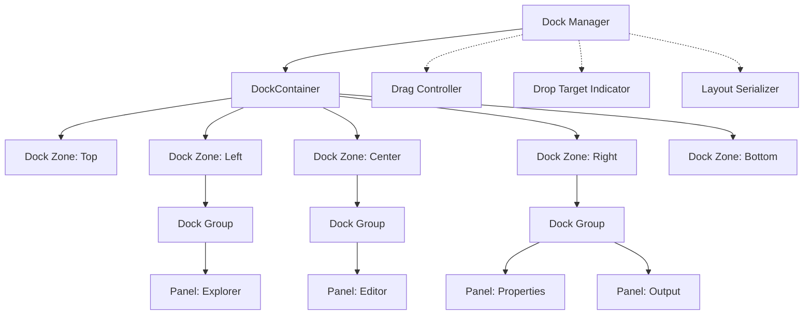

# Docking System

# Guide to Building a Blockable UI System

## Introduction

A blockable UI system (also known as a dockable panel system) allows users to customize their workspace by rearranging UI components. This guide explains how to implement such a system for Symphony IDE, similar to what you’d find in Visual Studio, VS Code, or JetBrains IDEs.

## Core Concepts

### 1. Key Components

- **Dock Container**: The root container that manages all panels
- **Dock Panel**: Individual UI components that can be moved around
- **Dock Zone**: Areas where panels can be docked (top, right, bottom, left, center)
- **Dock Group**: Multiple panels stacked together (usually as tabs)
- **Splitter**: Resizable divider between panels or groups

### 2. Panel States

- **Docked**: Panel is attached to a specific zone
- **Floating**: Panel is in its own window, detached from the main interface
- **Tabbed**: Panel is grouped with other panels in a tab container
- **Auto-hidden**: Panel is minimized to the edge of the window
- **Maximized**: Panel takes up the entire dock container

## Architecture Overview

[Online FlowChart & Diagrams Editor - Mermaid Live Editor](https://mermaid.live/view#pako:eNqFk0FPgzAUgP9K887bAhTG6MGDmzEmGo3u5ODQjDfWCG1TS6Iu--8W2MaImePS98r3vdc27Q7WKkdgUBiut2S5SCVx30KtP5645AWaVROTQ5KR8fim_TtX0nIh0fTCaeoEvSuJflegCRlZKp1dE4Jz4RE39qpBz405SusWes0Jz51XUWyvt4nOlVtlraqc01vt4k_GvVG1Pmy-jbMhSYdkcJkMhyQdkj3bdWzhFy6x9FftwMjdly6VGRxK17NngxObC6v-kLQn6ZF8MUqjsQI__6HDI_1cW13bwXoPd4qMJ832DC-aYzeqLJtL51LS59lFS-klNwXaVROSLiYPMhdrPtzHwHvk36q2b2gEL8WP69dNkH4mg5F7EyIHZk2NI6jQVLxJYdfUTMFuscIUmAtz3PC6tCmkcu80zeW7UtXRdCdSbIFtePnpslrn3OJCcPfgegRljmauammB-XTW1gC2gy9gYz9OJl4Y-15IaTD1ooiO4NthEZ0kSTIN6GwWxUkQxfsR_LR9_Ynn-TSOoimdxUkS-_tf0AREzg)



## Implementation Strategy

### 1. Layout Data Structure

The foundation of a blockable system is a flexible layout data structure. We’ll use a composite pattern:

```tsx
// Base interface for all layout elements
interface LayoutElement {
  id: string;
  type: 'panel' | 'group' | 'zone' | 'splitter';
  parent?: LayoutElement;
}

// A panel containing actual content
interface Panel extends LayoutElement {
  type: 'panel';
  component: React.ComponentType<any>;
  title: string;
  icon?: string;
  closable: boolean;
}

// A group containing multiple panels as tabs
interface Group extends LayoutElement {
  type: 'group';
  children: Panel[];
  activeIndex: number;
}

// A zone is a docking area (top, left, right, bottom, center)
interface Zone extends LayoutElement {
  type: 'zone';
  position: 'top' | 'left' | 'right' | 'bottom' | 'center';
  children: (Group | Splitter)[];
}

// A splitter divides space between elements
interface Splitter extends LayoutElement {
  type: 'splitter';
  direction: 'horizontal' | 'vertical';
  ratio: number; // 0-1 ratio for dividing space
  first: Group | Splitter;
  second: Group | Splitter;
}

// The root container
interface DockContainer {
  zones: {
    top: Zone;
    left: Zone;
    right: Zone;
    bottom: Zone;
    center: Zone;
  };
  floating: Group[]; // Detached floating windows
}

```

### 2. Core Components Implementation

Let’s implement the core React components needed for our blockable system:

### DockManager Component

This is the main controller that manages the entire docking system:

```tsx
import React, { useState, useCallback } from 'react';

interface DockManagerProps {
  initialLayout: DockContainer;
  onLayoutChange?: (layout: DockContainer) => void;
}

export const DockManager: React.FC<DockManagerProps> = ({
  initialLayout,
  onLayoutChange,
}) => {
  const [layout, setLayout] = useState<DockContainer>(initialLayout);
  const [dragState, setDragState] = useState<{
    dragging: boolean;
    panel: Panel | null;
    sourceGroup: Group | null;
  }>({
    dragging: false,
    panel: null,
    sourceGroup: null,
  });

  // Update layout and notify parent
  const updateLayout = useCallback(
    (newLayout: DockContainer) => {
      setLayout(newLayout);
      onLayoutChange?.(newLayout);
    },
    [onLayoutChange]
  );

  // Handle panel drag start
  const handleDragStart = useCallback((panel: Panel, sourceGroup: Group) => {
    setDragState({
      dragging: true,
      panel,
      sourceGroup,
    });
  }, []);

  // Handle panel drop
  const handleDrop = useCallback(
    (targetInfo: {
      targetType: 'zone' | 'group' | 'panel';
      target: Zone | Group | Panel;
      position?: 'left' | 'right' | 'top' | 'bottom' | 'center';
    }) => {
      if (!dragState.dragging || !dragState.panel) return;

      // Clone the current layout to make modifications
      const newLayout = structuredClone(layout);

      // Remove panel from source group
      // Add panel to target based on targetInfo
      // Complex logic to modify the layout based on drop target...

      // Reset drag state
      setDragState({
        dragging: false,
        panel: null,
        sourceGroup: null,
      });

      // Update the layout
      updateLayout(newLayout);
    },
    [dragState, layout, updateLayout]
  );

  return (
    <div className="dock-manager">
      <DockContainer
        layout={layout}
        onDragStart={handleDragStart}
        onDrop={handleDrop}
      />
      {dragState.dragging && (
        <DropTargetIndicator draggedPanel={dragState.panel} />
      )}
    </div>
  );
};

```

### DockContainer Component

Renders the main container with all zones:

```tsx
interface DockContainerProps {
  layout: DockContainer;  onDragStart: (panel: Panel, sourceGroup: Group) => void;  onDrop: (targetInfo: any) => void;}
const DockContainer: React.FC<DockContainerProps> = ({
  layout,  onDragStart,  onDrop
}) => {
  return (
    <div className="dock-container">      {Object.entries(layout.zones).map(([position, zone]) => (
        <DockZone
          key={position}
          zone={zone}
          onDragStart={onDragStart}
          onDrop={onDrop}
        />      ))}
      {layout.floating.map(group => (
        <FloatingGroup
          key={group.id}
          group={group}
          onDragStart={onDragStart}
          onDrop={onDrop}
        />      ))}
    </div>  );};
```

### DockZone Component

Renders a specific docking zone:

```tsx
interface DockZoneProps {
  zone: Zone;
  onDragStart: (panel: Panel, sourceGroup: Group) => void;
  onDrop: (targetInfo: any) => void;
}

const DockZone: React.FC<DockZoneProps> = ({
  zone,
  onDragStart,
  onDrop,
}) => {
  const handleDragOver = (e: React.DragEvent) => {
    e.preventDefault();
    e.dataTransfer.dropEffect = 'move';
  };

  const handleDrop = (e: React.DragEvent) => {
    e.preventDefault();
    onDrop({
      targetType: 'zone',
      target: zone,
      position: 'center',
    });
  };

  return (
    <div
      className={`dock-zone dock-zone-${zone.position}`}
      onDragOver={handleDragOver}
      onDrop={handleDrop}
    >
      {zone.children.map(child =>
        child.type === 'group' ? (
          <DockGroup
            key={child.id}
            group={child as Group}
            onDragStart={onDragStart}
            onDrop={onDrop}
          />
        ) : (
          <DockSplitter
            key={child.id}
            splitter={child as Splitter}
            onDragStart={onDragStart}
            onDrop={onDrop}
          />
        )
      )}
    </div>
  );
};

```

### 3. Drag and Drop System

The drag and drop system is the heart of a blockable UI. Here’s how to implement it:

### Panel Header with Drag Handle

```tsx
interface PanelHeaderProps {
  panel: Panel;
  group: Group;
  active: boolean;
  onActivate: () => void;
  onClose?: () => void;
  onDragStart: (panel: Panel, group: Group) => void;
}

const PanelHeader: React.FC<PanelHeaderProps> = ({
  panel,
  group,
  active,
  onActivate,
  onClose,
  onDragStart,
}) => {
  const handleDragStart = (e: React.DragEvent) => {
    // Set data transfer for HTML5 drag and drop
    e.dataTransfer.setData(
      'application/json',
      JSON.stringify({
        panelId: panel.id,
        groupId: group.id,
      })
    );

    // Set a drag image (optional)
    const dragImage = document.createElement('div');
    dragImage.textContent = panel.title;
    dragImage.className = 'panel-drag-image';
    document.body.appendChild(dragImage);
    e.dataTransfer.setDragImage(dragImage, 0, 0);

    // Notify parent about drag start
    onDragStart(panel, group);

    // Clean up drag image after a short delay
    setTimeout(() => {
      document.body.removeChild(dragImage);
    }, 0);
  };

  return (
    <div
      className={`panel-header ${active ? 'active' : ''}`}
      onClick={onActivate}
      draggable={true}
      onDragStart={handleDragStart}
    >
      {panel.icon && <span className="panel-icon">{panel.icon}</span>}
      <span className="panel-title">{panel.title}</span>
      {panel.closable && (
        <button className="panel-close" onClick={onClose}>
          ×
        </button>
      )}
    </div>
  );
};

```

### Drop Target Indicator

This component shows where the panel will be docked when dropped:

```tsx
interface DropTargetIndicatorProps {
  draggedPanel: Panel | null;
}

const DropTargetIndicator: React.FC<DropTargetIndicatorProps> = ({ draggedPanel }) => {
  const [position, setPosition] = useState({ x: 0, y: 0 });
  const [dropZone, setDropZone] = useState<{
    element: HTMLElement | null;
    position: 'left' | 'right' | 'top' | 'bottom' | 'center';
  }>({
    element: null,
    position: 'center',
  });

  // Update indicator position based on mouse movement
  useEffect(() => {
    const handleMouseMove = (e: MouseEvent) => {
      setPosition({ x: e.clientX, y: e.clientY });

      // Find potential drop targets under the cursor
      const elementsUnderCursor = document.elementsFromPoint(e.clientX, e.clientY);
      const dropTarget = elementsUnderCursor.find(el =>
        el.classList.contains('dock-zone') ||
        el.classList.contains('dock-group') ||
        el.classList.contains('panel-header')
      ) as HTMLElement | undefined;

      if (dropTarget) {
        // Calculate which part of the target the cursor is over
        const rect = dropTarget.getBoundingClientRect();
        const relX = e.clientX - rect.left;
        const relY = e.clientY - rect.top;
        const width = rect.width;
        const height = rect.height;

        // Determine drop position (center, top, right, bottom, left)
        let position: 'left' | 'right' | 'top' | 'bottom' | 'center' = 'center';

        const centerThreshold = 0.2; // 20% from each edge
        const inCenterX = relX > width * centerThreshold && relX < width * (1 - centerThreshold);
        const inCenterY = relY > height * centerThreshold && relY < height * (1 - centerThreshold);

        if (inCenterX && inCenterY) {
          position = 'center';
        } else {
          const distToLeft = relX;
          const distToRight = width - relX;
          const distToTop = relY;
          const distToBottom = height - relY;
          const minDist = Math.min(distToLeft, distToRight, distToTop, distToBottom);

          if (minDist === distToLeft) position = 'left';
          else if (minDist === distToRight) position = 'right';
          else if (minDist === distToTop) position = 'top';
          else position = 'bottom';
        }

        setDropZone({
          element: dropTarget,
          position,
        });
      } else {
        setDropZone({
          element: null,
          position: 'center',
        });
      }
    };

    document.addEventListener('mousemove', handleMouseMove);
    return () => {
      document.removeEventListener('mousemove', handleMouseMove);
    };
  }, [draggedPanel]);

  if (!draggedPanel || !dropZone.element) return null;

  // Render different indicators based on drop position
  const renderIndicator = () => {
    const rect = dropZone.element?.getBoundingClientRect();
    if (!rect) return null;

    switch (dropZone.position) {
      case 'center':
        return (
          <div
            className="drop-indicator drop-indicator-center"
            style={{
              left: rect.left,
              top: rect.top,
              width: rect.width,
              height: rect.height,
            }}
          />
        );
      case 'left':
        return (
          <div
            className="drop-indicator drop-indicator-left"
            style={{
              left: rect.left,
              top: rect.top,
              width: rect.width * 0.5,
              height: rect.height,
            }}
          />
        );
      // Add cases for right, top, bottom as needed
      default:
        return null;
    }
  };

  return (
    <>
      <div
        className="drag-preview"
        style={{
          left: position.x + 15,
          top: position.y + 15,
        }}
      >
        {draggedPanel.title}
      </div>
      {renderIndicator()}
    </>
  );
};

```