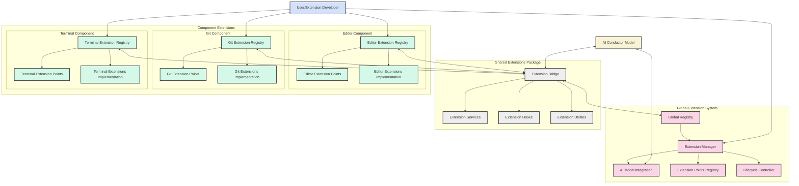
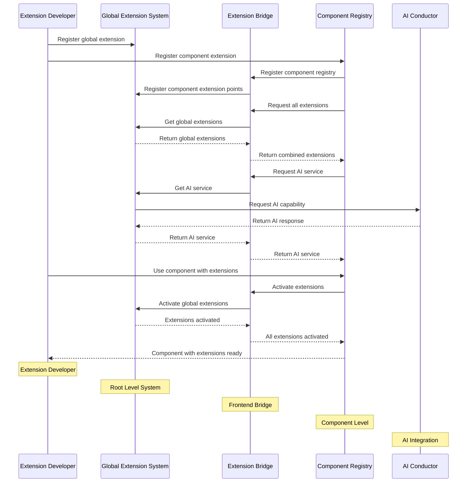
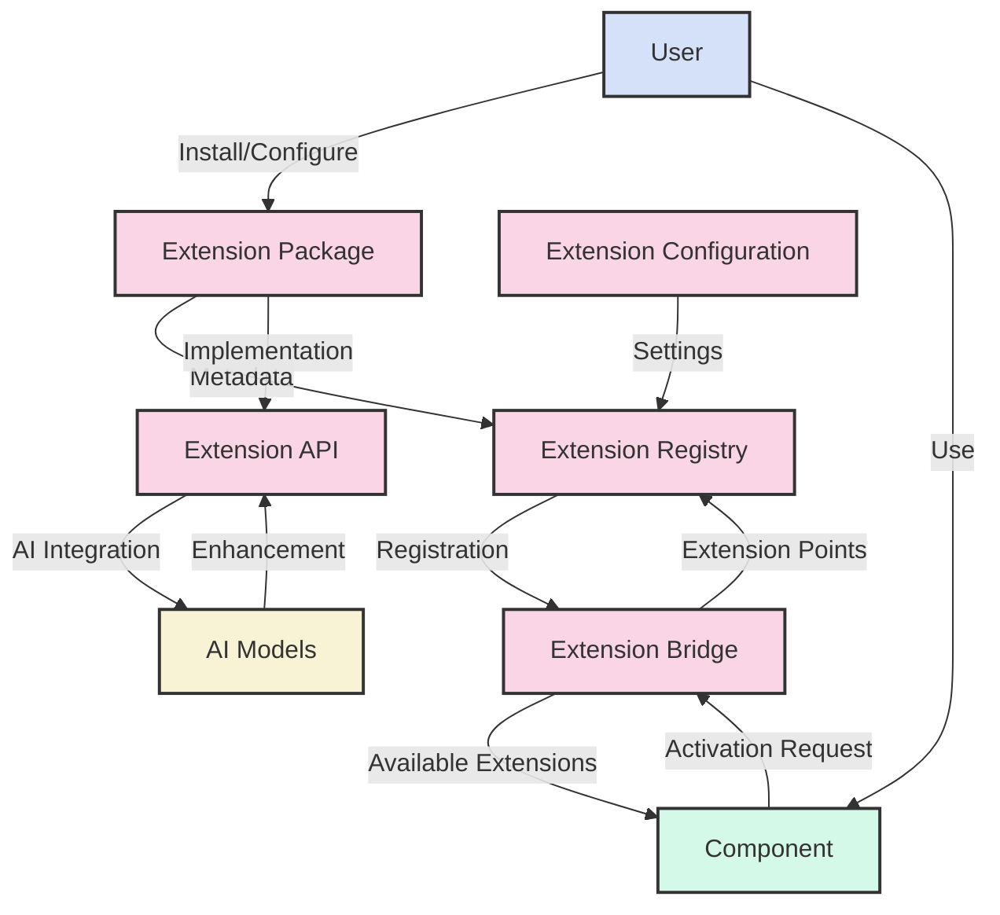
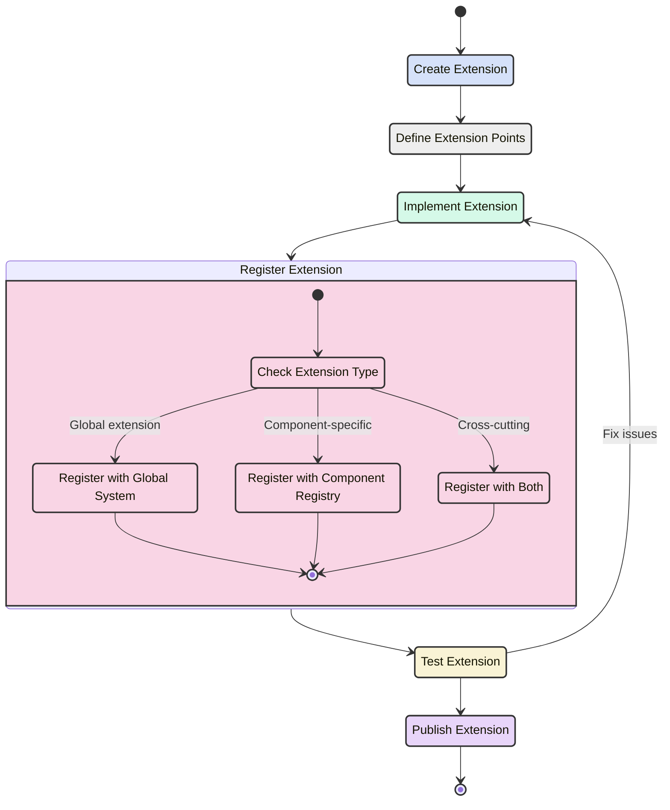
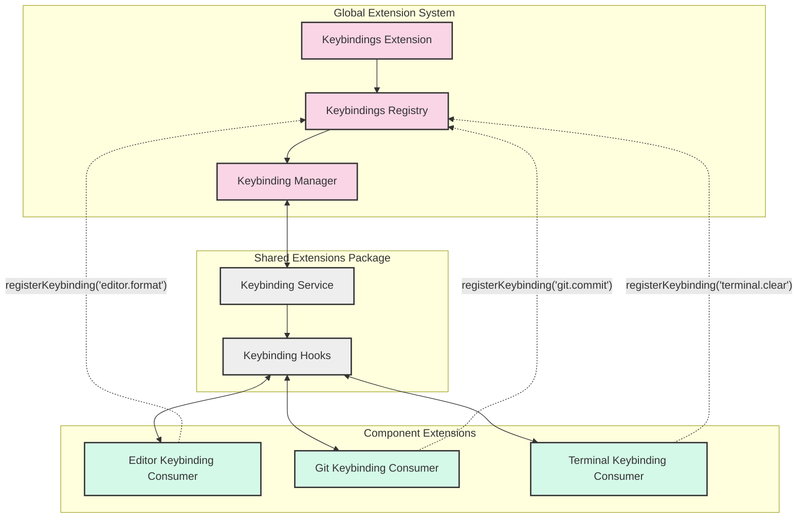
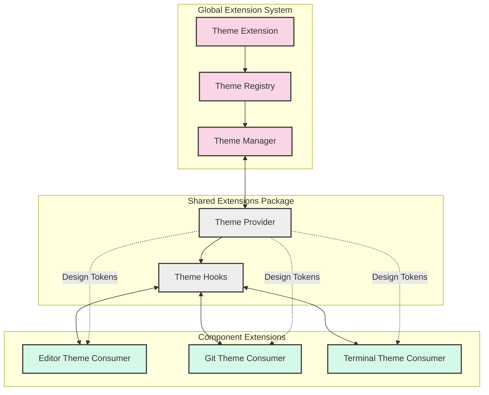
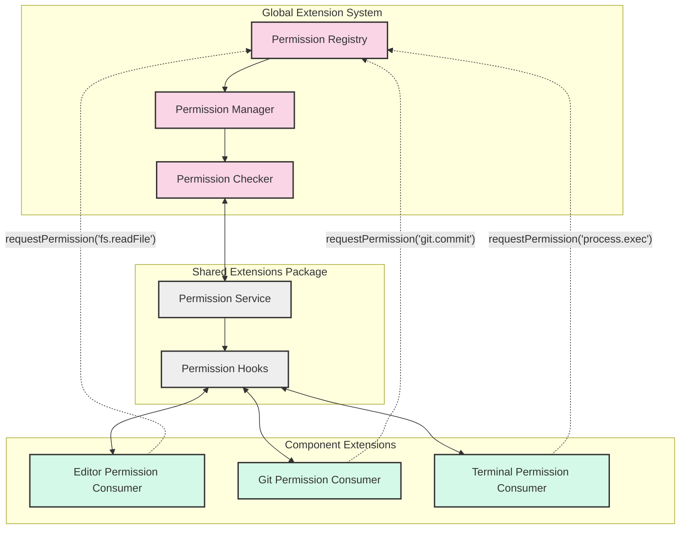

# Draft Implementations

## Overview

Symphony uses a **three-tier extension architecture** designed to support scalable, modular, and flexible development across the IDE. The tiers are:

1. **Global Extension System** – Located at the root level; handles centralized, IDE-wide functionality.
2. **Shared Extensions Package** – Resides in the frontend monorepo; serves as a bridge and shared service layer.
3. **Component-specific Extensions** – Located within individual components; enables localized extension logic and behavior.

This design ensures separation of concerns, reusability of shared logic, and ease of integration for new features.

---

## 1. Global Extension System

**Directory:** `symphony-ide/extensions/`

- **Purpose:** Hosts centralized features applicable across the entire IDE.
- **Contains:**
    - `registry/`: Handles global registry logic, lifecycle management, and extension points.
    - `builtin/`: Built-in extensions like themes, keybindings, and AI features.

### Key Files:

- `registry.ts`: Global registry implementation.
- `extension-points.ts`: Defines extension interfaces.
- `lifecycle.ts`: Manages loading/unloading lifecycle.

---

## 2. Shared Extensions Package

**Directory:** `frontend/shared/extension-bridge/`

- **Purpose:**
    - Acts as a bridge between global and component-specific extensions.
    - Provides shared utilities, services, and React hooks.

### Key Files:

- `bridge.ts`: Core bridge logic.
- `services.ts`: Shared service layer for extensions.
- `hooks.ts`: React hooks for consumption.
- `utilities.ts`: Helper functions.

---

## 3. Component-specific Extensions

**Directory:** `frontend/components/<component>/`

- **Purpose:** Encapsulates local extension logic for a specific component.
- **Structure:**
    - `extensions/`: Folder containing registry, points, and implementations.

### Example (Editor):

- `registry.ts`: Local registry for Editor.
- `points.ts`: Local extension points.
- `implementations/`: Actual extensions.

---

## Extension System Architecture Diagram

### As plain Text

```
symphony-ide/
├── 📁 extensions/                     # Global Extension System (Root Level)
│   ├── registry/                      # Global extension registry
│   │   ├── src/
│   │   │   ├── registry.ts            # Main registry implementation
│   │   │   ├── extension-points.ts    # Global extension points
│   │   │   └── lifecycle.ts           # Extension lifecycle management
│   │   └── package.json
│   └── builtin/                       # Built-in extensions
│       ├── themes/                    # Global themes
│       ├── keybindings/               # Global keybindings
│       └── ai-features/               # AI-specific extensions
│
├── frontend/                          # Frontend monorepo
│   ├── shared/                        # Shared Extensions Package (Frontend Level)
│   │   ├── extension-bridge/          # Bridge between global and component extensions
│   │   │   ├── src/
│   │   │   │   ├── bridge.ts          # Extension bridge implementation
│   │   │   │   ├── services.ts        # Shared extension services
│   │   │   │   ├── hooks.ts           # React hooks for extensions
│   │   │   │   └── utilities.ts       # Extension utilities
│   │   │   └── package.json
│   │
│   ├── components/                    # Component Extensions (Component Level)
│   │   ├── <component>/
│   │   │   ├── src/
│   │   │   │   ├── extensions/        # Editor-specific extensions
│   │   │   │   │   ├── registry.ts    # Editor extension registry
│   │   │   │   │   ├── points.ts      # Editor extension points
│   │   │   │   │   └── implementations/ # Editor extension implementations
│   │   │   │   └── ...
│   │   │   └── package.json
│   │   │
│   │   │
│   │   |

```

### AS a Mermaid

[Online FlowChart & Diagrams Editor - Mermaid Live Editor](https://mermaid.live/view#pako:eNqVVttO4zAQ_RXLiDeXpVeaCCGVkA2V2qVqUmm1LUIhcVqL1K4SF-gi_n0dO20cEujip3jOmfHM6XjcNxiwEEMTLhN_swLe9YICsU5PwdgnFLg44ITRVFnT7aOiLaATs0c_BvYrxzQVDODuUo7X4HLKGAcj_IzjqwVUbtlypvPcZYqXJOXJ7r4A7fG8CDT2qb_EiQYPhvPBEIxFnjEYUo5FDllSeoCJFmDCCOVp3Tkjaz4iEQ52QYyBxShPWBzLo_REQaNxJVLS05OmwbBisicV08hSJkzDfVhNNnflJzgsZEvBxA-eRL3g8mciEhJeNeLZ11p51wkJl1gv3tVQFyfPJMCpjt9q-C1jTyVwpoEzTmLCifTWT1e1ulXTbdU0-6p8i603jGLKdQUuC2u1dM3ZDglnCTiwdZrMwHqY2s48pxVV1TRCTp94Vbbqnip3OJ6MKuwUDNebGK9FNvuWrMtJKZOd9xWanVDgmoAfrx7hn4vgKBEyzlEFHKlAmVpbvpOXX6Ierd0pqnOqtZfR_63dw8maUDFFPhXAUwIciEdV8KQKNfxaKbxciir_qB5eUbFX1aOM1ujxQRgxoa2EpWlD3NcEBIzS0qgW1_FSajvN9yq8tNn5kHdqbN4H2-GwQpcoZi950N_ew8y1p_NZipMfBeMmu8Zscxjie15pspaN8tgawPkM8HLgkKB4IrTHQZkHwwfr7tfNzPLuptkbImZ-uA2yKyxfk_sqS1W-H_VVpKSJy3cxoUu1D2I_TW9wBJbqnYtIHJsnkRF2cReJvmNP2Dxpt9v5d-OFhHxltjavH9xT9UQodyzXd9yDwzBVEcJuZOD-dyJsxY95cMbNyPiOs08OhUft8FjhmrPoVGSP0WCI7AkaWbmKOsG-RraL7Ftkz3KRSqjsBySnLMqnKVLdg-T4QfmYQapzkLyDKL9rhWylmPuGyyTRgVJf-GRBIRJ_oEgITZ5sMYJrMR38bAvfMrcF5CsxGBbQFJ8hjvxtLOfWu3Db-PQPY-u9Z8K2yxU0Iz9OxW67CX2Ob4gvurqgiCmAE4ttKYdms9mVMaD5Bl-h2eh1zi46ne7FudHrn_daTQPBHTTbxsVZs99udjp9o9Vt9Tq9dwT_ymPPz4yu0RKrd9FqNZvn3f77P6WKAAk)



---

## Communication Flow

[Online FlowChart & Diagrams Editor - Mermaid Live Editor](https://mermaid.live/view#pako:eNqNVcuO4jAQ_JXI0twAkQcR5IDEws4IabWHHe1lxcUkPcFSYmdth5ks4t-38yBvmOGAHFPVrqrumAvxRQDEIwr-psB92DEaShofuIGfhErNfJZQro3fCqRBlfH9QwNXTHBjB2eIRAJyCH6JxJFGObxaNazXTGkYqf96ohKC7gnfJAtCGGK3Ik4EB1whvHn4BSFTWmZDwmafI_F7K3iQ-lqg5hL19HSjUZ0f-RyJ9_KX3PB0vS4NeBUKMwhLR3BT2UHXYloEvxbY49RgJJb2R1myY6sEjgkbOcdIBONatczumPLFGWTWcjquA-dBYcBRy6q6I-EF9CCWCltCpp3KOpX8Hr6q3Y-yoKDBI-M4JG1S7Qy7u-cawkEjH9lDEjbuzHx4YK0Pqjyt15t9p5JPE3pkEdNVqzb7aadPhQnESVAoSMEnCd3RNhpNG1sn0rxIG1-zc5HLvWnFndYAvTN9GrRmLMeqMHw-IzXyy4NSy1cGrcjBgyQ2nUntUxrxyMrte62Lo2cXG0SDrBXkT4G6lc4ixsNys9jJ3yOjrHX3VmyA9RwIoY0fOapzFzbAm_9nKXCeedC5BhtYy3rjpKjbR-Zj2n07yISEWJR4WqYwITHImOaP5JJzD0SfIIYD8XAZwBtNI30gB35FGl6nf4SIb0wp0vBEvDcaKXxKkwATr_5CaghaALkVKdfEc1dFCeJdyAfxbGs1W1hL07VMy1lY7sqZkIx4U9OaWcv5Yrkwnbm7dFYr8zoh_4pjzdl8adumaTvzuW267sK6_gds_kxl)

The communication flow for Symphony's extension system includes registration, discovery, activation, and AI service interactions:



---

## Data Flow

[Online FlowChart & Diagrams Editor - Mermaid Live Editor](https://mermaid.live/view#pako:eNqVU01z2jAU_CseZXIzFGxssA-dIUAZH0gYIDNtoQfVfjaaCInacgIF_nufPwCFHDrxSU9vV3q7Kx9IKCMgPom5fAvXNFXGYrgSBn7398aQKmqAUEwxyKrd0ffFcrRTIDImhTGl4QtN4FfVGzw9fgvGWnsgRcySPKUKqxrUnwYaAqt6fzYaB_PF7IfWnEHCMpXua8TDLBiOR1r_IWWRdvlk-vQ4elwsB3KzlQLHrjvP89Fs-ZxBep4gWPYDY4K6eYZb79UWPlylGo3GV-M4AUUjbB4vQ94Ags2WwwZvLIUeC1W6IxVoDkoxkWS3p5yrClVrrg-qJOvyK5SWgGRCfThTx_ZfKeP0NwfjwkL8xa4b92pOqNhrOQOG8CeHTL2fpbC0li4yRTn_co4ajoUttyh0_8OVmEGlRaypCEv7NOdwUY8SGIFQkJwt6QdaZHO15-hpVYecZtkQYiMqg2Sc-3exFzngmOiofAH_zrbtet14Y5Fa-9Z2d0MuHkBNjpzYg95nyDRUMr2woR17n2Kzy9SxHf1vao1cWG5Wb81E48zzYzDrd1AYosOvaRdq9U4ZWalC38UMKFsJYpIEfzniqzQHk2wg3dCiJIcCvCJqjSmuiI_LCGKac7UiK3FC2paKn1JuzsxU5sma-DHlGVb5FueDIaOY8RUCIoJ0IHOhiN-2nPIM4h_IDku30-w6Vq_X8mzXda12xyR74netptNpt7qW43ntrtuxTyb5W97aanYR5bmtXsvqeG3b6Z7-ATnIjv0)

Visual overview of how extension metadata, API implementations, and config are handled:



---

## Extension Development Workflow

[Online FlowChart & Diagrams Editor - Mermaid Live Editor](https://mermaid.live/view#pako:eNqVVU2PmzAQ_SuWV3upSBRCIOBDD822VW-r7p5aemDBJNaCjbDpJo3y3-sPcOysVlE4kTdvnmfeDM4RlqzCEEEuCoEfSLHti3b2d5lTIJ_fn_6A2ewz2PRYRnNqUE0FOTQo-LoXmHLCaA5BwS3XZT7gmlCHCR4ZoYKbBBP0E360XYNbTMWlug34_J94S7jA_SV9wn32M-bvhBXmsx6Hl4bw3SVxhCczRhOUS24jY8cKvij53JoK-gXaNlToXJGuV0H2bA-1igh8I3tAOB8w94dlhY8G9Ya7w-Xr86Gz8_VmrILO4DTPzPmcdplkT3sjYge-N-ylaMDTQUKtyTXQtcQNaztGlVMG7w_jyRN-TeALEzuTot-c9mzx2gFTDpoqxXbgH_BtAej8OuMdLklNyo-SVAmS3zPOZ-UgBKFbt6LxbMWUg3FErAnvQkrRR0-T4rS7Nmrg-3vwpJ3i4tDoAhRaNgXncmFBqXf5ScYwqEnToLsqxmGdBdJ79orRXRRF4_vsjVSyn2W3v9Co9OK7Glg_t2iQaaH9UuoMp7fI9OMyuCp1JluKb1ER8jPzFeqoukmhM8PwPElVO1dEHJnpmnEm5EbH28bx3o2ebxzfWJczfTiBXdrAbGRgFzDQ--aZ6iro68ia5UamZXR9yCkM4LYnFUSiH3AAW9y3hfoJ9RWVQ7GTleYQyVfZVzE0Ioc5Pcm0rqC_GGunzJ4N2x1EddFw-WvoqvMfmaVgWuF-wwYqIEpDLQHREe4hilbhfLlOslUcLZLVOksCeIBovZiHYRaF6SqN4yRcnwL4Tx-5mK_TJIyT5SpbxPEyiVen_zSgX5k)



- **Create → Define → Implement → Register → Test → Publish**
- Registration routes depend on extension scope: global, component, or both.

---

## Examples of Subsystems

[Online FlowChart & Diagrams Editor - Mermaid Live Editor](https://mermaid.live/view#pako:eNqVVFFv2jAQ_iuWq6qbFCJISIBo2kNpBRJCmghPW6bJTS7BamIj29mglP8-Y1MwnTY0P-XO33f33fkuO5zzAnCCK0HWK7S8zxjS5_YWzQllKIVcUc6k9cr2ycIyPKn5E6nR40YBkxqB0q1U0GTYIg9ndv9tBtsnygrKKnmGfncgiwvIAioqldi6iLmD0JoYqUDoezcN6nQ-61BuWOuaWxew4o3gVJCuiIDiLEuiLyR_1uEvakjd9CmInzQHV97UvZ9y_iwvxaVWyfRfSsa8WXMGTDliXBGP4x-6l48FVVwgJ91Y49rGtOMNOjHQCVVXcEuDW4JoKNPP-Hewo1jPxFhwKTuKgkA5Z-xiOGZz9MnUmh7tqbWN-kvX5E_X0rpOmc6DteaUqWMOEwt1fE14zbAw4wLirP7DHZgu-SUXDVF3HzP8epqMyVVyRZWf86ah75jLq0x17KSf10DEmX2qJ1XbWiOtnddEygcoUWW3qKR1ndyUoyKCyNMLwJ8huQnD8Pjd-UULtUqC9eYdXdoRtnQw53_o-WnubIQiKkcwvBLBiaFXz5stPP3wto6Lq9TTT2sFun7zgp55Cs-29aQiY9jTvyFa4ESJFjysp7AhBxPvDiEyrFbQ6PVM9GcBJWlrdViTvaatCfvKefPGFLytVjgpSS211a4LouCBEr1wZ4iebBBj3jKFk14QmRg42eGNNkexH8TdIIhGg15_2AuGHt7iJBiFftANe1E8GEXhcDDce_jFZO368bDfjaM4HPSDcDDoxvvfkeyqtA)

### Keyboard Bindings

- Implemented globally.
- Components register their keybindings using shared hooks.



### Theming

[Online FlowChart & Diagrams Editor - Mermaid Live Editor](https://mermaid.live/view#pako:eNqVVMGOmzAQ_RXLq72RKEAIBFU9NImSSySUcOpSVV4YiBWwI9u0SbP59xrMJmTbblufmHlv3jw8A2ec8gxwiAtBDjsUf0oY0ufxEa0JZWgLqaKcSZOV9bOhJXhZ8mdSosVRAZOagbYnqaBKsGE2J148xTuo4Eb60gM3HbiBgkolTn1s3WFrwkgBQkN9VTQYfNT1fS2TWpsUsOy1oGd4uyMCspsXiSKS7rX8neWo6xwJ_o1mbesrtuqwFed7ee8pMgZW7xmY8erAGTDV89DvvZh9jZ8WGVVcINNophl1dWdi2ZCWVP2ZETeMGERFmZ7Pb2k9f3rOM8GlHCgKAqWcsbuBx2v0oX2zqItXJm683meWv2TiNnNtY5wovoeruL61oSa-JHgOkhYMxQbFL_0G77CW_8R6Y2SrTiVlhYnTkkg5hxwVZp9zWpbhQz7NPPAsvZZaJHxwXbd7HnynmdqFzuH4plya7TLl0J7_KU-vu2EUMi-fQvAXhZ6G_iqseGPpcZn3uIMiS4_EGOznmyu2mhu0mgu6WUgYtvTfgGY4VKIGC-vFqUgT4nNTn2DVjDLBoX7MICd1qZo9vuiyA2GfOa9eKwWvix0Oc1JKHdWHjCiYU6K_iBtFLyOIGa-ZwqETtBI4POMjDm1nMgzG9mjqBL49Gtv22MInHE6d4WQSOFPP9_3RxHb9i4V_tE1Hw8ALJmPP8wLX8x038C8_AaDXfdI)

- Theme tokens registered globally.
- Shared provider distributes them.



### Permissions

[Online FlowChart & Diagrams Editor - Mermaid Live Editor](https://mermaid.live/view#pako:eNqVVFFv2jAQ_iuWq6qbFCIIBEg07WFpBy9IqOFpzTS5ySVYJDaznQ1K-e9zYgrOpg3NT7m777v77LvLAac8AxziQpDtGq0-JQzpc3uLFoQyFEOqKGfSeGX9bGAJnpX8mZToYaeASY1A8V4qqBJskM1ZPj4tQVRUtvFHKKhUYv_VAixswIIwUoCw45Edj9aQbtq4XQL1eh91IjupcUXGBSx7I1jq4zURkF3US7Qk6UaX7-iP7fIxiB80BVve3I7POd_IrrjYKJn_S0nEqy1nwJQlxhbxEH1bPj1kVHGB7MfQsLrqvNasQc6ougJbNbBVA2G6f3_HWnL1MESCS9lTFARKOWOdqVhG6EN70fhkz43dSO96Zn94Vq3nXMaSI-B7DVKdajS5UM_VjNcEn0IX8Lu7XLoCSPaZlnD3PsGvejIMcXaFWFDlpryqqOryVld4W8FTkNKFHaQX5vkisdqXlBXGTksi5T3kqDBLk9OyDG_yIPPBd_RO8A2EN8Ph8PTd-0kztQ697e43ujRTa-jQnv-hp-dRMxkyPw9geiWDlUPf0FkuHN1uc49OKHZ0S41A29_0zWl64LQPepaQMOzoXw7NcKhEDQ7Wg1eRxsSHhp9gtYZKr2OoPzPISV2qZi2OmrYl7Avn1RtT8LpY4zAnpdRWvc2IgntK9IJdIHqYQUS8ZgqHw1GbAocHvNOWN3CHwWDsjb2R5w8HUwfvcRj4bjAdjCfTwJ_2_cHEPzr4pa3Zd8eT8SgIpv2JNxpNAm98_AVWBaX5)

- Centralized permission control.
- Hook-based consumer integration.



---

## Summary

Symphony's three-tier extension system enables clean separation of extension concerns and provides clear pathways for discovery, registration, and interaction. By leveraging a modular architecture, extension developers can build isolated features, consume global services, and extend any component efficiently.