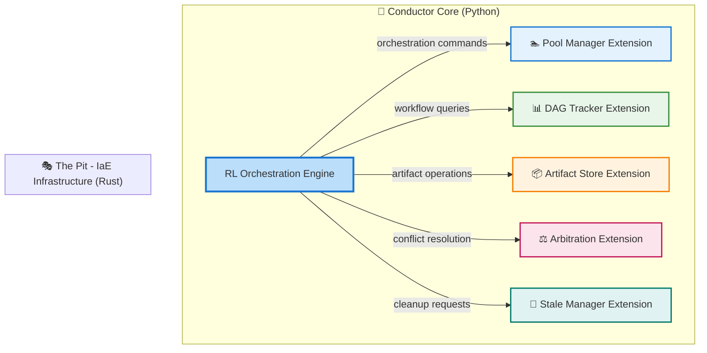

# The Conductor

> *The **microkernel** maestro that orchestrates the symphony of intelligent development*
> 

---

## 🎯 Core Identity

**Icon**: 🎩 [Top Hat — The elegant maestro conducting the full performance]

**Architecture**: 🧠 **Microkernel Design** — Minimal, powerful core that manages everything else as extensions

**Training Ground**: 🎮 **Function Quest Game (FQG)** — Where models become callable functions in logic puzzles

**Frequency**: *963 Hz* — Crown chakra activation, universal consciousness, divine creation

---

## 🏗️ Microkernel Architecture Philosophy

*The Conductor operates on a **microkernel principle***

- Core is implemented in **Python**, leveraging AI libraries (e.g., Gem, PyTorch, TensorFlow) to power its Reinforcement Learning (RL) model, trained via Function Quest Game (FQG). Infrastructure and other extensions are built in **Rust** to ensure high performance and memory safety, integrating seamlessly with the Python core via a robust extension API.
- it's the minimal but powerful core that keeps everything running smoothly ⬇️

### 🔧 **What the Core Does** (**Minimal**)

- **Model Lifecycle Management**: Starts, stops, and monitors all other models
- **Orchestration Logic**: Decides what happens when and why
- **State Tracking**: Knows where everything is in the development process
- **Communication Protocols**: Ensures models can talk to each other

### 🧩 **What Runs as Extensions** (Everything Else)

- **All Symphony Models**: Enhancement, planning, coding models run independently
- **Failure Recovery Strategies**: Each model has its own adaptive failure handling
- **Artifact Processing**: Data transformation and validation steps
- **Output Generation**: File creation, formatting, and delivery

### 🎯 **Why This Matters**

- **🔄 Replaceability**: Any model can be swapped out without breaking the system
- **🛡️ Isolation**: If one model fails, it doesn't crash everything else
- **📈 Scalability**: New models can be added without rewriting the core
- **🧪 Testability**: Each component can be tested independently

---

## 🏗️ Conductor's Trusted Orchestra

The Conductor's intelligent orchestration operates atop a robust infrastructure layer implemented as **Infrastructure as Extension (IaE)** - five privileged Rust extensions that form the unshakable foundation of Symphony's microkernel architecture.



### 🔧 The Pit’s Dependency Matrix

| Conductor Capability | Infrastructure Dependencies | Purpose |
| --- | --- | --- |
| **Model Activation** | 🏊 Pool Manager + ⚖️ Arbitration | Intelligent resource allocation and conflict resolution |
| **Workflow Execution** | 📊 DAG Tracker + 📦 Artifact Store | Dependency management and state persistence |
| **Failure Recovery** | 🧹 Stale Manager + 📊 DAG Tracker | System cleanup and workflow reconstruction |
| **Performance Optimization** | 🏊 Pool Manager + 🧹 Stale Manager | **Training data preservation & storage lifecycle management** - retains melody artifacts for model training, archives to cloud, and only deletes when storage limits require |
| **Quality Assurance** | 📦 Artifact Store + ⚖️ Arbitration | Artifact validation and quality-based routing |

### 🎯 Why *“The Pit”* Matters for the Conductor

**🛡️ Reliability Through Isolation**

- Infrastructure failures don't crash the Conductor's RL core
- Each extension can be updated independently
- Graceful degradation when individual components are unavailable

**🔧 Operational Flexibility**

- Infrastructure can be customized for different deployment scenarios
- Enterprise extensions can replace or enhance core infrastructure
- The Conductor remains focused on orchestration intelligence

**🌐 Platform Consistency**

- Uses the same extension system provided to community developers
- Demonstrates Symphony's extension capabilities at infrastructure scale
- Provides reference implementation for high-performance extensions

*Learn more at → [The Pit](The%20Pit%20282461aa2705805581afc348c0e4913f.md)* 

---

## 🕹️ Extension Lifecycle: The Chambering Flow

> 🎼 The Conductor's elegant choreography for summoning, wielding, and releasing extensions
> 

The **Chambering Flow** is the Conductor’s deterministic, RL-optimized lifecycle for managing extensions—like loading kernel modules in a microkernel OS, but with AI-driven finesse. This process ensures **isolation**, **transparency**, and **traceability**, treating extensions (The Pit and UFE) as orchestrated resources summoned on-demand to perform in Symphony’s intelligent workflows.

### 🎬 Lifecycle Steps

1. **🔔 Requesting**
    
    The Conductor signals the **Orchestra Kit** to summon an extension based on orchestration needs (e.g., a Melody for UI or Artifact Store for data persistence).
    
2. **📜 Registration**
    
    The extension declares its **capabilities** (via manifest, e.g., `provides_artifact_storage`) and **requirements** (e.g., memory, compute), registering with the Conductor’s Python core.
    
3. **🚀 Activation**
    
    The Conductor activates the extension with context—artifacts, state, or RL-driven parameters from Function Quest.
    
4. **🎭 Usage**
    
    The Conductor invokes the extension for its task (e.g., storing artifacts, generating code). The **DAG Tracker** monitors progress, ensuring no direct extension-to-extension calls.
    
5. **🔚 Return & Unloading**
    
    The extension returns results to the Conductor, which coordinates cleanup via the **Stale Manager**. Graceful release prevents resource leaks.
    
6. **📊 State Update**
    
    The Conductor updates global state, logs metrics, and feeds performance data into the RL model for **Function Quest** adaptation, refining future orchestrations.
    

### 🎻 Example: Melody → Artifact Store

Consider a **Melody extension** (UFE) needing to store a workflow artifact:

1. **🎵 Melody** sends: “Store this artifact” to the Conductor.
2. **🎩 Conductor** routes the request to **The Pit’s Artifact Store** (*IaE’s Rust extension*).
3. **📦 Artifact Store** processes and confirms success.
4. **🎩 Conductor** relays the result back to Melody.

This flow enforces the Conductor’s role as the **sole communication hub**, ensuring no direct calls between extensions, preserving hierarchy, and enabling RL-driven optimization.

---

## 🎮 Function Quest Foundation

The Conductor isn't just inspired by Function Quest — **it IS the Function Quest Maestro (FQM)**:

### 🎲 **How It Works**

- **🎻 Symphony Models** = **Functions** in the game
- **📄 Outputs** (something.txt, something2.csv, etc.) = **Return Values**
- **🎼 Orchestration** = **Function Call Sequences**
- **🏆 Project Success** = **Winning the Level**

### 🎯 **Training Process**

1. **🎮 Play Function Quest**: Learn logical reasoning on puzzle levels
2. **📊 Track Performance**: Monitor success rates and efficiency
3. **🧠 Reinforcement Learning**: Improve strategies through trial and error
4. **🚀 Deploy to Symphony**: Apply learned orchestration skills to real projects

### 💡 **Why This Approach?**

- **Logic First**: Builds rock-solid reasoning before handling real complexity
- **Measurable Progress**: Clear success/failure metrics in each level
- **Safe Learning**: Mistakes in games don't break real projects
- **Scalable Training**: Can create infinite variations of orchestration challenges

---

## 🎛️ Dynamic Orchestration Capabilities

### 🔀 **Model Activation Intelligence**

The Conductor doesn't just follow scripts — it makes smart decisions:

**📊 Activation Factors**:

- **Current State**: What's already been done?
- **Quality Metrics**: How good are the current outputs?
- **Dependencies**: What needs to happen before what?
- **Resource Availability**: What models are ready to work?

### 🛠️ **Adaptive Failure Handling**

When things go wrong, the Conductor has multiple strategies:

**🔄 Retry Strategies**:

- **Simple Retry**: Try the same model again with different parameters
- **Fallback Models**: Switch to a backup model that can do similar work
- **Reverse Reconstruction**: Generate missing early outputs from later results
- **Graceful Skip**: Continue without the failed component if possible

**🎯 Strategy Selection Based On**:

- **Model Importance**: Critical vs. nice-to-have components
- **Alternative Availability**: Are there other ways to get this done?
- **Risk Tolerance**: How much can we afford to lose this piece?

### 📊 **Artifact Flow Management**

The Conductor manages the chain of outputs between models:

```
artifact_1 → artifact_2 → artifact_3 -> ...
     🎻              🎻            🎻  
   Model A        Model B       Model C 

```

**🔍 Flow Intelligence**:

- **Quality Checks**: Ensures each output meets standards before passing it on
- **Compatibility**: Makes sure outputs work with the next model's expectations
- **Harmony**: Maintains consistency across the entire chain

### 🌊 **Orchestration Flow Types**

**📈 Standard Sequential**: A → B → C → D (Most common)

**🌿 Branching Logic**:

```
A → B → C
    ↓
    D → E

```

**⏪ Reverse Reconstruction**:

```
Missing A ← Generate from B ← C (already exists)

```

**⚡ Parallel Execution**:

```
    B ← A → C
    ↓       ↓
    D → E ← F

```

---

## 🧠 Learning & Adaptation System

### 📊 **Performance Tracking**

The Conductor learns from every project:

**🎯 Success Metrics**:

- **Completion Rate**: How often projects finish successfully
- **Efficiency**: Minimum function calls needed vs. actual calls used
- **Quality Scores**: How good are the final outputs
- **Recovery Success**: How well does failure handling work

### 📈 **Adaptive Improvement**

**🔄 Strategy Evolution**:

- **Pattern Recognition**: Identifies what works best for different project types
- **Optimization**: Learns to skip unnecessary steps
- **Robustness**: Gets better at handling edge cases and failures
- **Personalization**: Adapts to user preferences and coding styles

### 🎮 **Continuous Function Quest Training**

Even after deployment, the Conductor keeps improving through Function Quest:

- **New Challenges**: Tests against increasingly complex orchestration puzzles
- **Edge Case Training**: Practices handling unusual scenarios
- **Performance Benchmarking**: Compares against previous versions

---

## 🎵 Real-World Symphony Orchestration

### 🚀 **From Game to Production**

The transition from Function Quest training to real Symphony orchestration:

**🎮 In Function Quest**:

- `find_key()` → `'rusty_key'`
- `use_key('rusty_key')` → `'Success!'`
- `open_door()` → `'The door opens!'`

**🎼 In Symphony**:

- `enhance_prompt(user_input)` → `enhanced_prompt.txt`
- `extract_features(enhanced_prompt)` → `backlog.csv`
- `generate_code(instructions)` → `source_files/`

### 🛡️ **Production Safeguards**

**🔒 Safety Measures**:

- **Sandboxed Execution**: Models run in isolated environments
- **Rollback Capability**: Can undo changes if something goes wrong
- **Human Override**: Users can intervene at any point
- **Quality Gates**: Automatic checks prevent bad outputs from propagating

### 📊 **Real-World Monitoring**

**👁️ Live Tracking**:

- **Model Performance**: Which models are working well/poorly
- **Bottleneck Detection**: Where are the slowdowns happening
- **User Satisfaction**: Are people happy with the results
- **Resource Usage**: Keeping costs and computation time reasonable

---

## 🎯 Success Indicators

### 🏆 **Function Quest Mastery**

- ✅ Consistently solves complex orchestration puzzles
- ✅ Achieves optimal solutions (minimal unnecessary function calls)
- ✅ Handles edge cases and unusual scenarios gracefully

### 🚀 **Symphony Production Success**

- ✅ High project completion rates
- ✅ Quality outputs that satisfy user requirements
- ✅ Efficient resource utilization
- ✅ Robust failure recovery and error handling

### 📈 **Continuous Improvement**

- ✅ Performance metrics improve over time
- ✅ Learns from user feedback and preferences
- ✅ Adapts to new models and capabilities as they're added

---

*The Agentic Conductor Model transforms the complex art of software orchestration into a learnable, measurable skill through Function Quest training, then applies this mastery to create beautiful symphonies of intelligent development.*