# V2

> The Infrastructure-Aware Training Ground for Intelligent Orchestration
> 
> 
> *Where Conductors learn to dance with system architecture, not just call functions*
> 

---

## 🎯 What is Function Quest V2?

**Function Quest V2** is the evolved training simulator for Symphony's Conductor model, designed to teach **infrastructure-aware orchestration** rather than mere function sequencing. Unlike traditional logic puzzles, Function Quest V2 embeds architectural awareness directly into its core mechanics, producing Conductors who understand systems, not just steps.

### 🎮 **From Puzzle Game to Architectural Simulator**

**V1 (Legacy)**: Flat function sequencing puzzles

```
find_key() → unlock_door() → open_door()
```

**V2 (Evolution)**: Infrastructure-aware orchestration training

```
[🏗️ Auto-Infrastructure] → find_key() → [🔄 System Update] →
unlock_door() → [📊 Progress Tracking] → open_door() → [🎯 Success!]
```

---

## 🏗️ Core Innovation: The Automated Infrastructure Layer

### 🔄 **The Infrastructure-Aware Game Engine**

Function Quest V2 introduces an **implicit infrastructure layer** that operates automatically around every player action, mirroring Symphony's production architecture:

```mermaid
graph TB
    subgraph "Player Perspective"
        P[Player Action]
        S[Success/Failure]
        P --> S
    end

    subgraph "Game Engine Reality"
        PRE[🏗️ Pre-Action Infrastructure]
        ACTION[🎯 Player Function]
        POST[🔄 Post-Action Infrastructure]
        SCORE[📊 Performance Scoring]

        PRE --> ACTION
        ACTION --> POST
        POST --> SCORE
    end

    P --> PRE
    POST --> S

```



### 🎯 **What Gets Automated**

### **Pre-Action Infrastructure (Before Every Function)**

- 🏊 **Resource Allocation**: Game engine automatically provisions required resources
- 📊 **State Preparation**: Execution context established and validated
- 🔒 **Permission Verification**: Access controls and constraints enforced
- 📦 **Input Validation**: Required artifacts and parameters checked

### **Post-Action Infrastructure (After Every Function)**

- 💾 **Result Storage**: Outputs automatically persisted and indexed
- 📈 **Progress Tracking**: Workflow state updated and dependencies resolved
- 🧹 **Resource Cleanup**: Temporary resources released and recycled
- 📊 **Performance Logging**: Metrics collected for training and optimization

### **Inter-Action Optimization (Between Functions)**

- 🔄 **Predictive Allocation**: Resources pre-warmed for likely next steps
- ⚡ **State Synchronization**: Consistent system view maintained
- 🛡️ **Failure Preparedness**: Fallback strategies pre-configured
- 📋 **Dependency Analysis**: Next-step readiness automatically validated

---

## 🎮 How Function Quest V2 Works

### 🎯 **Player Experience: Simplified Surface**

**What Players See:**

- Clean function sequences focused on business logic
- Intuitive puzzle narratives and goals
- Performance feedback and scoring
- Progressive complexity and challenges

**What Happens Underneath:**

- Complete infrastructure orchestration
- Resource management and optimization
- System state maintenance
- Performance monitoring and scoring

### 🔧 **Game Engine Architecture**


### 🎯 **Training the Conductor's Intuition**

Function Quest V2 teaches through **consequence-based learning**:

### **Efficiency Patterns**

```
Sequence A: enhance_prompt() → generate_code()
Result: ⚡ Fast execution, 💰 Low resource usage → 🏆 High score

Sequence B: enhance_prompt() → unnecessary_step() → generate_code()
Result: 🐌 Slow execution, 💸 High resource usage → 😞 Low score

```

### **Stability Awareness**

```
Stable Pattern: Logical progression with clear dependencies
Result: 🛡️ System remains responsive, 📈 Consistent performance

Unstable Pattern: Resource-intensive operations back-to-back
Result: ⚠️ System warnings, 🔄 Recovery overhead, 📉 Performance penalties

```

### **Optimization Discovery**

```
Basic Solution: Direct sequence solving puzzle
Score: 100 points

Optimized Solution: Efficient resource usage, predictive operations
Score: 150 points + 🎯 Optimization bonus

```

---

## 🎨 Level Design Philosophy

### 📚 **Progressive Complexity Curve**

### **Levels 1-5: Foundation Building**

**Focus**: Basic function sequencing and goal achievement
**Infrastructure**: Completely hidden, operates seamlessly
**Teaching**: "Some sequences work better than others"

```
Example: "Escape the Room"
Functions: find_key(), unlock_door(), open_door()
Infrastructure: Auto-allocates search resources, tracks progress

```

### **Levels 6-10: Resource Awareness**

**Focus**: Introduction to resource constraints and efficiency
**Infrastructure**: Resource indicators shown, efficiency scores emphasized
**Teaching**: "Thoughtful sequencing conserves system resources"

```
Example: "Prepare the Banquet"
Functions: chop_vegetables(), cook_food(), set_table()
Infrastructure: Shows kitchen resource usage, awards efficiency bonuses

```

### **Levels 11-15: System Optimization**

**Focus**: Multi-resource management and predictive operations
**Infrastructure**: Resource pools visible, optimization opportunities highlighted
**Teaching**: "System-aware decisions enable superior outcomes"

```
Example: "Orchestrate the Festival"
Functions: book_bands(), arrange_seating(), manage_crowds()
Infrastructure: Multiple resource types, predictive allocation bonuses

```

### **Levels 16-20: Architectural Mastery**

**Focus**: Complex dependency chains and failure recovery
**Infrastructure**: Full system state visible, stability metrics tracked
**Teaching**: "Robust systems handle uncertainty gracefully"

```
Example: "Launch the Spaceship"
Functions: fuel_engines(), calibrate_systems(), initiate_launch()
Infrastructure: Failure scenarios, recovery patterns, stability scoring

```

### 🎭 **Narrative-Driven Learning**

Each level uses compelling stories that naturally teach architectural concepts:

> "The Ancient Bridge": Teaching infrastructure dependencies
"The magical foundations must stabilize before placing physical stones, or the bridge will collapse"
> 

> "The Royal Messenger": Teaching resource optimization
> 
> 
> *"Efficient message routing enables faster delivery with fewer messengers"*
> 

> "The Alchemist's Laboratory": Teaching error recovery
"Proper preparation allows failed experiments to be safely contained and restarted"
> 

---

## 📊 Enhanced Scoring System

### 🎯 **Multi-Dimensional Performance Evaluation**

```mermaid
graph LR
    A[Player Solution] --> B[Base Score]
    A --> C[Efficiency Bonus]
    A --> D[Stability Bonus]
    A --> E[Optimization Bonus]

    B --> F[🎯 Final Score]
    C --> F
    D --> F
    E --> F

```



### **Base Score (0-100 points)**

- ✅ **Goal Achievement**: Did the solution solve the puzzle?
- ✅ **Correctness**: Were the right functions used in the right order?
- ✅ **Completeness**: Were all necessary steps included?

### **Efficiency Bonus (0-50 points)**

- ⚡ **Execution Speed**: How quickly was the goal achieved?
- 💰 **Resource Usage**: How economically were resources utilized?
- 🔄 **Operation Density**: How many meaningful operations per action?

### **Stability Bonus (0-30 points)**

- 🛡️ **System Health**: Was infrastructure maintained within optimal ranges?
- 🔒 **Error Avoidance**: Were potential failures anticipated and prevented?
- 📈 **Consistent Performance**: Was execution smooth without degradation?

### **Optimization Bonus (0-20 points)**

- 🎯 **Predictive Operations**: Did the solution anticipate future needs?
- 🔧 **Resource Recycling**: Were resources efficiently reused?
- 🌟 **Elegant Patterns**: Did the solution demonstrate architectural insight?

### 🏆 **Performance Tiers**

- **🥉 Apprentice**: 0-100 points (Basic solution)
- **🥈 Journeyman**: 101-150 points (Efficient solution)
- **🥇 Master**: 151-180 points (Optimized solution)
- **🎯 Grand Maestro**: 181-200 points (Architectural excellence)

---

## 🧠 What the Conductor Learns

### 🎯 **Implicit Architectural Understanding**

Through consequence-based learning, the RL model develops:

### **Infrastructure Intuition**

- Knows which sequences work harmoniously with system resources
- Understands the cost of inefficient patterns without explicit teaching
- Develops feel for system capacity and limitations

### **Efficiency Optimization**

- Naturally gravitates toward resource-conserving patterns
- Discovers optimization opportunities through experimentation
- Learns to balance speed against resource consumption

### **System Stability Awareness**

- Recognizes patterns that stress infrastructure
- Develops intuition for failure points and recovery strategies
- Understands the value of graceful degradation

### **Predictive Thinking**

- Anticipates resource needs for upcoming operations
- Learns to prepare systems for likely next steps
- Develops forward-looking orchestration strategies

### 🔄 **Production-Ready Mindset**

The Conductor emerges from training thinking in terms of:

```
Not: "What function comes next?"
But: "What system state enables which outcomes?"

```

---

## 🚀 Implementation Strategy

### 🏗️ **Technical Architecture**

```rust
struct FunctionQuestV2 {
    game_engine: GameEngine,
    infrastructure_sim: PitSimulator,
    rl_trainer: RLTrainingEngine,
    scoring_system: MultiDimensionScorer,
}

impl FunctionQuestV2 {
    async fn execute_player_action(&mut self, action: PlayerAction) -> TurnResult {
        // 1. Pre-action infrastructure preparation
        let infra_context = self.infrastructure_sim.prepare_for_action(&action);

        // 2. Execute player action in game context
        let game_result = self.game_engine.execute_action(action, infra_context);

        // 3. Post-action infrastructure processing
        let performance_data = self.infrastructure_sim.process_result(&game_result);

        // 4. Multi-dimensional scoring
        let score = self.scoring_system.calculate_score(&game_result, &performance_data);

        // 5. RL model training update
        self.rl_trainer.update_model(&game_result, &performance_data, score);

        TurnResult { game_result, score, performance_data }
    }
}

```

### 📅 **Development Roadmap**

### **Phase 1: Core Engine (Weeks 1-4)**

- Implement infrastructure simulation layer
- Build basic game engine with automated infrastructure
- Create first 5 levels teaching basic concepts

### **Phase 2: Advanced Mechanics (Weeks 5-8)**

- Implement multi-dimensional scoring system
- Add resource awareness and efficiency tracking
- Develop levels 6-15 with progressive complexity

### **Phase 3: RL Integration (Weeks 9-12)**

- Integrate consequence-based learning
- Train initial Conductor models
- Validate architectural understanding

### **Phase 4: Production Alignment (Weeks 13-16)**

- Fine-tune infrastructure simulation to match production
- Create advanced levels mirroring real orchestration scenarios
- Deploy trained Conductors to Symphony staging

---

## 🌟 The Function Quest V2 Advantage

### 🎯 **Training Efficiency**

- 🚀 **Focused Learning**: RL model concentrates on business logic, not infrastructure management
- 📈 **Accelerated Progress**: Architectural concepts learned through experience, not explanation
- 🎯 **Better Outcomes**: Conductors emerge with production-ready intuition

### 🔧 **Development Benefits**

- 🛠️ **Simplified Game Design**: No need to teach explicit infrastructure calls
- 🎮 **Better Player Experience**: Clean, focused puzzles without infrastructure complexity
- 📊 **Accurate Assessment**: Multi-dimensional scoring reveals true orchestration skill

### 🏗️ **Architectural Alignment**

- 🔄 **Seamless Transition**: Training environment mirrors production architecture
- 🎯 **Relevant Skills**: Learned behaviors directly applicable to real orchestration
- 📈 **Continuous Improvement**: Training evolves with Symphony's architecture

---

## 🎵 The Symphony of Training and Reality

Function Quest V2 represents a paradigm shift in AI training: from **explicit instruction** to **implicit understanding**, from **function sequencing** to **system orchestration**, from **puzzle solving** to **architectural thinking**.

The Conductors who emerge from this training don't just know which functions to call—they understand how systems work, how resources flow, and how to create elegant, efficient, stable orchestration in the complex world of AI-driven development.

> In Function Quest V2, we don't teach Conductors to command infrastructure—we teach them to dance with it. The result is orchestration that feels less like engineering and more like artistry, where every decision harmonizes with the system's natural rhythms. 🎼
> 

---

*Function Quest V2: Where infrastructure awareness becomes second nature, and every Conductor learns the silent language of systems.*

[The Infrastructure-Aware Evolution](The%20Infrastructure-Aware%20Evolution%20282461aa270580a0aa26c5cc44865099.md)