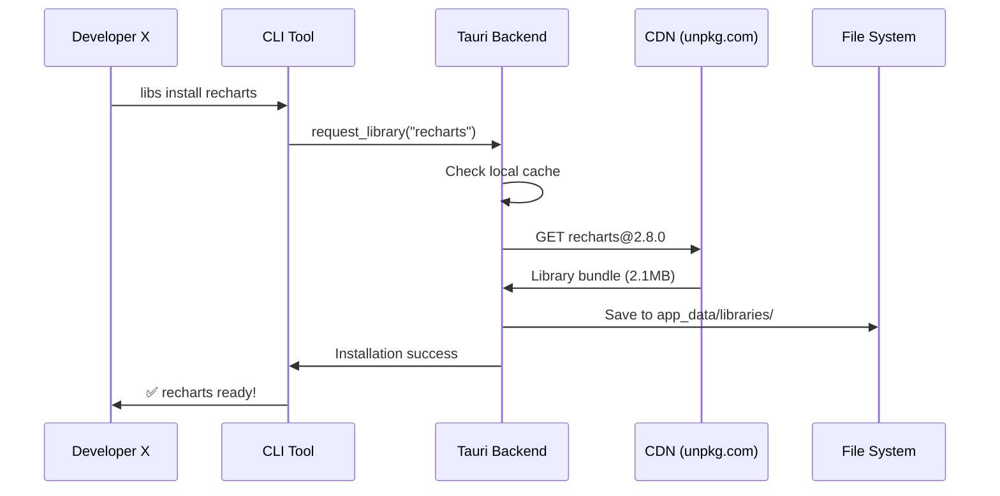
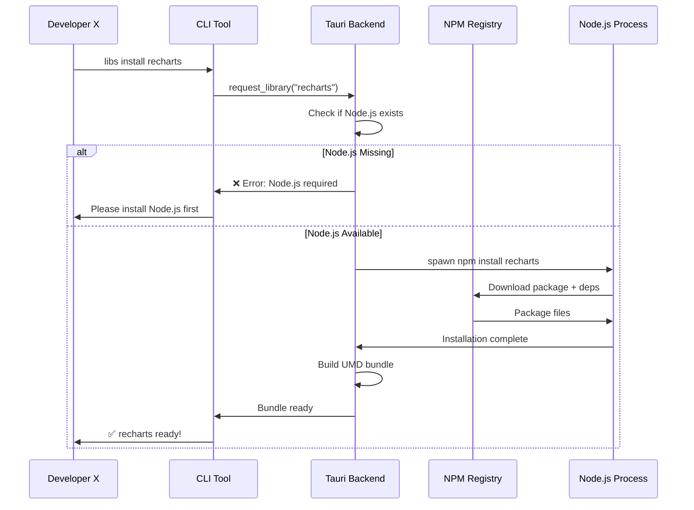
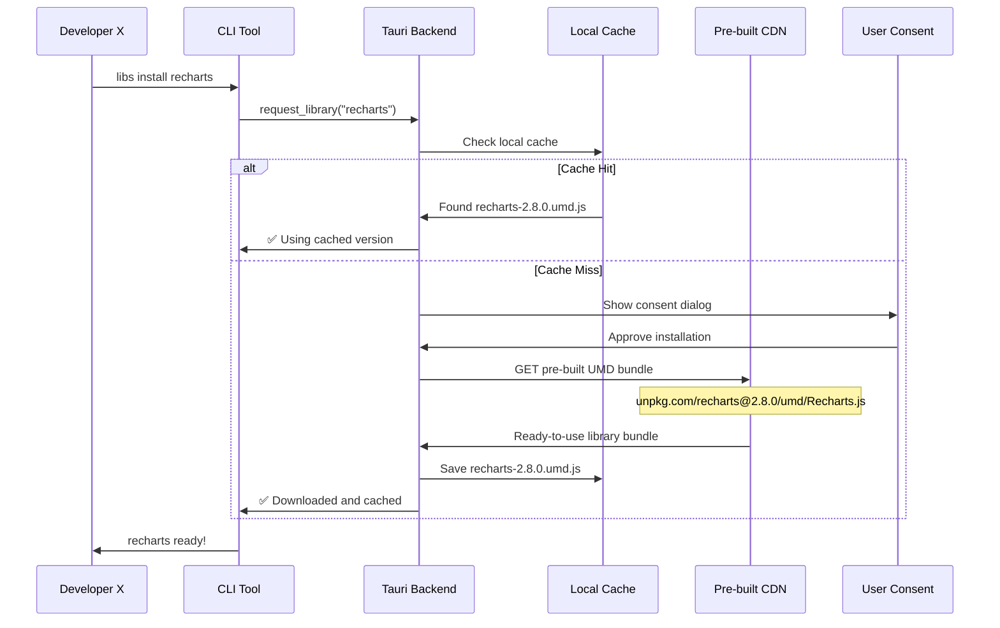

# Walkthrough

## 📖 Scenario

**Developer X** wants to create an extension that shows beautiful charts for developer productivity tracking. The extension needs the **Recharts** library, but it's not included in the base application bundle.

---

## 🚀 Developer X's Journey

### Step 1: 🔍 Check Available Libraries

**Developer X** first checks what's available in the platform:

```bash
# Option A: CLI Command
$ myapp-cli libs list
Available libraries:
  ✅ react (built-in)
  ✅ shadcn-ui (built-in)
  ❌ recharts (not installed)
  ❌ d3 (not installed)
  ❌ plotly (not installed)

# Option B: API Function (inside extension)
const availableLibs = await window.__TAURI__.invoke('get_available_libraries');
console.log(availableLibs);
// { react: true, shadcn: true, recharts: false }

```

### Step 2: 📦 Request Library Installation

**Developer X** needs Recharts, so they request it:

```bash
# Option A: CLI Command (Recommended)
$ myapp-cli libs install recharts
🔍 Checking recharts availability...
📦 Library: recharts@2.8.0 (Size: 2.1MB)
📋 Dependencies: react, react-dom
🔒 Source: https://unpkg.com/recharts@2.8.0
❓ Install recharts for visualization features? (y/n): y
⬇️  Downloading...  [████████████████] 100%
✅ recharts installed successfully!
🎯 Available in extensions as: window.Recharts

# Option B: API Function (Programmatic)
const result = await window.__TAURI__.invoke('request_library', {
  name: 'recharts',
  version: '2.8.0',
  reason: 'Data visualization for productivity extension'
});
// Shows user consent dialog automatically

```

### Step 3: ✅ Verify Installation

```bash
# CLI Verification
$ myapp-cli libs list
Available libraries:
  ✅ react (built-in)
  ✅ shadcn-ui (built-in)
  ✅ recharts (installed) - 2.1MB

# Or programmatically
const isAvailable = await window.__TAURI__.invoke('check_library', { name: 'recharts' });
console.log('Recharts ready:', isAvailable);

```

### Step 4: 🛠️ Write Extension Code

Now **Developer X** can write their extension:

```rust
// extension/src/lib.rs
pub struct ProductivityChartExtension {
    data: Vec<ProductivityData>,
}

impl UIExtension for ProductivityChartExtension {
    fn render(&self, context: &RenderContext) -> Result<VirtualNode, RenderError> {
        // Create chart using Recharts components
        let chart = VirtualNode {
            id: "productivity-chart".to_string(),
            component_type: ComponentType::External {
                library: "recharts".to_string(),
                component: "LineChart".to_string(),
            },
            props: {
                let mut props = HashMap::new();
                props.insert("data".to_string(), json!(self.data));
                props.insert("width".to_string(), json!(800));
                props.insert("height".to_string(), json!(400));
                props
            },
            children: vec![
            // ... Child virtual nodes
						]
        Ok(chart)
    }
}

```

### Step 5: 🚀 Test Extension

```bash
# Load extension for testing
$ myapp-cli ext load ./productivity-extension
🔍 Analyzing extension dependencies...
✅ All dependencies satisfied:
   - recharts ✅ (already installed)
   - react ✅ (built-in)
🎯 Extension loaded successfully!

# Test in development mode
$ myapp-cli ext dev ./productivity-extension
🚀 Development server started on port 3001
🔄 Hot reload enabled

```

---

## ⚙️ What Happens Internally

When **Developer X** runs `myapp-cli libs install recharts`, here's what happens behind the scenes:

### 🎯 Option 1: CDN Download Strategy



**Internal Steps:**

1. **🔍 Cache Check**: Look in `~/.myapp/libraries/recharts/`
2. **📋 Metadata Fetch**: Get package info from CDN
3. **🛡️ Security Scan**: Verify integrity and whitelist
4. **⬇️ Download**: Fetch pre-built UMD bundle
5. **💾 Local Storage**: Save to `libraries/recharts-2.8.0.js`
6. **📝 Registry Update**: Add to `installed_libraries.json`
7. **✅ Success**: Ready for extensions to use

### 🎯 Option 2: Package Manager Strategy ⚠️ **PROBLEMATIC**



**🚫 Major Problems:**

1. **📦 NPM Install**: Requires Node.js + npm on user's machine
2. **🔨 Bundle Build**: Needs webpack/rollup + build tools
3. **🧹 Dependencies**: Native modules may fail to compile
4. **💾 Environment**: Different OS/architectures cause issues
5. **📝 Support**: Users blame YOUR app when npm fails
6. **✅ Complexity**: Way too much for end users

**❌ Why This Fails:**

- Most end users don't have Node.js
- Corporate firewalls block npm registry
- Different Node versions cause conflicts
- Native dependencies break on different architectures
- Users expect apps to be self-contained

### 🎯 Option 3: Hybrid Strategy (Recommended)

**💡 This is NOT Option 1 + Option 2!**
It's **Enhanced Option 1** with smart caching and user consent.



**🔑 Key Difference from Option 2:**

- **❌ No Node.js**: Downloads pre-built bundles, not source code
- **❌ No npm install**: No package manager required on user machine
- **❌ No bundling**: CDN serves ready-to-use UMD files
- **✅ Pure JavaScript**: Just downloads .js files and loads them

**Internal Steps:**

1. **🔍 Local Check**: Search in `app_data/libraries/recharts-2.8.0.umd.js`
2. **👤 User Consent**: Show permission dialog (first time only)
3. **⬇️ Direct Download**: Fetch pre-built UMD from `unpkg.com/recharts/umd/Recharts.js`
4. **🛡️ Security**: Verify checksums and signatures
5. **💾 File Cache**: Save `.js` file for offline use
6. **📊 Registry**: Update `installed_libraries.json`
7. **✅ Runtime Load**: `<script>` tag injection or dynamic import

---

## 📋 Library Management Commands

**Developer X** has these tools available:

```bash
# List all available libraries
$ myapp-cli libs list

# Search for libraries
$ myapp-cli libs search visualization
📊 Found 3 visualization libraries:
   - recharts (React charts)
   - d3 (Low-level data viz)
   - plotly (Interactive plots)

# Install specific version
$ myapp-cli libs install recharts@2.7.0

# Remove library
$ myapp-cli libs remove recharts
⚠️  This library is used by 2 extensions:
   - productivity-tracker
   - sales-dashboard
Continue? (y/n):

# Update library
$ myapp-cli libs update recharts
📦 recharts 2.8.0 → 2.9.1 available
📋 Breaking changes: None
✅ Safe to update

# Clear cache
$ myapp-cli libs cache clear
🧹 Cleared 45MB of cached libraries

```

---

## 🔧 Extension Development Workflow

### Local Development

```bash
# Create new extension
$ myapp-cli ext new productivity-charts
📁 Created extension template
📦 Dependencies: Add to extension.toml

# Declare library dependencies (extension.toml)
[dependencies]
recharts = "^2.8.0"
d3 = "^7.0.0"

# Auto-install dependencies
$ myapp-cli ext dev
🔍 Checking dependencies...
❌ recharts not installed
❓ Install recharts@2.8.0? (y/n): y
⬇️  Installing... ✅ Done
🚀 Starting dev server...

```

### Production Release

```bash
# Package extension
$ myapp-cli ext build
📦 Building extension...
🔍 Dependency check:
   ✅ recharts@2.8.0 (external)
   ✅ react (built-in)
📋 Creating manifest...
✅ Extension ready: productivity-charts.ext

# The .ext file includes:
# - Extension code
# - Dependency requirements
# - Metadata and permissions

```

---

## 🛡️ Security & Trust Model

### What Users See

When **Developer X's** extension is installed by end users:

```bash
$ myapp-cli ext install productivity-charts.ext
📋 Extension: Productivity Charts v1.0.0
👤 Author: Developer X
🔍 Permissions requested:
   - Read file system (productivity data)
   - Network access (sync data)
📦 Dependencies needed:
   - recharts@2.8.0 (2.1MB) - Data visualization
❓ Install this extension? (y/n): y
⬇️  Installing dependencies... ✅ Done
🎯 Extension installed successfully!

```

---

*This walkthrough shows **Developer X** exactly what commands to run, what code to write, and what happens internally when libraries are installed on-demand in your production Tauri application!*