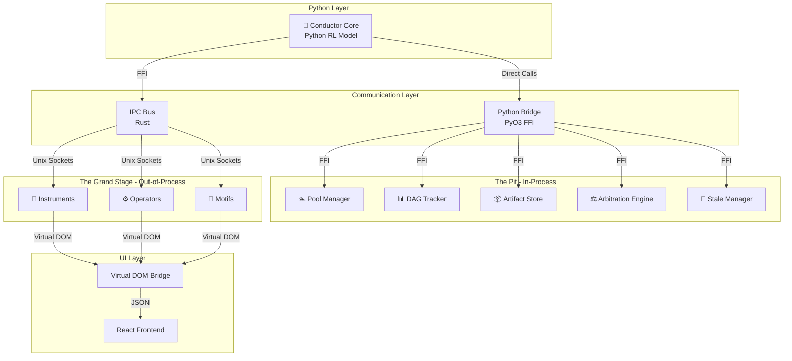

# Symphony Backend Architecture Specification

**Version**: 0.1.0  
**Last Updated**: 2025-10-05  
**Status**: Design Phase  
**Classification**: Internal Technical Documentation

---

## Executive Summary

Symphony employs a **Dual Ensemble Architecture (DEA)** with strategic process placement to achieve both extreme performance and robust isolation. The architecture centers around an AI-powered **Python Conductor** that orchestrates five high-performance **Rust infrastructure extensions** (The Pit) running in-process, while user-facing extensions (The Grand Stage) run in isolated processes for stability and security.

### Key Architectural Innovations

1. **Microkernel Orchestration**: Python RL model as intelligent core, everything else as extensions
2. **Strategic Process Placement**: In-process for 50-100ns operations, out-of-process for stability
3. **Virtual DOM UI Bridge**: Backend-generated UI structures rendered by React frontend
4. **Function Quest Training**: RL-based orchestration learning system
5. **Extension Marketplace**: Full ecosystem with SDK, registry, and security sandboxing

### Performance Envelope

| Layer | Execution Model | Latency | Throughput | Reliability |
|-------|----------------|---------|------------|-------------|
| **The Conductor** | Python RL | 0.5-2ms | 10K ops/sec | 99.9% |
| **The Pit (IaE)** | Rust In-Process | 50-100ns | 1M+ ops/sec | 99.99% |
| **IPC Bus** | Rust FFI Bridge | 0.01-0.05ms | 100K ops/sec | 99.95% |
| **UFE Extensions** | Rust Out-of-Process | 0.1-0.5ms | 10K-100K ops/sec | 99.5% |
| **Virtual DOM** | JSON Serialization | 1-5ms | 5K ops/sec | 99.9% |

### Architecture Philosophy

> **"Intelligence at the Core, Extensions at the Edge"**
> 
> Symphony's architecture places an AI-powered conductor at its center, orchestrating a symphony of specialized extensions. Performance-critical infrastructure runs in-process for nanosecond operations, while user-facing extensions run isolated for stability and security.

---

## Cargo Workspace Architecture

```toml
# apps/backend/Cargo.toml
[workspace]
resolver = "2"
members = [
    # === THE PIT - Infrastructure as Extensions (IaE) ===
    # In-Process Rust Extensions for Performance-Critical Operations
    "pit/pool-manager",           # 🏊 Resource allocation & model lifecycle
    "pit/dag-tracker",            # 📊 Workflow dependency & execution tracking
    "pit/artifact-store",         # 📦 Data persistence & versioning
    "pit/arbitration-engine",     # ⚖️ Conflict resolution & resource fairness
    "pit/stale-manager",          # 🧹 Training data curation & cleanup
    
    # === CONDUCTOR INTEGRATION ===
    # Python-Rust Bridge for RL Orchestration
    "conductor/python-bridge",    # PyO3 FFI layer for Conductor ↔ Pit
    "conductor/ipc-bus",          # Communication backbone (hardcoded Rust)
    
    # === CORE FOUNDATION ===
    "core/types",                 # Shared type definitions
    "core/config",                # Configuration management
    "core/manifest",              # Extension manifest parsing
    
    # === EXTENSION SYSTEM ===
    # Base extension infrastructure
    "extensions/core",            # Base extension traits & registry
    "extensions/loader",          # Dynamic extension loading
    "extensions/sandbox",         # Security & permission system
    
    # === THE GRAND STAGE - User-Faced Extensions (UFE) ===
    # Out-of-Process Extensions
    "stage/instruments",          # 🎻 AI/ML model extensions
    "stage/operators",            # ⚙️ Workflow utilities
    "stage/motifs",               # 🧩 UI/UX addons
    
    # === UI BRIDGE ===
    "bridge/virtual-dom",         # Backend → Frontend UI bridge
    "bridge/state-sync",          # Shared state synchronization
    
    # === ORCHESTRA KIT ===
    # Marketplace & Extension Management
    "orchestra-kit/marketplace",  # Extension discovery & installation
    "orchestra-kit/sdk",          # Developer tools (Carets SDK)
    "orchestra-kit/registry",     # Extension registry & versioning
    
    # === APPLICATIONS ===
    "apps/desktop",               # Tauri desktop application
    "apps/server",                # Optional server mode
    
    # === INFRASTRUCTURE ===
    "infra/logging",              # Comprehensive logging
    "infra/metrics",              # Performance monitoring
    "infra/hooks",                # Desktop integration hooks
]

[workspace.dependencies]
# Shared dependencies across all crates
serde = { version = "1.0", features = ["derive"] }
tokio = { version = "1.0", features = ["full"] }
anyhow = "1.0"
thiserror = "1.0"
tracing = "0.1"
uuid = { version = "1.0", features = ["v4", "serde"] }

# Python Integration (for Conductor)
pyo3 = { version = "0.20", features = ["auto-initialize"] }
pyo3-asyncio = { version = "0.20", features = ["tokio-runtime"] }

# IPC & Communication
crossbeam-channel = "0.5"
dashmap = "5.5"
arc-swap = "1.6"

# Performance
parking_lot = "0.12"  # Fast synchronization primitives
```

## Package Structure & Responsibilities

### 1. The Conductor (Python Core)

**Location**: `apps/backend/conductor/` (Python, not Rust)

**Purpose**: AI-powered orchestration engine trained via Function Quest Game (FQG)

```
conductor/
├── __init__.py
├── core.py                    # Main Conductor RL model
├── orchestrator.py            # Workflow orchestration logic
├── decision_maker.py          # AI decision making
├── model_manager.py           # AI model lifecycle
├── fqg_trainer.py             # Function Quest training
└── pit_interface.py           # Interface to Rust Pit extensions
```

**Key Responsibilities**:
- 🧠 Reinforcement Learning orchestration
- 🎯 Intelligent workflow execution
- 🔄 Adaptive failure handling
- 📊 Model lifecycle management
- 🎮 Function Quest Game integration

### 2. The Pit - Infrastructure as Extensions (IaE)

**Execution Model**: In-Process (shared memory with Conductor)
**Performance**: 50-100 nanosecond operations

#### `pit/pool-manager` 🏊
**Purpose**: AI model resource allocation and lifecycle management
```
pool-manager/
├── src/
│   ├── lib.rs                 # PyO3 exports to Python
│   ├── allocator.rs           # Model allocation logic
│   ├── lifecycle.rs           # Model lifecycle states
│   ├── health_monitor.rs      # Model health checks
│   └── predictive_loader.rs   # Predictive pre-warming
├── Cargo.toml
└── README.md
```

#### `pit/dag-tracker` 📊
**Purpose**: Workflow dependency tracking and execution monitoring
```
dag-tracker/
├── src/
│   ├── lib.rs                 # PyO3 exports
│   ├── graph.rs               # DAG data structures
│   ├── executor.rs            # Workflow execution engine
│   ├── recovery.rs            # Checkpoint & recovery
│   └── optimizer.rs           # Critical path optimization
├── Cargo.toml
└── README.md
```

#### `pit/artifact-store` 📦
**Purpose**: Data persistence, versioning, and quality scoring
```
artifact-store/
├── src/
│   ├── lib.rs                 # PyO3 exports
│   ├── storage.rs             # File storage backend
│   ├── versioning.rs          # Version control
│   ├── quality_scorer.rs      # Artifact quality assessment
│   └── indexing.rs            # Fast metadata search
├── Cargo.toml
└── README.md
```

#### `pit/arbitration-engine` ⚖️
**Purpose**: Resource conflict resolution and fairness enforcement
```
arbitration-engine/
├── src/
│   ├── lib.rs                 # PyO3 exports
│   ├── resolver.rs            # Conflict resolution logic
│   ├── fairness.rs            # Resource fairness algorithms
│   ├── priority.rs            # Priority scoring
│   └── strategies.rs          # Decision strategies
├── Cargo.toml
└── README.md
```

#### `pit/stale-manager` 🧹
**Purpose**: Training data curation and storage lifecycle management
```
stale-manager/
├── src/
│   ├── lib.rs                 # PyO3 exports
│   ├── curator.rs             # Training value assessment
│   ├── retention.rs           # Retention policies (1-month → cloud)
│   ├── archival.rs            # Cloud archival integration
│   └── cleanup.rs             # Storage-aware cleanup
├── Cargo.toml
└── README.md
```

### 3. Conductor Integration Layer

#### `conductor/python-bridge`
**Purpose**: PyO3 FFI bridge between Python Conductor and Rust Pit
```
python-bridge/
├── src/
│   ├── lib.rs                 # PyO3 module definition
│   ├── ffi_exports.rs         # Exported Python functions
│   ├── type_conversion.rs     # Python ↔ Rust type mapping
│   └── error_handling.rs      # Error translation
├── Cargo.toml
└── README.md
```

**Key Features**:
- Zero-copy data passing where possible
- Async/await integration (pyo3-asyncio)
- Direct function call performance (~0.01ms overhead)

#### `conductor/ipc-bus`
**Purpose**: High-performance IPC communication backbone (hardcoded Rust crate)
```
ipc-bus/
├── src/
│   ├── lib.rs                 # Core bus implementation
│   ├── ffi_bridge.rs          # Python ↔ Rust FFI
│   ├── transport/
│   │   ├── unix_socket.rs     # Unix domain sockets
│   │   ├── named_pipes.rs     # Windows named pipes
│   │   └── shared_memory.rs   # High-frequency data
│   ├── protocol/
│   │   ├── message_format.rs  # Binary serialization
│   │   └── routing.rs         # Message routing engine
│   └── manager/
│       ├── process_manager.rs # Extension process lifecycle
│       └── health_monitor.rs  # Process health monitoring
├── Cargo.toml
└── README.md
```

**Performance Characteristics**:
- Control messages: 0.1-0.3ms (Unix sockets)
- High-frequency data: 0.01-0.05ms (shared memory)
- Large payloads: 0.5-2ms (memory-mapped files)

### 4. Core Foundation

#### `core/types`
**Purpose**: Shared type definitions across all packages
```
core/types/
├── src/
│   ├── lib.rs                 # Re-exports all types
│   ├── extension.rs           # Extension-related types
│   ├── manifest.rs            # Manifest structures
│   ├── workflow.rs            # Workflow types
│   ├── artifact.rs            # Artifact types
│   └── errors.rs              # Error types
├── Cargo.toml
└── README.md
```

#### `core/config`
**Purpose**: Configuration management
```
core/config/
├── src/
│   ├── lib.rs                 # Configuration API
│   ├── conductor.rs           # conductor.json management
│   ├── schema.rs              # JSON schema validation
│   └── watchers.rs            # File system watchers
├── Cargo.toml
└── README.md
```

#### `core/manifest`
**Purpose**: Extension manifest parsing and validation
```
core/manifest/
├── src/
│   ├── lib.rs                 # Manifest API
│   ├── parser.rs              # TOML/JSON parsing
│   ├── validator.rs           # Schema validation
│   └── types.rs               # Manifest type definitions
├── Cargo.toml
└── README.md
```

### 5. UI Bridge System

#### `bridge/virtual-dom`
**Purpose**: Backend → Frontend UI bridge (Rust extensions generate React UI)
```
bridge/virtual-dom/
├── src/
│   ├── lib.rs                 # VirtualNode API
│   ├── virtual_node.rs        # Core VirtualNode implementation
│   ├── component_registry.rs  # Shadcn component mappings
│   ├── ui_builder.rs          # UI construction helpers
│   ├── event_system.rs        # UI event handling
│   ├── serialization.rs       # JSON serialization for React
│   └── diff_engine.rs         # Efficient UI diffing
├── Cargo.toml
└── README.md
```

**How It Works**:
1. Rust extensions build VirtualNode trees
2. Serialize to JSON for React consumption
3. React renders using Shadcn components
4. User events flow back through IPC bus

#### `bridge/state-sync`
**Purpose**: Shared state synchronization between backend/frontend
```
bridge/state-sync/
├── src/
│   ├── lib.rs                 # State sync API
│   ├── state_manager.rs       # Central state management
│   ├── synchronizer.rs        # Real-time synchronization
│   ├── persistence.rs         # State persistence
│   └── subscriptions.rs       # State change subscriptions
├── Cargo.toml
└── README.md
```

### 6. Extension System

#### `extensions/core`
**Purpose**: Base extension infrastructure and traits
```
extensions/core/
├── src/
│   ├── lib.rs                 # Extension system API
│   ├── base.rs                # BaseExtension trait
│   ├── registry.rs            # Extension registry
│   ├── lifecycle.rs           # Lifecycle management
│   └── communication.rs       # Inter-extension communication
├── Cargo.toml
└── README.md
```

#### `extensions/loader`
**Purpose**: Dynamic extension loading and hot-swapping
```
extensions/loader/
├── src/
│   ├── lib.rs                 # Loader API
│   ├── dynamic_loader.rs      # Dynamic library loading
│   ├── hot_reload.rs          # Hot-swap support
│   └── dependency_resolver.rs # Dependency management
├── Cargo.toml
└── README.md
```

#### `extensions/sandbox`
**Purpose**: Security sandboxing and permission system
```
extensions/sandbox/
├── src/
│   ├── lib.rs                 # Sandbox API
│   ├── permission_set.rs      # Permission definitions
│   ├── policy_engine.rs       # Permission enforcement
│   ├── resource_limits.rs     # CPU/memory limits
│   └── audit.rs               # Security audit logging
├── Cargo.toml
└── README.md
```

### 7. The Grand Stage - User-Faced Extensions (UFE)

**Execution Model**: Out-of-Process (isolated processes via IPC)
**Performance**: 0.1-0.5ms operations

#### `stage/instruments` 🎻
**Purpose**: AI/ML model extensions
```
stage/instruments/
├── src/
│   ├── lib.rs                 # Instrument trait
│   ├── base_instrument.rs     # Base implementation
│   ├── model_interface.rs     # AI model integration
│   └── examples/              # Example instruments
├── Cargo.toml
└── README.md
```

#### `stage/operators` ⚙️
**Purpose**: Workflow utilities and data processing
```
stage/operators/
├── src/
│   ├── lib.rs                 # Operator trait
│   ├── base_operator.rs       # Base implementation
│   ├── file_ops/              # File operations
│   ├── data_ops/              # Data transformations
│   └── git_ops/               # Git operations
├── Cargo.toml
└── README.md
```

#### `stage/motifs` 🧩
**Purpose**: UI/UX addons and visual enhancements
```
stage/motifs/
├── src/
│   ├── lib.rs                 # Motif trait
│   ├── base_motif.rs          # Base implementation
│   ├── ui_components.rs       # Custom UI components
│   └── themes.rs              # Theme system
├── Cargo.toml
└── README.md
```

### 8. Orchestra Kit - Marketplace & Extension Management

#### `orchestra-kit/marketplace`
**Purpose**: Extension discovery, installation, and marketplace
```
orchestra-kit/marketplace/
├── src/
│   ├── lib.rs                 # Marketplace API
│   ├── discovery.rs           # Extension discovery
│   ├── installer.rs           # Installation engine
│   ├── updater.rs             # Update management
│   ├── dependency_resolver.rs # Dependency resolution
│   └── verification.rs        # Security verification
├── Cargo.toml
└── README.md
```

#### `orchestra-kit/sdk` (Carets SDK)
**Purpose**: Developer tools for creating extensions
```
orchestra-kit/sdk/
├── src/
│   ├── lib.rs                 # SDK API
│   ├── cli.rs                 # CLI tools
│   ├── project_generator.rs   # Project scaffolding
│   ├── hot_reload.rs          # Development hot reload
│   ├── testing_framework.rs   # Testing utilities
│   └── publishing.rs          # Extension publishing
├── templates/                 # Extension templates
│   ├── instrument/
│   ├── operator/
│   └── motif/
├── Cargo.toml
└── README.md
```

#### `orchestra-kit/registry`
**Purpose**: Extension registry and version management
```
orchestra-kit/registry/
├── src/
│   ├── lib.rs                 # Registry API
│   ├── versioning.rs          # Semantic versioning
│   ├── metadata.rs            # Extension metadata
│   └── search.rs              # Search and filtering
├── Cargo.toml
└── README.md
```

### 9. Infrastructure

#### `infra/logging`
**Purpose**: Comprehensive logging and tracing
```
infra/logging/
├── src/
│   ├── lib.rs                 # Logging API
│   ├── logger.rs              # Main logger
│   ├── formatters.rs          # Log formatters
│   └── exporters.rs           # Export to file/network
├── Cargo.toml
└── README.md
```

#### `infra/metrics`
**Purpose**: Performance monitoring and metrics
```
infra/metrics/
├── src/
│   ├── lib.rs                 # Metrics API
│   ├── collectors.rs          # Metric collection
│   ├── exporters.rs           # Prometheus/Grafana export
│   └── dashboards.rs          # Dashboard integration
├── Cargo.toml
└── README.md
```

#### `infra/hooks`
**Purpose**: Desktop integration hooks
```
infra/hooks/
├── src/
│   ├── lib.rs                 # Hooks API
│   ├── hook_manager.rs        # Hook management
│   ├── desktop_integration.rs # Desktop app hooks
│   └── web_integration.rs     # Web integration
├── Cargo.toml
└── README.md
```

### 10. Applications

#### `apps/desktop`
**Purpose**: Tauri desktop application
```
apps/desktop/
├── src-tauri/
│   ├── src/
│   │   ├── main.rs            # Tauri entry point
│   │   ├── commands.rs        # Tauri commands
│   │   ├── conductor_bridge.rs # Bridge to Python Conductor
│   │   └── state.rs           # App state
│   ├── Cargo.toml
│   └── tauri.conf.json
└── README.md
```

#### `apps/server`
**Purpose**: Optional server mode
```
apps/server/
├── src/
│   ├── main.rs                # Server entry point
│   ├── http_server.rs         # Axum HTTP server
│   ├── websocket.rs           # WebSocket support
│   └── auth.rs                # Authentication
├── Cargo.toml
└── README.md
```

## Architecture Dependency Graph



## Performance Characteristics

| Layer | Execution Model | Latency | Throughput | Use Case |
|-------|----------------|---------|------------|----------|
| **The Pit** | In-Process | 50-100ns | 1M+ ops/sec | Infrastructure operations |
| **IPC Bus** | FFI Bridge | 0.01-0.05ms | 100K ops/sec | Conductor ↔ Extensions |
| **UFE Extensions** | Out-of-Process | 0.1-0.5ms | 10K-100K ops/sec | User-facing features |
| **Virtual DOM** | Serialization | 1-5ms | 5K ops/sec | UI updates |

## Build Configuration

```toml
# Root Cargo.toml workspace configuration
[workspace.package]
version = "0.1.0"
edition = "2021"
license = "Proprietary"
authors = ["Symphony Team"]
repository = "https://github.com/Symphony-Code-Editor/Symphony-App"

[workspace.dependencies]
# The Pit - Infrastructure Extensions
pool-manager = { path = "pit/pool-manager" }
dag-tracker = { path = "pit/dag-tracker" }
artifact-store = { path = "pit/artifact-store" }
arbitration-engine = { path = "pit/arbitration-engine" }
stale-manager = { path = "pit/stale-manager" }

# Conductor Integration
python-bridge = { path = "conductor/python-bridge" }
ipc-bus = { path = "conductor/ipc-bus" }

# Core Foundation
symphony-types = { path = "core/types" }
symphony-config = { path = "core/config" }
symphony-manifest = { path = "core/manifest" }

# UI Bridge
virtual-dom = { path = "bridge/virtual-dom" }
state-sync = { path = "bridge/state-sync" }

# Extension System
extension-core = { path = "extensions/core" }
extension-loader = { path = "extensions/loader" }
extension-sandbox = { path = "extensions/sandbox" }

# External dependencies
serde = { version = "1.0", features = ["derive"] }
tokio = { version = "1.0", features = ["full"] }
anyhow = "1.0"
thiserror = "1.0"
tracing = "0.1"
pyo3 = { version = "0.20", features = ["auto-initialize"] }
```

## Key Architectural Principles

1. **Dual Ensemble Architecture (DEA)**
   - The Pit (IaE) - In-Process for performance
   - The Grand Stage (UFE) - Out-of-Process for stability

2. **Microkernel Orchestration**
   - Python Conductor as intelligent core
   - Everything else as extensions

3. **Strategic Process Placement**
   - In-Process: 50-100ns operations (The Pit)
   - Out-of-Process: 0.1-0.5ms operations (UFE)

4. **Virtual DOM UI Bridge**
   - Rust extensions generate UI structures
   - React renders with Shadcn components

5. **Orchestra Kit Ecosystem**
   - Marketplace for extension discovery
   - SDK for extension development
   - Security sandboxing and permissions