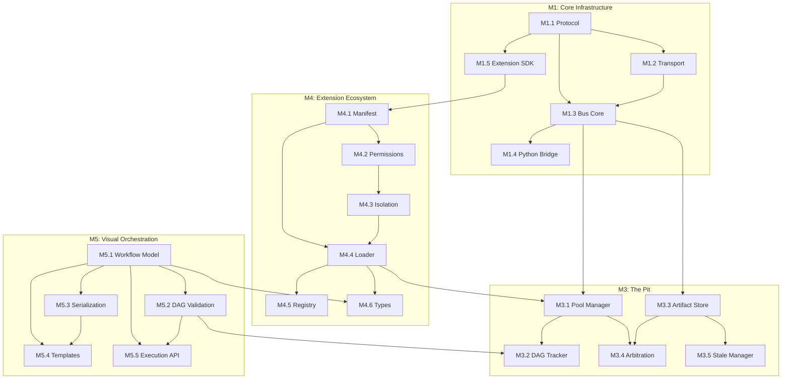

# Symphony Backend Milestones - Level 1 Decomposition

> **Scope**: Backend-focused decomposition of M1, M5, M4, M3
> **Ordering**: M1 → M5 → M4 → M3 (foundational to complex)
> **Parent Document**: [MILESTONES.md](./MILESTONES.md)

---

## 📋 Overview

This document decomposes the high-level milestones into actionable sub-milestones.
Each sub-milestone is designed to be completable in 2-4 weeks.

```
M1: Core Infrastructure (3-4 months)
├── M1.1: IPC Protocol & Serialization (3 weeks)
├── M1.2: Transport Layer (3 weeks)
├── M1.3: Message Bus Core (3 weeks)
├── M1.4: Python-Rust Bridge (3 weeks)
└── M1.5: Extension SDK Foundation (3 weeks)

M5: Visual Orchestration Backend (2-3 months)
├── M5.1: Workflow Data Model (2 weeks)
├── M5.2: DAG Validation & Operations (2 weeks)
├── M5.3: Workflow Serialization (2 weeks)
├── M5.4: Template System (2 weeks)
└── M5.5: Execution State API (3 weeks)

M4: Extension Ecosystem (4-5 months)
├── M4.1: Manifest System (3 weeks)
├── M4.2: Permission Framework (3 weeks)
├── M4.3: Process Isolation (4 weeks)
├── M4.4: Extension Loader (3 weeks)
├── M4.5: Registry & Discovery (3 weeks)
└── M4.6: Extension Types (4 weeks)

M3: The Pit - Infrastructure Extensions (3-4 months)
├── M3.1: Pool Manager (4 weeks)
├── M3.2: DAG Tracker (4 weeks)
├── M3.3: Artifact Store (4 weeks)
├── M3.4: Arbitration Engine (3 weeks)
└── M3.5: Stale Manager (3 weeks)
```

---

## 🚧 M1: Core Infrastructure

**Goal**: Build the foundational communication and integration systems
**Duration**: 3-4 months
**Dependencies**: M0 (Foundation) ✅ Complete


---

### M1.1: IPC Protocol & Serialization (3 weeks)

**Goal**: Define message formats and serialization for all IPC communication

**Deliverables**:
- Message envelope schema (header, payload, metadata)
- Binary serialization using MessagePack/Bincode
- Schema validation system
- Message type registry

**Crate**: `symphony-ipc-protocol`
```
apps/backend/crates/symphony-ipc-protocol/
├── src/
│   ├── lib.rs
│   ├── message.rs        # Message envelope types
│   ├── schema.rs         # Schema definitions
│   ├── serialize.rs      # MessagePack/Bincode impl
│   ├── validate.rs       # Schema validation
│   └── registry.rs       # Message type registry
└── Cargo.toml
```

**Sub-tasks**:
- [ ] M1.1.1: Define message envelope structure (MessageHeader, MessagePayload)
- [ ] M1.1.2: Implement MessagePack serialization with serde
- [ ] M1.1.3: Implement Bincode serialization as alternative
- [ ] M1.1.4: Create schema validation framework
- [ ] M1.1.5: Build message type registry with versioning
- [ ] M1.1.6: Add pretty-printer for debugging
- [ ] M1.1.7: Write property tests for round-trip serialization

**Success Criteria**:
- ✅ Messages serialize/deserialize in <0.01ms
- ✅ Schema validation catches malformed messages
- ✅ Round-trip property tests pass for all message types

---

### M1.2: Transport Layer (3 weeks)

**Goal**: Platform-specific transport implementations

**Deliverables**:
- Unix domain socket transport (Linux/macOS)
- Named pipe transport (Windows)
- Shared memory transport (high-frequency)
- Transport abstraction trait

**Crate**: `symphony-ipc-transport`
```
apps/backend/crates/symphony-ipc-transport/
├── src/
│   ├── lib.rs
│   ├── traits.rs         # Transport trait definitions
│   ├── unix_socket.rs    # Unix domain sockets
│   ├── named_pipe.rs     # Windows named pipes
│   ├── shared_memory.rs  # Shared memory for hot path
│   └── config.rs         # Transport configuration
└── Cargo.toml
```

**Sub-tasks**:
- [ ] M1.2.1: Define Transport trait (connect, send, receive, close)
- [ ] M1.2.2: Implement Unix domain socket transport
- [ ] M1.2.3: Implement Windows named pipe transport
- [ ] M1.2.4: Implement shared memory transport for high-frequency data
- [ ] M1.2.5: Add connection pooling and reuse
- [ ] M1.2.6: Implement automatic reconnection with backoff
- [ ] M1.2.7: Write integration tests for each transport

**Success Criteria**:
- ✅ Unix socket latency <0.1ms
- ✅ Named pipe latency <0.2ms
- ✅ Shared memory latency <0.01ms
- ✅ Automatic reconnection works within 5 attempts


---

### M1.3: Message Bus Core (3 weeks)

**Goal**: Central message routing and management system

**Deliverables**:
- Message bus with routing logic
- Endpoint registration and discovery
- Request/response correlation
- Pub/sub for broadcast messages
- Health monitoring

**Crate**: `symphony-ipc-bus`
```
apps/backend/crates/symphony-ipc-bus/
├── src/
│   ├── lib.rs
│   ├── bus.rs            # Core bus implementation
│   ├── router.rs         # Message routing logic
│   ├── endpoint.rs       # Endpoint management
│   ├── correlation.rs    # Request/response tracking
│   ├── pubsub.rs         # Publish/subscribe system
│   └── health.rs         # Health monitoring
└── Cargo.toml
```

**Sub-tasks**:
- [ ] M1.3.1: Implement core bus with async message handling
- [ ] M1.3.2: Build routing engine with pattern matching
- [ ] M1.3.3: Create endpoint registration system
- [ ] M1.3.4: Implement request/response correlation
- [ ] M1.3.5: Add pub/sub for system-wide events
- [ ] M1.3.6: Build health monitoring and metrics
- [ ] M1.3.7: Add message batching for throughput
- [ ] M1.3.8: Write load tests for 10,000+ msg/sec

**Success Criteria**:
- ✅ Handles 10,000+ messages/second
- ✅ Average routing latency <0.1ms
- ✅ Pub/sub delivers to all subscribers within 1ms
- ✅ Health checks detect failures within 100ms

---

### M1.4: Python-Rust Bridge (3 weeks)

**Goal**: Seamless FFI between Python Conductor and Rust infrastructure

**Deliverables**:
- PyO3 bindings for IPC bus
- Type conversion layer
- Error handling across boundary
- Async support for Python

**Crate**: `symphony-python-bridge`
```
apps/backend/crates/symphony-python-bridge/
├── src/
│   ├── lib.rs
│   ├── bindings.rs       # PyO3 FFI bindings
│   ├── types.rs          # Type conversion
│   ├── errors.rs         # Error handling
│   ├── async_support.rs  # Async/await bridge
│   └── pit_api.rs        # Pit extension APIs
└── Cargo.toml
```

**Sub-tasks**:
- [ ] M1.4.1: Set up PyO3 project structure
- [ ] M1.4.2: Implement primitive type conversions
- [ ] M1.4.3: Implement collection type conversions (Vec, HashMap)
- [ ] M1.4.4: Create error conversion (Rust Result → Python Exception)
- [ ] M1.4.5: Add async support with tokio-pyo3
- [ ] M1.4.6: Expose IPC bus API to Python
- [ ] M1.4.7: Write Python integration tests
- [ ] M1.4.8: Benchmark FFI overhead

**Success Criteria**:
- ✅ FFI call overhead <0.01ms
- ✅ All primitive types convert correctly
- ✅ Async calls work from Python asyncio
- ✅ Errors propagate with full context


---

### M1.5: Extension SDK Foundation (3 weeks)

**Goal**: Core SDK for extension development

**Deliverables**:
- Extension manifest schema and parser
- Lifecycle hook system
- Permission declaration framework
- Extension trait definitions

**Crate**: `symphony-extension-sdk`
```
apps/backend/crates/symphony-extension-sdk/
├── src/
│   ├── lib.rs
│   ├── manifest.rs       # Manifest parsing (TOML/JSON)
│   ├── lifecycle.rs      # Lifecycle hooks
│   ├── permissions.rs    # Permission system
│   ├── traits.rs         # Extension traits
│   └── macros.rs         # Derive macros for extensions
└── Cargo.toml
```

**Sub-tasks**:
- [ ] M1.5.1: Define manifest schema (TOML format)
- [ ] M1.5.2: Implement manifest parser with validation
- [ ] M1.5.3: Create lifecycle trait (on_load, on_activate, on_deactivate, on_unload)
- [ ] M1.5.4: Build permission declaration system
- [ ] M1.5.5: Define Extension trait for all extension types
- [ ] M1.5.6: Create derive macros for boilerplate reduction
- [ ] M1.5.7: Add manifest pretty-printer
- [ ] M1.5.8: Write property tests for manifest round-trip

**Success Criteria**:
- ✅ Manifest parsing <1ms for typical manifests
- ✅ Invalid manifests rejected with clear errors
- ✅ Lifecycle hooks called in correct order
- ✅ Permission violations detected at declaration time

---

## 🎨 M5: Visual Orchestration Backend

**Goal**: Backend support for visual workflow composition
**Duration**: 2-3 months
**Dependencies**: M1.1 (Protocol), M1.3 (Bus)

---

### M5.1: Workflow Data Model (2 weeks)

**Goal**: Core data structures for workflow representation

**Deliverables**:
- Workflow struct with metadata
- Node types (Instrument, Operator, Control)
- Edge types (Data, Control, Conditional)
- Workflow builder API

**Crate**: `symphony-workflow-model`
```
apps/backend/crates/symphony-workflow-model/
├── src/
│   ├── lib.rs
│   ├── workflow.rs       # Workflow struct
│   ├── node.rs           # Node types
│   ├── edge.rs           # Edge types
│   ├── builder.rs        # Fluent builder API
│   └── metadata.rs       # Workflow metadata
└── Cargo.toml
```

**Sub-tasks**:
- [ ] M5.1.1: Define Workflow struct with ID, name, version, metadata
- [ ] M5.1.2: Create Node enum (InstrumentNode, OperatorNode, ControlNode)
- [ ] M5.1.3: Create Edge types (DataEdge, ControlEdge, ConditionalEdge)
- [ ] M5.1.4: Implement WorkflowBuilder with fluent API
- [ ] M5.1.5: Add metadata support (author, created, modified, tags)
- [ ] M5.1.6: Write unit tests for all types

**Success Criteria**:
- ✅ All node types representable
- ✅ Builder API is ergonomic and type-safe
- ✅ Metadata supports arbitrary key-value pairs


---

### M5.2: DAG Validation & Operations (2 weeks)

**Goal**: Ensure workflow graphs are valid DAGs with useful operations

**Deliverables**:
- Cycle detection algorithm
- Topological sorting
- Dependency resolution
- Graph traversal utilities

**Location**: `symphony-workflow-model` (extended)

**Sub-tasks**:
- [ ] M5.2.1: Implement cycle detection (Kahn's or DFS-based)
- [ ] M5.2.2: Implement topological sort for execution order
- [ ] M5.2.3: Build dependency resolver (what nodes depend on what)
- [ ] M5.2.4: Add graph traversal (BFS, DFS, ancestors, descendants)
- [ ] M5.2.5: Create validation pipeline (cycles, orphans, type mismatches)
- [ ] M5.2.6: Write property tests for DAG invariants

**Success Criteria**:
- ✅ Cycle detection works for graphs up to 10,000 nodes
- ✅ Topological sort is deterministic
- ✅ Validation catches all invalid graphs

---

### M5.3: Workflow Serialization (2 weeks)

**Goal**: Persist and load workflows in portable formats

**Deliverables**:
- JSON serialization for interchange
- Binary serialization for performance
- Pretty-printer for human readability
- Migration support for schema changes

**Location**: `symphony-workflow-model` (extended)

**Sub-tasks**:
- [ ] M5.3.1: Implement JSON serialization with serde
- [ ] M5.3.2: Implement binary serialization (MessagePack)
- [ ] M5.3.3: Create pretty-printer for debugging
- [ ] M5.3.4: Add schema versioning to serialized format
- [ ] M5.3.5: Implement migration system for schema changes
- [ ] M5.3.6: Write property tests for round-trip serialization

**Success Criteria**:
- ✅ JSON round-trip preserves all data
- ✅ Binary format is 50%+ smaller than JSON
- ✅ Pretty-printer output is human-readable
- ✅ Old versions can be migrated to new schema

---

### M5.4: Template System (2 weeks)

**Goal**: Reusable workflow templates with parameterization

**Deliverables**:
- Template definition format
- Parameter schema and validation
- Template instantiation
- Template library management

**Crate**: `symphony-workflow-templates`
```
apps/backend/crates/symphony-workflow-templates/
├── src/
│   ├── lib.rs
│   ├── template.rs       # Template definition
│   ├── parameters.rs     # Parameter schema
│   ├── instantiate.rs    # Template instantiation
│   └── library.rs        # Template library
└── Cargo.toml
```

**Sub-tasks**:
- [ ] M5.4.1: Define Template struct with parameter placeholders
- [ ] M5.4.2: Create parameter schema (type, default, validation)
- [ ] M5.4.3: Implement template instantiation with parameter binding
- [ ] M5.4.4: Build template library with search/filter
- [ ] M5.4.5: Add template versioning
- [ ] M5.4.6: Write tests for parameter validation

**Success Criteria**:
- ✅ Templates can parameterize any workflow property
- ✅ Invalid parameters rejected with clear errors
- ✅ Template library supports 1000+ templates


---

### M5.5: Execution State API (3 weeks)

**Goal**: API for tracking and controlling workflow execution

**Deliverables**:
- Execution state machine
- Progress tracking
- Control commands (pause, resume, cancel)
- Event streaming for UI updates

**Crate**: `symphony-workflow-execution`
```
apps/backend/crates/symphony-workflow-execution/
├── src/
│   ├── lib.rs
│   ├── state.rs          # Execution state machine
│   ├── progress.rs       # Progress tracking
│   ├── control.rs        # Control commands
│   ├── events.rs         # Event streaming
│   └── api.rs            # Public API
└── Cargo.toml
```

**Sub-tasks**:
- [ ] M5.5.1: Define execution states (Pending, Running, Paused, Completed, Failed)
- [ ] M5.5.2: Implement state machine with valid transitions
- [ ] M5.5.3: Build progress tracking (node completion, percentage)
- [ ] M5.5.4: Add control commands (pause, resume, cancel, retry)
- [ ] M5.5.5: Create event stream for real-time UI updates
- [ ] M5.5.6: Implement execution history/audit log
- [ ] M5.5.7: Write integration tests with mock workflows

**Success Criteria**:
- ✅ State transitions are atomic and consistent
- ✅ Progress updates within 10ms of node completion
- ✅ Control commands take effect within 100ms
- ✅ Event stream delivers updates to all subscribers

---

## 🧩 M4: Extension Ecosystem

**Goal**: Complete extension system for community and commercial extensions
**Duration**: 4-5 months
**Dependencies**: M1 (Core Infrastructure), M5.1 (Workflow Model)

---

### M4.1: Manifest System (3 weeks)

**Goal**: Comprehensive extension manifest with all metadata

**Deliverables**:
- Full manifest schema
- Capability declarations
- Dependency specifications
- Configuration schema

**Location**: `symphony-extension-sdk` (extended from M1.5)

**Sub-tasks**:
- [ ] M4.1.1: Extend manifest with capability declarations
- [ ] M4.1.2: Add dependency specification (version ranges, optional)
- [ ] M4.1.3: Create configuration schema definition
- [ ] M4.1.4: Add resource requirements (memory, CPU, GPU)
- [ ] M4.1.5: Implement manifest inheritance for extension families
- [ ] M4.1.6: Add marketplace metadata (description, screenshots, pricing)
- [ ] M4.1.7: Write comprehensive manifest validation

**Success Criteria**:
- ✅ All extension metadata expressible in manifest
- ✅ Dependency resolution handles complex graphs
- ✅ Configuration schema generates UI automatically


---

### M4.2: Permission Framework (3 weeks)

**Goal**: Fine-grained permission system for extension security

**Deliverables**:
- Permission types (file, network, system, model)
- Permission scopes (read, write, execute)
- Runtime permission checking
- Permission UI generation

**Crate**: `symphony-permissions`
```
apps/backend/crates/symphony-permissions/
├── src/
│   ├── lib.rs
│   ├── types.rs          # Permission types
│   ├── scopes.rs         # Permission scopes
│   ├── checker.rs        # Runtime checking
│   ├── policy.rs         # Permission policies
│   └── ui.rs             # UI generation for approval
└── Cargo.toml
```

**Sub-tasks**:
- [ ] M4.2.1: Define permission types (FileAccess, NetworkAccess, SystemAccess, ModelAccess)
- [ ] M4.2.2: Create permission scopes (Read, Write, Execute, Admin)
- [ ] M4.2.3: Implement runtime permission checker
- [ ] M4.2.4: Build permission policy engine (allow, deny, prompt)
- [ ] M4.2.5: Create permission request/grant flow
- [ ] M4.2.6: Generate permission UI from manifest
- [ ] M4.2.7: Add permission audit logging

**Success Criteria**:
- ✅ All operations checked against permissions
- ✅ Permission violations blocked and logged
- ✅ UI clearly shows what permissions are requested
- ✅ Audit log captures all permission decisions

---

### M4.3: Process Isolation (4 weeks)

**Goal**: Secure sandbox for out-of-process extensions

**Deliverables**:
- Process spawning with isolation
- Resource limits (memory, CPU)
- Filesystem sandboxing
- Network sandboxing

**Crate**: `symphony-sandbox`
```
apps/backend/crates/symphony-sandbox/
├── src/
│   ├── lib.rs
│   ├── process.rs        # Process management
│   ├── limits.rs         # Resource limits
│   ├── filesystem.rs     # FS sandboxing
│   ├── network.rs        # Network sandboxing
│   └── platform/         # Platform-specific impl
│       ├── linux.rs
│       ├── macos.rs
│       └── windows.rs
└── Cargo.toml
```

**Sub-tasks**:
- [ ] M4.3.1: Implement process spawning with isolation
- [ ] M4.3.2: Add memory limits using OS mechanisms
- [ ] M4.3.3: Add CPU limits using cgroups (Linux) / Job Objects (Windows)
- [ ] M4.3.4: Implement filesystem sandboxing (chroot/namespaces/sandbox-exec)
- [ ] M4.3.5: Implement network sandboxing (firewall rules)
- [ ] M4.3.6: Add process health monitoring
- [ ] M4.3.7: Implement graceful and forced termination
- [ ] M4.3.8: Write security tests for sandbox escapes

**Success Criteria**:
- ✅ Extensions cannot access files outside sandbox
- ✅ Memory limits enforced within 10% accuracy
- ✅ CPU limits enforced within 20% accuracy
- ✅ Network access blocked unless permitted


---

### M4.4: Extension Loader (3 weeks)

**Goal**: Load, initialize, and manage extension lifecycle

**Deliverables**:
- Extension discovery and loading
- Dependency resolution and ordering
- Hot reload support
- Extension state management

**Crate**: `symphony-extension-loader`
```
apps/backend/crates/symphony-extension-loader/
├── src/
│   ├── lib.rs
│   ├── discovery.rs      # Extension discovery
│   ├── loader.rs         # Loading logic
│   ├── resolver.rs       # Dependency resolution
│   ├── hot_reload.rs     # Hot reload support
│   └── state.rs          # Extension state
└── Cargo.toml
```

**Sub-tasks**:
- [ ] M4.4.1: Implement extension discovery (scan directories)
- [ ] M4.4.2: Build dependency resolver with version constraints
- [ ] M4.4.3: Create loading sequence (resolve → load → activate)
- [ ] M4.4.4: Add hot reload for development
- [ ] M4.4.5: Implement extension state machine
- [ ] M4.4.6: Add extension health checks
- [ ] M4.4.7: Create extension crash recovery
- [ ] M4.4.8: Write integration tests for full lifecycle

**Success Criteria**:
- ✅ Extensions load within 100ms
- ✅ Dependency conflicts detected before loading
- ✅ Hot reload works without system restart
- ✅ Crashed extensions auto-recover

---

### M4.5: Registry & Discovery (3 weeks)

**Goal**: Extension catalog with search and management

**Deliverables**:
- Local extension registry
- Remote marketplace client
- Search and filtering
- Version management

**Crate**: `symphony-extension-registry`
```
apps/backend/crates/symphony-extension-registry/
├── src/
│   ├── lib.rs
│   ├── registry.rs       # Local registry
│   ├── marketplace.rs    # Remote marketplace client
│   ├── search.rs         # Search and filter
│   ├── versions.rs       # Version management
│   └── signatures.rs     # Signature verification
└── Cargo.toml
```

**Sub-tasks**:
- [ ] M4.5.1: Implement local registry with SQLite backend
- [ ] M4.5.2: Create marketplace client (REST API)
- [ ] M4.5.3: Build search with full-text and filters
- [ ] M4.5.4: Implement version management (install, update, rollback)
- [ ] M4.5.5: Add signature verification for security
- [ ] M4.5.6: Create extension rating/review system
- [ ] M4.5.7: Add usage analytics (opt-in)

**Success Criteria**:
- ✅ Search returns results in <100ms
- ✅ Version rollback works reliably
- ✅ Signature verification catches tampering
- ✅ Registry handles 10,000+ extensions


---

### M4.6: Extension Types (4 weeks)

**Goal**: Implement the three extension types (Instruments, Operators, Addons)

**Deliverables**:
- Instrument trait and base implementation
- Operator trait and base implementation
- Addon trait and base implementation
- Example extensions for each type

**Crate**: `symphony-extension-types`
```
apps/backend/crates/symphony-extension-types/
├── src/
│   ├── lib.rs
│   ├── instrument.rs     # AI/ML model extensions
│   ├── operator.rs       # Workflow utility extensions
│   ├── addon.rs          # UI enhancement extensions
│   └── common.rs         # Shared functionality
└── Cargo.toml
```

**Sub-tasks**:
- [ ] M4.6.1: Define Instrument trait (invoke, configure, health_check)
- [ ] M4.6.2: Implement base Instrument with common functionality
- [ ] M4.6.3: Define Operator trait (process, validate_input, validate_output)
- [ ] M4.6.4: Implement base Operator with common functionality
- [ ] M4.6.5: Define Addon trait (render, handle_event, get_state)
- [ ] M4.6.6: Implement base Addon with VirtualNode support
- [ ] M4.6.7: Create example Instrument (mock AI model)
- [ ] M4.6.8: Create example Operator (JSON transformer)
- [ ] M4.6.9: Create example Addon (status panel)

**Success Criteria**:
- ✅ All three extension types fully functional
- ✅ Example extensions demonstrate best practices
- ✅ Extensions integrate with workflow system
- ✅ Documentation complete for extension developers

---

## 🎭 M3: The Pit - Infrastructure Extensions

**Goal**: Build the five core infrastructure extensions
**Duration**: 3-4 months
**Dependencies**: M1 (Core Infrastructure), M4.1-M4.4 (Extension basics)

---

### M3.1: Pool Manager (4 weeks)

**Goal**: AI model lifecycle and resource management

**Deliverables**:
- Model state machine
- Predictive prewarming
- Model caching
- Health monitoring

**Crate**: `symphony-pool-manager`
```
apps/backend/crates/symphony-pool-manager/
├── src/
│   ├── lib.rs
│   ├── lifecycle.rs      # State machine (cold→warming→hot→cooling)
│   ├── prewarming.rs     # Predictive loading
│   ├── cache.rs          # Model caching (LRU)
│   ├── health.rs         # Health monitoring
│   ├── metrics.rs        # Performance metrics
│   └── config.rs         # Configuration
└── Cargo.toml
```

**Sub-tasks**:
- [ ] M3.1.1: Define model state machine (Cold, Warming, Hot, Cooling)
- [ ] M3.1.2: Implement state transitions with validation
- [ ] M3.1.3: Build LRU cache for hot models
- [ ] M3.1.4: Create predictive prewarming based on usage patterns
- [ ] M3.1.5: Add health monitoring with heartbeats
- [ ] M3.1.6: Implement graceful model shutdown
- [ ] M3.1.7: Add performance metrics collection
- [ ] M3.1.8: Write property tests for state machine invariants

**Success Criteria**:
- ✅ Model allocation <100μs on cache hit
- ✅ Prewarming reduces cold starts by 50%+
- ✅ Health checks detect failures within 1s
- ✅ Memory usage stays within configured limits


---

### M3.2: DAG Tracker (4 weeks)

**Goal**: Workflow execution engine with parallel processing

**Deliverables**:
- Execution engine
- Parallel node execution
- Checkpointing and recovery
- Execution metrics

**Crate**: `symphony-dag-tracker`
```
apps/backend/crates/symphony-dag-tracker/
├── src/
│   ├── lib.rs
│   ├── executor.rs       # Execution engine
│   ├── scheduler.rs      # Node scheduling
│   ├── parallel.rs       # Parallel execution
│   ├── checkpoint.rs     # State checkpointing
│   ├── recovery.rs       # Failure recovery
│   └── metrics.rs        # Execution metrics
└── Cargo.toml
```

**Sub-tasks**:
- [ ] M3.2.1: Implement execution engine with node runner
- [ ] M3.2.2: Build scheduler with topological ordering
- [ ] M3.2.3: Add parallel execution for independent nodes
- [ ] M3.2.4: Create checkpointing system (periodic + on-demand)
- [ ] M3.2.5: Implement recovery strategies (retry, fallback, skip)
- [ ] M3.2.6: Add execution metrics (duration, throughput, errors)
- [ ] M3.2.7: Implement execution timeout handling
- [ ] M3.2.8: Write stress tests for 10,000-node workflows

**Success Criteria**:
- ✅ Handles 10,000-node workflows
- ✅ Parallel execution utilizes available cores
- ✅ Recovery from checkpoint <1s
- ✅ Execution metrics accurate within 1%

---

### M3.3: Artifact Store (4 weeks)

**Goal**: Content-addressable storage with search

**Deliverables**:
- Content-addressable storage
- Versioning system
- Full-text search (Tantivy)
- Quality scoring

**Crate**: `symphony-artifact-store`
```
apps/backend/crates/symphony-artifact-store/
├── src/
│   ├── lib.rs
│   ├── storage.rs        # Content-addressable storage
│   ├── versioning.rs     # Version management
│   ├── search.rs         # Tantivy integration
│   ├── quality.rs        # Quality scoring
│   ├── encryption.rs     # AES-256 encryption
│   └── metadata.rs       # Artifact metadata
└── Cargo.toml
```

**Sub-tasks**:
- [ ] M3.3.1: Implement content-addressable storage (SHA-256 hashing)
- [ ] M3.3.2: Add deduplication for identical content
- [ ] M3.3.3: Build versioning system with history
- [ ] M3.3.4: Integrate Tantivy for full-text search
- [ ] M3.3.5: Implement quality scoring (structure, semantics, utility)
- [ ] M3.3.6: Add AES-256 encryption at rest
- [ ] M3.3.7: Create artifact relationship tracking
- [ ] M3.3.8: Write property tests for storage invariants

**Success Criteria**:
- ✅ Store latency <5ms, retrieve <2ms
- ✅ Deduplication saves 30%+ storage
- ✅ Search returns results in <100ms
- ✅ Encryption transparent to users


---

### M3.4: Arbitration Engine (3 weeks)

**Goal**: Fair resource allocation and conflict resolution

**Deliverables**:
- Conflict detection
- Resolution strategies
- Priority-based routing
- Fairness monitoring

**Crate**: `symphony-arbitration-engine`
```
apps/backend/crates/symphony-arbitration-engine/
├── src/
│   ├── lib.rs
│   ├── conflicts.rs      # Conflict detection
│   ├── resolution.rs     # Resolution strategies
│   ├── routing.rs        # Priority-based routing
│   ├── fairness.rs       # Fairness monitoring
│   ├── queue.rs          # Request queuing
│   └── audit.rs          # Decision audit log
└── Cargo.toml
```

**Sub-tasks**:
- [ ] M3.4.1: Implement conflict detection (resource contention)
- [ ] M3.4.2: Build resolution strategies (priority, round-robin, collaborative)
- [ ] M3.4.3: Create priority-based routing
- [ ] M3.4.4: Add fairness monitoring and correction
- [ ] M3.4.5: Implement request queuing with wait time estimation
- [ ] M3.4.6: Create decision audit log
- [ ] M3.4.7: Add multi-dimensional scoring (business, user, cost, learning)

**Success Criteria**:
- ✅ Conflict resolution <1ms
- ✅ Fairness deviation <10% over time
- ✅ Priority ordering respected
- ✅ Audit log captures all decisions

---

### M3.5: Stale Manager (3 weeks)

**Goal**: Intelligent data lifecycle and cleanup

**Deliverables**:
- Retention policy engine
- Training data preservation
- Cloud archival
- Storage optimization

**Crate**: `symphony-stale-manager`
```
apps/backend/crates/symphony-stale-manager/
├── src/
│   ├── lib.rs
│   ├── retention.rs      # Retention policies
│   ├── preservation.rs   # Training data preservation
│   ├── archival.rs       # Cloud archival
│   ├── cleanup.rs        # Cleanup execution
│   ├── scoring.rs        # Value scoring
│   └── lifecycle.rs      # Storage lifecycle
└── Cargo.toml
```

**Sub-tasks**:
- [ ] M3.5.1: Define retention policy schema
- [ ] M3.5.2: Implement policy engine with rule evaluation
- [ ] M3.5.3: Build training data value scoring
- [ ] M3.5.4: Create cloud archival integration (S3-compatible)
- [ ] M3.5.5: Implement cleanup execution with safety checks
- [ ] M3.5.6: Add storage tier management (hot, warm, cold)
- [ ] M3.5.7: Create cleanup scheduling and throttling

**Success Criteria**:
- ✅ High-value data never deleted
- ✅ Archival preserves retrieval capability
- ✅ Cleanup runs without impacting performance
- ✅ Storage costs reduced by 40%+ over time

---

## 📊 Timeline Summary

| Sub-Milestone | Duration | Dependencies | Crate |
|---------------|----------|--------------|-------|
| **M1.1** Protocol | 3 weeks | - | `symphony-ipc-protocol` |
| **M1.2** Transport | 3 weeks | M1.1 | `symphony-ipc-transport` |
| **M1.3** Bus Core | 3 weeks | M1.1, M1.2 | `symphony-ipc-bus` |
| **M1.4** Python Bridge | 3 weeks | M1.3 | `symphony-python-bridge` |
| **M1.5** Extension SDK | 3 weeks | M1.1 | `symphony-extension-sdk` |
| **M5.1** Workflow Model | 2 weeks | - | `symphony-workflow-model` |
| **M5.2** DAG Validation | 2 weeks | M5.1 | `symphony-workflow-model` |
| **M5.3** Serialization | 2 weeks | M5.1 | `symphony-workflow-model` |
| **M5.4** Templates | 2 weeks | M5.1, M5.3 | `symphony-workflow-templates` |
| **M5.5** Execution API | 3 weeks | M5.1, M5.2 | `symphony-workflow-execution` |
| **M4.1** Manifest | 3 weeks | M1.5 | `symphony-extension-sdk` |
| **M4.2** Permissions | 3 weeks | M4.1 | `symphony-permissions` |
| **M4.3** Isolation | 4 weeks | M4.2 | `symphony-sandbox` |
| **M4.4** Loader | 3 weeks | M4.1, M4.3 | `symphony-extension-loader` |
| **M4.5** Registry | 3 weeks | M4.4 | `symphony-extension-registry` |
| **M4.6** Types | 4 weeks | M4.4, M5.1 | `symphony-extension-types` |
| **M3.1** Pool Manager | 4 weeks | M1.3, M4.4 | `symphony-pool-manager` |
| **M3.2** DAG Tracker | 4 weeks | M5.2, M3.1 | `symphony-dag-tracker` |
| **M3.3** Artifact Store | 4 weeks | M1.3 | `symphony-artifact-store` |
| **M3.4** Arbitration | 3 weeks | M3.1, M3.3 | `symphony-arbitration-engine` |
| **M3.5** Stale Manager | 3 weeks | M3.3 | `symphony-stale-manager` |


---

## 🔗 Dependency Graph



---

## 🎯 Parallel Work Opportunities

### Phase 1 (Weeks 1-6)
Can work in parallel:
- M1.1 Protocol + M5.1 Workflow Model
- M1.2 Transport (after M1.1)
- M5.2 DAG Validation + M5.3 Serialization (after M5.1)

### Phase 2 (Weeks 7-12)
Can work in parallel:
- M1.3 Bus Core + M1.5 Extension SDK
- M5.4 Templates + M5.5 Execution API
- M4.1 Manifest (after M1.5)

### Phase 3 (Weeks 13-20)
Can work in parallel:
- M1.4 Python Bridge
- M4.2 Permissions + M4.3 Isolation
- M4.4 Loader + M4.5 Registry

### Phase 4 (Weeks 21-28)
Can work in parallel:
- M4.6 Extension Types
- M3.1 Pool Manager + M3.3 Artifact Store

### Phase 5 (Weeks 29-36)
Can work in parallel:
- M3.2 DAG Tracker
- M3.4 Arbitration + M3.5 Stale Manager

---

## ✅ Success Metrics

### Performance Targets
| Component | Metric | Target |
|-----------|--------|--------|
| IPC Bus | Message latency | <0.3ms |
| IPC Bus | Throughput | 10,000+ msg/sec |
| Python Bridge | FFI overhead | <0.01ms |
| Pool Manager | Allocation (cache hit) | <100μs |
| DAG Tracker | Workflow capacity | 10,000 nodes |
| Artifact Store | Store latency | <5ms |
| Artifact Store | Retrieve latency | <2ms |
| Extension Loader | Load time | <100ms |

### Quality Targets
| Metric | Target |
|--------|--------|
| Test Coverage | >80% |
| Documentation | All public APIs |
| Property Tests | All serialization |
| Security Tests | All sandboxing |

---

## 📝 Notes

1. **Crate Naming**: All crates follow `symphony-*` naming convention
2. **Location**: All crates in `apps/backend/crates/`
3. **Testing**: Each sub-milestone includes property tests for correctness
4. **Documentation**: Each crate must have complete rustdoc
5. **CI/CD**: Each crate must pass clippy, fmt, and tests before merge

---

**Last Updated**: December 2025
**Status**: Level 1 Decomposition Complete
**Next Step**: Create MILESTONES_LEVEL2.md for detailed task breakdown
